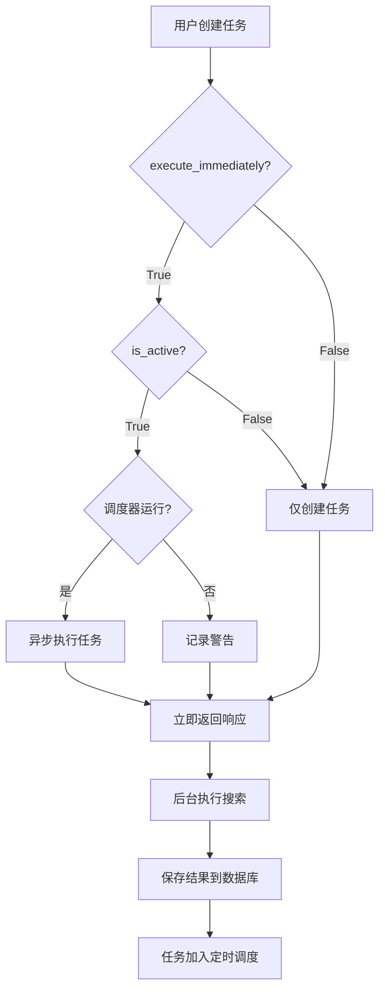

# 定时搜索任务首次立即执行功能

## 📋 功能概述

### 版本信息
- **版本号**: v2.0.1
- **实现日期**: 2025-11-04
- **功能分类**: 任务调度增强

### 功能说明

当用户创建新的定时搜索任务时，系统支持在将任务加入定时调度列表的同时，**立即执行一次搜索**。这样用户无需等待下一个调度周期即可看到首次执行结果。

**核心特性**：
- ✅ 可配置：通过 `execute_immediately` 参数控制是否立即执行
- ✅ 非阻塞：使用异步任务执行，不影响 API 响应速度
- ✅ 容错性：首次执行失败不影响任务创建和后续定时执行
- ✅ 优雅降级：调度器未运行时自动跳过立即执行

## 🎯 使用场景

### 适用场景
1. **快速反馈**：用户希望立即看到搜索结果，验证任务配置是否正确
2. **数据预热**：为新任务立即获取初始数据集
3. **即时需求**：用户需要立即获取某主题的最新信息

### 不适用场景
1. **批量创建任务**：大量任务同时立即执行可能导致系统负载过高
2. **低优先级任务**：不紧急的任务可以等待定时调度

## 🔧 API 变更

### 1. 请求模型变更

#### 文件位置
`src/api/v1/endpoints/search_tasks_frontend.py`

#### 新增字段
```python
class SearchTaskCreate(BaseModel):
    """创建搜索任务请求"""
    name: str = Field(..., description="任务名称", min_length=1, max_length=100)
    description: Optional[str] = Field(None, description="任务描述", max_length=500)
    query: str = Field(..., description="搜索关键词", min_length=1, max_length=200)
    target_website: Optional[str] = Field(None, description="主要目标网站", max_length=200)
    crawl_url: Optional[str] = Field(None, description="定时爬取的URL", max_length=500)
    search_config: Dict[str, Any] = Field(default_factory=dict, description="搜索配置")
    schedule_interval: str = Field("DAILY", description="调度间隔")
    is_active: bool = Field(True, description="是否启用")

    # ⭐ 新增字段
    execute_immediately: bool = Field(True, description="创建后是否立即执行一次")
```

**字段说明**：
- **字段名**: `execute_immediately`
- **类型**: `bool`
- **默认值**: `True`（默认启用首次立即执行）
- **说明**: 控制任务创建后是否立即执行一次

### 2. 端点逻辑变更

#### 执行流程
```python
# 1. 创建并保存任务
task = SearchTask(...)
await repo.create(task)

# 2. 首次立即执行（如果启用）
if task.is_active and task_data.execute_immediately:
    try:
        scheduler = await get_scheduler()
        if scheduler.is_running():
            # 异步触发首次执行（不阻塞API响应）
            import asyncio
            asyncio.create_task(scheduler.execute_task_now(str(task.id)))
            logger.info(f"✅ 已触发首次立即执行: {task.name}")
        else:
            logger.warning(f"⚠️ 调度器未运行，跳过首次执行")
    except Exception as e:
        # 首次执行失败不影响任务创建
        logger.warning(f"⚠️ 触发首次执行失败: {e}")

# 3. 返回任务信息
return task_to_response(task)
```

#### 关键设计决策

| 设计点 | 决策 | 理由 |
|--------|------|------|
| 默认值 | `True` | 大多数用户希望立即看到结果 |
| 执行方式 | `asyncio.create_task()` | 不阻塞 API 响应，提升用户体验 |
| 错误处理 | 捕获并记录，不抛出异常 | 首次执行失败不应影响任务创建 |
| 调度器检查 | 检查 `is_running()` | 避免调度器未启动时出错 |

## 📊 执行流程

### 完整流程图

参考 UML 序列图：`claudedocs/diagrams/task_immediate_execution_sequence.puml`

### 流程步骤



### 时序说明

1. **同步阶段（0-50ms）**：
   - 创建任务实体
   - 保存到数据库
   - 触发异步执行（不等待）
   - 返回 API 响应

2. **异步阶段（1-60秒）**：
   - 调度器执行搜索任务
   - 爬取目标网站
   - AI 处理搜索结果
   - 保存到 `processed_results_new`
   - 更新任务执行统计

## 🔍 使用示例

### 示例 1：启用首次立即执行（默认）

```bash
curl -X POST http://localhost:8000/api/v1/search-tasks \
  -H "Content-Type: application/json" \
  -d '{
    "name": "Myanmar 新闻监控",
    "query": "Myanmar political news",
    "target_website": "www.gnlm.com.mm",
    "schedule_interval": "DAILY",
    "is_active": true,
    "execute_immediately": true
  }'
```

**预期结果**：
- ✅ 任务创建成功
- ✅ API 立即返回（不等待执行）
- ✅ 后台开始执行首次搜索
- ✅ 1-2 分钟后可查询到首次执行结果

### 示例 2：禁用首次立即执行

```bash
curl -X POST http://localhost:8000/api/v1/search-tasks \
  -H "Content-Type: application/json" \
  -d '{
    "name": "Myanmar 新闻监控",
    "query": "Myanmar political news",
    "schedule_interval": "DAILY",
    "is_active": true,
    "execute_immediately": false
  }'
```

**预期结果**：
- ✅ 任务创建成功
- ⏳ 不执行首次搜索
- ⏳ 等待下一个调度周期执行

### 示例 3：创建未启用的任务

```bash
curl -X POST http://localhost:8000/api/v1/search-tasks \
  -H "Content-Type: application/json" \
  -d '{
    "name": "Myanmar 新闻监控",
    "query": "Myanmar political news",
    "is_active": false,
    "execute_immediately": true
  }'
```

**预期结果**：
- ✅ 任务创建成功
- ⚠️ 因为 `is_active=false`，不执行首次搜索
- ⚠️ 需要手动启用任务后才会执行

## ⚠️ 错误处理

### 错误场景及处理

| 场景 | 系统行为 | 日志记录 |
|------|----------|----------|
| 调度器未运行 | 跳过首次执行，任务创建成功 | ⚠️ WARNING: 调度器未运行，跳过首次执行 |
| 执行触发失败 | 任务创建成功，首次执行失败 | ⚠️ WARNING: 触发首次执行失败（不影响任务创建） |
| 搜索执行失败 | 任务已创建，执行失败计入统计 | ❌ ERROR: 任务执行失败（记录在 task.failure_count） |
| 网络超时 | 后台执行超时，不影响任务创建 | ⚠️ WARNING: 搜索请求超时 |

### 容错机制

1. **异步执行**：立即执行在后台运行，不影响 API 响应
2. **异常隔离**：首次执行失败不会导致任务创建失败
3. **优雅降级**：调度器未运行时自动跳过，不抛出异常
4. **日志完整**：所有异常都被记录，便于排查问题

## 🧪 测试验证

### 测试场景

#### 1. 正常流程测试

**测试步骤**：
```bash
# 1. 确保调度器运行
ps aux | grep uvicorn

# 2. 创建任务（启用立即执行）
curl -X POST http://localhost:8000/api/v1/search-tasks \
  -H "Content-Type: application/json" \
  -d '{
    "name": "测试任务",
    "query": "test query",
    "execute_immediately": true
  }'

# 3. 等待 1-2 分钟

# 4. 查询任务执行状态
curl http://localhost:8000/api/v1/search-tasks/{task_id}

# 5. 查询搜索结果
curl http://localhost:8000/api/v1/search-tasks/{task_id}/results
```

**预期结果**：
- ✅ 任务创建成功
- ✅ `execution_count = 1`
- ✅ 有搜索结果返回

#### 2. 禁用立即执行测试

**测试步骤**：
```bash
# 创建任务（禁用立即执行）
curl -X POST http://localhost:8000/api/v1/search-tasks \
  -H "Content-Type: application/json" \
  -d '{
    "name": "测试任务",
    "query": "test query",
    "execute_immediately": false
  }'

# 立即查询执行状态
curl http://localhost:8000/api/v1/search-tasks/{task_id}
```

**预期结果**：
- ✅ 任务创建成功
- ✅ `execution_count = 0`（未执行）
- ✅ 无搜索结果

#### 3. 调度器未运行测试

**测试步骤**：
```bash
# 1. 停止调度器（仅用于测试）
# （实际操作：修改代码或配置禁用调度器）

# 2. 创建任务
curl -X POST http://localhost:8000/api/v1/search-tasks \
  -H "Content-Type: application/json" \
  -d '{
    "name": "测试任务",
    "query": "test query",
    "execute_immediately": true
  }'
```

**预期结果**：
- ✅ 任务创建成功（不报错）
- ⚠️ 日志记录：调度器未运行警告
- ✅ `execution_count = 0`

## 📈 性能影响

### 系统资源

| 指标 | 立即执行=True | 立即执行=False | 影响 |
|------|---------------|----------------|------|
| API 响应时间 | ~50ms | ~50ms | 无影响（异步执行） |
| 后台任务队列 | +1 任务 | 无 | 临时增加 |
| 数据库写入 | +1 次 | 无 | 首次执行保存结果 |
| 网络请求 | +1-10 次 | 无 | 取决于搜索引擎调用 |

### 并发考虑

- **单任务创建**：性能影响可忽略
- **批量任务创建**（>10个）：建议设置 `execute_immediately=false`，避免短时间大量爬取请求

### 优化建议

1. **批量创建场景**：
   ```python
   # 批量创建时禁用立即执行
   for task_data in batch_tasks:
       task_data['execute_immediately'] = False
       create_task(task_data)
   ```

2. **高优先级任务**：
   ```python
   # 仅对关键任务启用立即执行
   if is_critical_task:
       task_data['execute_immediately'] = True
   ```

## 🔗 相关文件

### 实现文件
- `src/api/v1/endpoints/search_tasks_frontend.py` - API 端点实现
- `src/services/task_scheduler.py` - 调度器服务（`execute_task_now` 方法）

### 文档文件
- `claudedocs/diagrams/task_immediate_execution_sequence.puml` - UML 序列图
- `claudedocs/TASK_IMMEDIATE_EXECUTION_FEATURE.md` - 本文档

### 相关实体
- `src/core/domain/entities/search_task.py` - SearchTask 实体
- `src/infrastructure/database/search_task_repositories.py` - 任务仓储

## 🚀 未来扩展

### 可能的增强功能

1. **优先级队列**：
   - 支持设置任务执行优先级
   - 高优先级任务优先执行

2. **执行延迟**：
   - 添加 `execute_delay_seconds` 参数
   - 支持延迟 N 秒后执行（而非立即）

3. **执行结果回调**：
   - 添加 `callback_url` 参数
   - 首次执行完成后通知前端

4. **批量优化**：
   - 批量任务创建时智能分批执行
   - 避免系统负载过高

## 📝 变更日志

### v2.0.1 (2025-11-04)
- ✅ 新增 `execute_immediately` 参数
- ✅ 实现首次立即执行逻辑
- ✅ 添加异步执行机制
- ✅ 完善错误处理和日志记录

## 🎉 总结

首次立即执行功能为定时搜索任务提供了更好的用户体验：

1. ✅ **即时反馈**：用户无需等待即可看到首次结果
2. ✅ **灵活配置**：可按需启用或禁用
3. ✅ **高性能**：异步执行不影响 API 响应速度
4. ✅ **高可用**：完善的错误处理确保系统稳定性

**推荐用法**：
- 常规任务：保持默认 `execute_immediately=true`
- 批量创建：设置 `execute_immediately=false`
- 紧急任务：启用立即执行并监控执行结果
