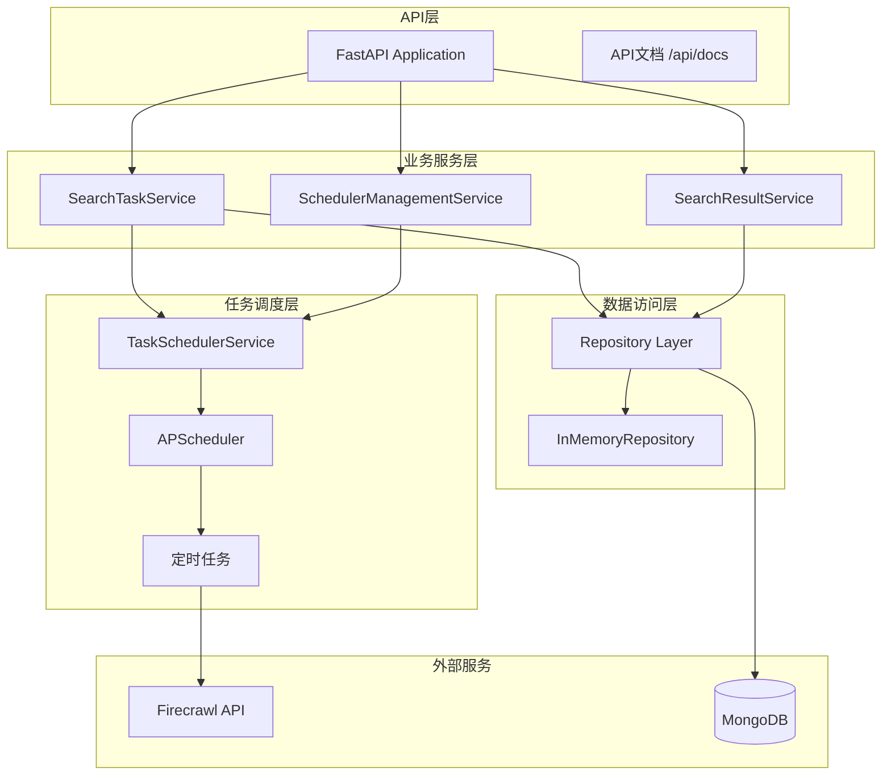

# 关山智能系统架构文档

## 系统概述

关山智能系统是基于Firecrawl + LLM + RAG Pipeline的智能信息采集与处理平台，核心功能是定时搜索任务管理系统。

## 技术架构

### 核心技术栈
- **后端框架**: FastAPI
- **数据库**: MongoDB (主数据存储)
- **任务调度**: APScheduler (AsyncIOScheduler)
- **搜索服务**: Firecrawl API
- **开发语言**: Python 3.13

### 系统架构图



## 核心组件

### 1. 数据源管理系统

#### 1.1 数据源整编流程
- **功能**: 将多条原始数据整合为高质量数据源
- **状态管理**: DRAFT（待审核）⇄ CONFIRMED（已通过）
- **状态同步**: 数据源操作自动同步原始数据状态（通过MongoDB事务保证一致性）

#### 1.2 数据源存档系统 ✅ 已实施

**业务价值**: 确保已确认的数据源拥有独立的数据生命周期，不受原始数据表清理影响。

**核心设计**:
- **存档表**: `data_source_archived_data` - 独立集合存储完整数据快照
- **触发时机**: 数据源确认（DRAFT → CONFIRMED）时自动存档
- **事务保证**: MongoDB事务保证状态更新和数据存档的原子性

**性能指标**: 确认操作 <2秒 | 查询 <100ms | 存储成本可控（1000个数据源约250-500MB）

**详细文档**: [数据源存档系统完整指南](ARCHIVED_DATA_GUIDE.md) - 完整技术方案、UML图表、API文档、部署指南

### 2. 定时搜索任务系统

#### 2.1 任务管理
- **任务实体**: `SearchTask` - 支持安全ID生成
- **任务状态**: ACTIVE, PAUSED, FAILED, COMPLETED, DISABLED
- **调度间隔**: 6种预定义间隔（每小时到每周）

#### 2.2 调度器服务
- **实现**: `TaskSchedulerService` 基于APScheduler
- **接口**: `ITaskScheduler` 标准接口
- **功能**: 启动/停止、任务增删改、手动执行、状态监控

#### 2.3 搜索配置
- **三层配置**: 系统默认 → 模板 → 用户覆盖
- **测试模式**: 自动限制结果数量控制成本
- **多语言支持**: 8种语言选项

#### 2.4 搜索结果处理系统 (v2.0.0) ✅ 已设计

**版本**: v2.0.0 职责分离
**状态**: 🚧 设计完成，待实施

**核心设计**: 将原始数据存储与AI处理结果分离，实现职责清晰的双表架构

**数据流程**:
```
定时任务 → Firecrawl搜索 → search_results（原始数据，只写一次）
                        ↓
                  create pending in processed_results_new
                        ↓
                  AI服务异步处理
                        ↓
                  processed_results_new（AI增强数据）
                        ↓
                  前端查询展示（主要来源）
```

**双表职责**:
- **search_results**: 纯原始数据存储（不可变）
  - 只负责存储Firecrawl返回的原始搜索结果
  - 数据写入后不再修改（immutable）
  - 提供原始数据查询接口（备用）

- **processed_results_new**: AI处理结果（主查询源）
  - 存储AI翻译、总结、分类后的增强数据
  - 管理处理状态（pending → processing → completed/failed）
  - **前端主要查询来源**，提供用户友好的展示数据
  - 支持用户操作（留存、删除、评分、备注）

**技术特性**:
- **异步处理**: AI服务异步处理，不阻塞定时任务
- **状态管理**: 6种状态（pending, processing, completed, failed, archived, deleted）
- **重试机制**: 失败自动重试，最多3次
- **性能优化**: 原始数据和处理数据分离查询，提升性能

**详细文档**:
- [职责分离架构完整设计](../claudedocs/SEARCH_RESULTS_SEPARATION_ARCHITECTURE.md)
- [UML图表和数据流](../claudedocs/diagrams/)
- [实施指南（9天计划）](../claudedocs/SEARCH_RESULTS_IMPLEMENTATION_GUIDE.md)
- [数据库集合指南](../claudedocs/DATABASE_COLLECTIONS_GUIDE.md)

### 3. 即时+智能搜索系统（v2.1.0 统一架构） ✅ 已设计

**版本**: v2.1.0 架构统一
**状态**: 🚧 设计完成，待实施

**核心变更**: 即时搜索和智能搜索结果统一管理，采用与定时搜索一致的职责分离架构

**架构统一**:
```
即时搜索 + 智能搜索 → instant_search_results（统一原始数据表）
                                    ↓
                           通过 search_type 字段区分
                           ├─ search_type="instant": 即时搜索结果
                           └─ search_type="smart": 智能搜索聚合结果
                                    ↓
                           instant_processed_results_new（统一AI处理表）
                                    ↓
                           前端查询展示（主要来源）
```

**设计优势**:
- ✅ **统一存储**: 所有非定时搜索结果统一管理，代码简化
- ✅ **统一AI处理**: 即时和智能搜索共享同一套AI处理流程
- ✅ **架构一致性**: 与定时搜索的职责分离保持一致
- ✅ **前端简化**: 统一查询接口，降低前端复杂度
- ✅ **易于扩展**: 未来新增搜索类型只需添加 search_type

**数据流程**:

**即时搜索流程**:
```
用户点击"立即搜索"
    ↓
InstantSearchService.execute()
    ↓
instant_search_results（search_type="instant"）
    ↓
AI服务异步处理
    ↓
instant_processed_results_new
    ↓
前端查询展示
```

**智能搜索流程**:
```
用户输入智能搜索查询
    ↓
LLM分解为3个子查询
    ↓
并发执行3个即时搜索
    ↓
instant_search_results（search_type="instant", 子查询结果）
    ↓
聚合去重
    ↓
instant_search_results（search_type="smart", 聚合结果）
    ↓
AI服务异步处理
    ↓
instant_processed_results_new
    ↓
前端查询展示（combined或by_query模式）
```

**数据表职责**:

| 表名 | 职责 | search_type | 数据特性 |
|-----|------|------------|---------|
| `instant_search_results` | 统一原始数据存储 | instant/smart | 不可变、去重 |
| `instant_processed_results_new` | 统一AI处理结果 | instant/smart | 状态管理、用户操作 |

**关键字段**:
- `search_type`: 区分即时搜索（instant）和智能搜索（smart）
- `content_hash`: 即时搜索去重字段
- `composite_score`: 智能搜索综合评分
- `sources`: 智能搜索多源信息

**详细文档**:
- [数据库集合指南 v2.1.0](../claudedocs/DATABASE_COLLECTIONS_GUIDE.md)
- [统一架构类图](../claudedocs/diagrams/INSTANT_SEARCH_UNIFIED_ARCHITECTURE.mermaid)
- [统一架构数据流](../claudedocs/diagrams/INSTANT_SEARCH_UNIFIED_DATA_FLOW.mermaid)
- [数据迁移方案](../claudedocs/INSTANT_SEARCH_MIGRATION_PLAN.md)

### 4. API接口设计

#### 4.1 数据源管理
```
POST   /api/v1/data-sources/                     # 创建数据源
GET    /api/v1/data-sources/                     # 查询列表
GET    /api/v1/data-sources/{id}                 # 数据源详情
PUT    /api/v1/data-sources/{id}/content         # 更新内容
POST   /api/v1/data-sources/{id}/confirm         # 确定数据源（触发存档）
POST   /api/v1/data-sources/{id}/revert-to-draft # 退回待处理
DELETE /api/v1/data-sources/{id}                 # 删除数据源

# 存档系统API
GET    /api/v1/data-sources/{id}/archived-data        # 获取存档数据
POST   /api/v1/data-sources/{id}/archived-data/stats  # 获取存档统计
```

#### 4.2 搜索任务管理
```
POST   /api/v1/search-tasks              # 创建任务
GET    /api/v1/search-tasks              # 列表查询
GET    /api/v1/search-tasks/{id}         # 任务详情
GET    /api/v1/search-tasks/{id}/status  # 任务状态监控 (专为前端设计)
PUT    /api/v1/search-tasks/{id}         # 更新任务
DELETE /api/v1/search-tasks/{id}         # 删除任务
PATCH  /api/v1/search-tasks/{id}/status  # 状态控制 (启用/禁用)
```

**任务状态监控端点特点**:
- 专为前端状态监控设计的轻量级接口
- 返回完整的任务信息，包括执行统计、资源使用和调度信息
- 与任务详情端点使用统一的响应模型`SearchTaskResponse`
- 包含成功/失败次数、成功率、平均结果数等关键指标
- 支持实时查询下次运行时间和调度间隔信息

#### 4.3 调度器管理
```
GET    /api/v1/scheduler/status          # 调度器状态
POST   /api/v1/scheduler/start           # 启动调度器
POST   /api/v1/scheduler/stop            # 停止调度器
POST   /api/v1/scheduler/tasks/{id}/execute  # 手动执行
POST   /api/v1/scheduler/tasks/{id}/pause    # 暂停任务
POST   /api/v1/scheduler/tasks/{id}/resume   # 恢复任务
```

#### 4.4 搜索结果查询（v2.0.0 + v2.1.0 统一架构）

**定时搜索结果查询（v2.0.0）**:

**主要查询接口（processed_results_new）**:
```
GET    /api/v1/search-tasks/{task_id}/results      # 任务的AI处理结果（默认）
GET    /api/v1/processed-results/{id}              # 处理结果详情
GET    /api/v1/processed-results/                  # 处理结果列表（按状态过滤）
POST   /api/v1/processed-results/{id}/archive      # 标记留存
POST   /api/v1/processed-results/{id}/delete       # 标记删除
PUT    /api/v1/processed-results/{id}/rating       # 用户评分
PUT    /api/v1/processed-results/{id}/notes        # 添加备注
```

**原始数据查询接口（search_results，备用）**:
```
GET    /api/v1/search-results/tasks/{id}           # 任务的原始结果
GET    /api/v1/search-results/{id}                 # 原始结果详情
```

**即时+智能搜索结果查询（v2.1.0 统一）**:

**主要查询接口（instant_processed_results_new）**:
```
GET    /api/v1/instant-search/{task_id}/results    # 即时搜索AI处理结果（默认）
GET    /api/v1/smart-search/{task_id}/results      # 智能搜索AI处理结果（默认）
    ?mode=combined                                  # 聚合模式（search_type="smart"）
    ?mode=by_query                                  # 子查询模式（search_type="instant"）
GET    /api/v1/instant-processed-results/{id}      # 处理结果详情
POST   /api/v1/instant-processed-results/{id}/archive  # 标记留存
POST   /api/v1/instant-processed-results/{id}/delete   # 标记删除
PUT    /api/v1/instant-processed-results/{id}/rating   # 用户评分
```

**原始数据查询接口（instant_search_results，备用）**:
```
GET    /api/v1/instant-search/{task_id}/results?view=raw   # 即时搜索原始结果
GET    /api/v1/smart-search/{task_id}/results?view=raw     # 智能搜索原始结果
GET    /api/v1/instant-search-results/{id}                 # 原始结果详情
```

**统一查询说明**:
- 前端默认查询 `instant_processed_results_new`（AI增强数据）
- 支持 `view=raw` 参数查询原始数据
- 智能搜索支持 `mode` 参数切换聚合/子查询视图

### 5. 数据模型

#### 5.1 定时搜索数据模型（v2.0.0 职责分离）

**原始搜索结果 (SearchResult)** - 不可变存储
```python
@dataclass
class SearchResult:
    id: str                    # 雪花算法ID
    task_id: str              # 关联的任务ID
    title: str                # 原始标题
    url: str                  # 原始URL
    content: str              # 原始内容
    published_date: datetime  # 发布日期
    crawled_at: datetime      # 采集时间
    score: float              # 搜索相关性分数
    # v2.0.0: 移除status和processed_at字段（职责分离）
```

**AI处理结果 (ProcessedResult)** - 主查询实体
```python
@dataclass
class ProcessedResult:
    id: str                       # 雪花算法ID
    raw_result_id: str           # 关联search_results的ID
    task_id: str                 # 关联的任务ID

    # AI增强数据
    translated_title: str        # 翻译后标题
    translated_content: str      # 翻译后内容
    summary: str                 # AI生成摘要
    key_points: List[str]        # 关键要点
    sentiment: str               # 情感分析
    categories: List[str]        # 智能分类

    # AI处理元数据
    ai_model: str                # 使用的AI模型
    ai_processing_time_ms: int   # 处理时间
    ai_confidence_score: float   # 置信度分数

    # 处理状态
    status: ProcessedStatus      # pending/processing/completed/failed/archived/deleted
    processing_error: str        # 错误信息（如果失败）
    retry_count: int             # 重试次数

    # 用户操作
    user_rating: int             # 用户评分(1-5)
    user_notes: str              # 用户备注

    # 时间戳
    created_at: datetime         # 创建时间
    processed_at: datetime       # AI处理完成时间
    updated_at: datetime         # 最后更新时间
```

**处理状态枚举 (ProcessedStatus)**
```python
class ProcessedStatus(Enum):
    PENDING = "pending"           # 等待AI处理
    PROCESSING = "processing"     # AI处理中
    COMPLETED = "completed"       # 处理成功
    FAILED = "failed"            # 处理失败
    ARCHIVED = "archived"        # 用户留存
    DELETED = "deleted"          # 用户删除（软删除）
```

#### 5.2 即时+智能搜索数据模型（v2.1.0 统一架构）

**统一原始结果 (InstantSearchResult)**:
```python
@dataclass
class InstantSearchResult:
    id: str                       # 雪花算法ID
    task_id: str                  # 任务ID
    search_type: str              # "instant" | "smart"（关键字段）

    # 共享字段
    title: str
    url: str
    content: str
    status: str
    created_at: datetime

    # 即时搜索专属字段（search_type="instant"）
    content_hash: str             # 去重字段
    url_normalized: str
    discovered_count: int
    relevance_score: float

    # 智能搜索专属字段（search_type="smart"）
    composite_score: float        # 综合评分
    avg_relevance_score: float
    position_score: float
    sources: List[Dict]           # 多源信息
    source_count: int
```

**统一AI处理结果 (InstantProcessedResult)**:
```python
@dataclass
class InstantProcessedResult:
    id: str                       # 雪花算法ID
    raw_result_id: str           # 关联instant_search_results._id
    task_id: str
    search_type: str              # 继承自原始结果

    # AI增强数据（与ProcessedResult相同）
    translated_title: str
    translated_content: str
    summary: str
    key_points: List[str]
    sentiment: str
    categories: List[str]

    # AI处理元数据
    ai_model: str
    ai_processing_time_ms: int
    ai_confidence_score: float

    # 用户操作和状态
    status: ProcessedStatus
    user_rating: int
    user_notes: str

    # 时间戳
    created_at: datetime
    processed_at: datetime
    updated_at: datetime
```

#### 5.3 搜索任务 (SearchTask)
```python
@dataclass
class SearchTask:
    id: str                    # 雪花算法安全ID
    name: str                  # 任务名称
    description: str           # 任务描述
    query: str                 # 搜索关键词
    search_config: Dict        # 搜索配置JSON
    schedule_interval: str     # 调度间隔枚举
    is_active: bool           # 是否启用
    status: TaskStatus        # 任务状态
    created_by: str           # 创建者
    created_at: datetime      # 创建时间
    updated_at: datetime      # 更新时间
    last_executed_at: datetime # 最后执行时间
    next_run_time: datetime   # 下次运行时间
    execution_count: int      # 执行次数
    success_count: int        # 成功次数
    failure_count: int        # 失败次数
    total_results: int        # 总结果数
    total_credits_used: int   # 总消耗积分
```

#### 5.4 调度间隔 (ScheduleInterval)
```python
class ScheduleInterval(Enum):
    HOURLY_1 = ("HOURLY_1", "0 * * * *", "每小时", 60)
    HOURLY_6 = ("HOURLY_6", "0 */6 * * *", "每6小时", 360)
    HOURLY_12 = ("HOURLY_12", "0 */12 * * *", "每12小时", 720)
    DAILY = ("DAILY", "0 9 * * *", "每天", 1440)
    DAYS_3 = ("DAYS_3", "0 9 */3 * *", "每3天", 4320)
    WEEKLY = ("WEEKLY", "0 9 * * 1", "每周", 10080)
```

### 6. 安全特性

#### 4.1 ID安全性
- **雪花算法**: 生成不可预测的64位ID
- **防枚举**: 替代简单递增ID防止任务枚举攻击
- **分布式友好**: 支持高并发和分布式环境

#### 4.2 配置安全
- **输入验证**: 严格的配置参数验证
- **资源限制**: 测试模式自动限制资源消耗
- **错误处理**: 完善的异常处理和日志记录

### 7. 性能优化

#### 5.1 调度性能
- **异步执行**: 基于AsyncIOScheduler异步处理
- **内存调度**: MemoryJobStore高性能任务存储
- **错误容忍**: 配置任务错过时间容忍度

#### 5.2 数据库性能
- **仓储模式**: 抽象数据访问层
- **内存回退**: MongoDB不可用时自动切换内存存储
- **连接管理**: 自动数据库连接管理

### 8. 监控与运维

#### 6.1 健康检查
```
GET /health                   # 系统健康检查
GET /api/v1/scheduler/health  # 调度器健康检查
```

#### 6.2 状态监控
- **调度器状态**: 运行状态、活跃任务数、下次执行时间
- **任务统计**: 执行次数、成功率、平均结果数
- **资源监控**: 积分消耗、执行耗时

### 9. 扩展性设计

#### 7.1 接口化设计
- **调度器接口**: `ITaskScheduler` 支持多种调度器实现
- **仓储接口**: 支持多种数据存储后端
- **适配器模式**: `FirecrawlSearchAdapter` 可扩展其他搜索服务

#### 7.2 配置灵活性
- **三层配置**: 系统→模板→用户的灵活配置体系
- **多语言支持**: 支持8种语言的搜索配置
- **域名过滤**: 支持包含/排除域名的灵活过滤

## 部署架构

### 开发环境
```
FastAPI (localhost:8000)
├── MongoDB (可选)
├── APScheduler (内存)
└── Firecrawl API
```

### 生产环境
```
Load Balancer
├── FastAPI Instance 1
├── FastAPI Instance 2
└── FastAPI Instance 3
    ├── MongoDB Cluster
    ├── Redis (缓存)
    └── Firecrawl API
```

## 文档结构

### API文档
- `API_FIELD_REFERENCE.md` - 字段参考手册
- `API_USAGE_GUIDE.md` - 使用指南和示例

### 系统文档
- `SYSTEM_ARCHITECTURE.md` - 系统架构 (本文档)
- FastAPI自动生成文档: `/api/docs`

### 项目文档
- `README.md` - 项目概述和快速开始
- 其他项目管理文档位于docs目录

## 总结

关山智能系统采用现代化的微服务架构设计，具备：

✅ **完整的功能实现**: 任务管理、调度执行、结果查询
✅ **安全的设计**: 雪花算法ID、输入验证、资源限制
✅ **高性能架构**: 异步调度、内存存储、连接管理
✅ **良好的扩展性**: 接口化设计、多层配置、适配器模式
✅ **运维友好**: 健康检查、状态监控、错误处理
✅ **v2.0.0+架构优化**: 职责分离、统一AI处理、前端查询简化

**版本演进**:
- **v2.1.0**: 即时+智能搜索统一架构（设计完成）
- **v2.0.0**: 定时搜索职责分离架构（设计完成）
- **v1.5.2及之前**: 基础搜索系统（已实施）

系统已投入使用并持续迭代优化中。