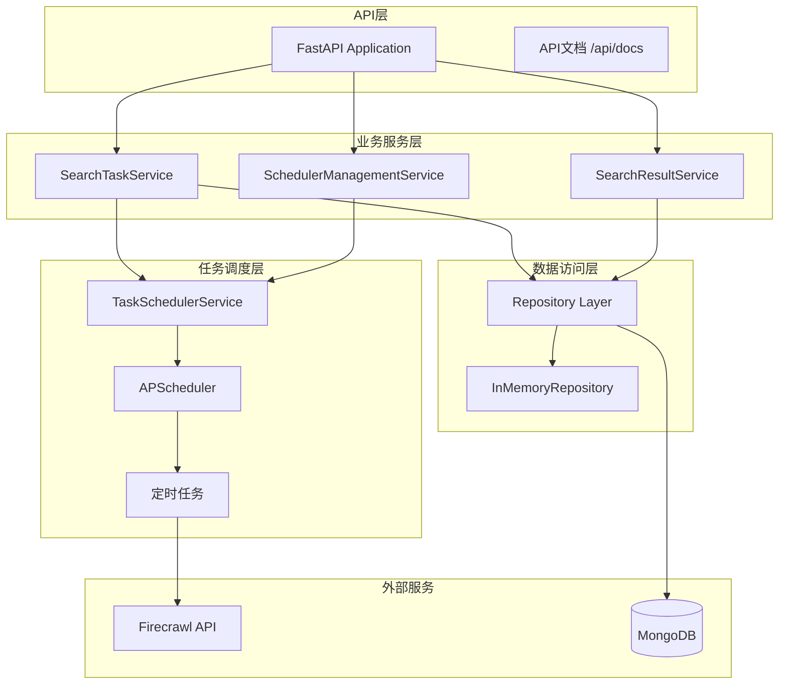

# 关山智能系统 - 定时搜索任务平台 (Guanshan Intelligence System)

[](https://www.python.org/downloads/)
[](https://fastapi.tiangolo.com/)
[](https://www.mongodb.com/)
[](https://apscheduler.readthedocs.io/)

基于 **Firecrawl + 定时任务调度** 的智能信息采集与处理平台

## 🎯 系统概述

关山智能系统是基于Firecrawl + LLM + RAG Pipeline的智能信息采集与处理平台，核心功能是**定时搜索任务管理系统**。

### 核心特性

- ⏰ **定时搜索任务**: 支持多种调度间隔的自动化搜索
- 🔍 **智能搜索引擎**: 基于Firecrawl的网页内容爬取
- 📅 **任务调度器**: APScheduler驱动的高性能任务管理
- 🛡️ **安全设计**: 雪花算法ID，防枚举攻击
- 🏗️ **模块化架构**: 业务逻辑与技术实现解耦
- 🚀 **异步高性能**: 基于FastAPI异步框架
- 📊 **灵活存储**: MongoDB支持，内存仓储备用

## 📚 文档结构

| 文档类型 | 文档 | 描述 |
|---------|------|------|
| **快速开始** | [完整启动指南](STARTUP_GUIDE.md) | 统一的项目启动和配置指南 |
| **系统概述** | [系统架构文档](docs/SYSTEM_ARCHITECTURE.md) | 完整的系统架构设计与技术规范 |
| **开发文档** | [API使用指南](docs/API_GUIDE.md) | 完整的API使用示例与工作流程 |
| | [文档中心](docs/README.md) | 所有技术文档的导航索引 |

## 🚀 快速开始

> 详细的启动指南请参考: [STARTUP_GUIDE.md](STARTUP_GUIDE.md)

### 环境要求

- Python 3.13+
- 8GB+ RAM
- MongoDB (可选，有内存备用)
- Firecrawl API Key

### 安装步骤

1. **克隆项目**
```bash
git clone <repository-url>
cd guanshanPython
```

2. **安装Python依赖**
```bash
python -m venv venv
source venv/bin/activate  # Linux/Mac
# venv\Scripts\activate  # Windows
pip install -r requirements.txt
```

3. **配置环境变量**
```bash
cp .env.example .env
# 编辑 .env 文件，配置Firecrawl API密钥
```

4. **运行应用**
```bash
python -m uvicorn src.main:app --reload --host 0.0.0.0 --port 8000
```

5. **访问服务**
- **API文档**: http://localhost:8000/api/docs
- **健康检查**: http://localhost:8000/health
- **调度器状态**: http://localhost:8000/api/v1/scheduler/status

## 🏗️ 技术架构

### 核心技术栈

- **Web框架**: FastAPI (异步、高性能)
- **任务调度**: APScheduler (AsyncIOScheduler)
- **数据存储**: MongoDB (主数据存储) + InMemory (备用)
- **搜索服务**: Firecrawl API
- **开发语言**: Python 3.13

### 系统架构



## 🔧 主要功能

### 定时搜索任务系统

1. **创建搜索任务**
```bash
curl -X POST "http://localhost:8000/api/v1/search-tasks" \
  -H "Content-Type: application/json" \
  -d '{
    "name": "AI技术动态监控",
    "query": "人工智能 机器学习 深度学习",
    "search_config": {
      "limit": 20,
      "sources": ["web", "news"],
      "language": "zh"
    },
    "schedule_interval": "DAILY",
    "is_active": true
  }'
```

2. **查看任务状态**
```bash
curl "http://localhost:8000/api/v1/scheduler/status"
```

3. **手动执行任务**
```bash
curl -X POST "http://localhost:8000/api/v1/scheduler/tasks/{task_id}/execute"
```

### 调度间隔选项

- `HOURLY_1`: 每小时执行
- `HOURLY_6`: 每6小时执行
- `HOURLY_12`: 每12小时执行
- `DAILY`: 每天执行
- `DAYS_3`: 每3天执行
- `WEEKLY`: 每周执行

### 项目结构

```
guanshanPython/
├── src/                      # 源代码
│   ├── api/v1/              # API接口层
│   ├── core/domain/         # 核心业务层
│   ├── services/            # 业务服务层
│   └── infrastructure/      # 基础设施层
├── docs/                    # 文档目录
├── demand/                  # 需求文档
└── requirements.txt         # 项目依赖
```

## 📊 监控与运维

- **健康检查**: `GET /health`
- **调度器状态**: `GET /api/v1/scheduler/status`
- **任务监控**: `GET /api/v1/scheduler/running-tasks`
- **API文档**: http://localhost:8000/api/docs

## 🔧 配置说明

### 环境变量

```bash
# .env 文件示例
FIRECRAWL_API_KEY=your_firecrawl_api_key
MONGODB_URL=mongodb://localhost:27017/guanshan_db  # 可选
DEBUG=true
LOG_LEVEL=INFO
```

### 搜索配置选项

- **limit**: 搜索结果数量限制 (1-100)
- **sources**: 搜索来源 ["web", "news"]
- **language**: 语言选择 (zh, en, ja, es, fr, de, it, pt)
- **time_range**: 时间范围 (day, week, month)
- **include_domains**: 包含域名列表
- **exclude_domains**: 排除域名列表

## 🎯 项目特点

**完整的功能实现**: 任务管理、调度执行、结果查询  
**安全的设计**: 雪花算法ID、输入验证、资源限制  
**高性能架构**: 异步调度、内存存储、连接管理  
**良好的扩展性**: 接口化设计、多层配置、适配器模式  
**运维友好**: 健康检查、状态监控、错误处理

---

© 2025 关山智能系统. 持续迭代优化中.