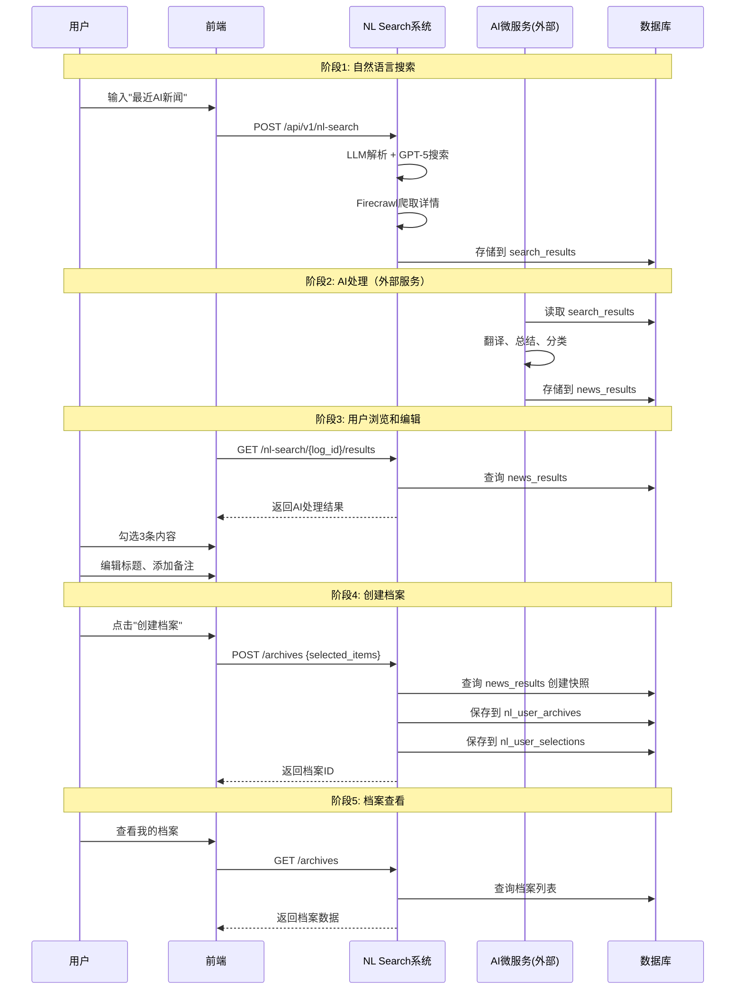

# 🗂️ 自然语言搜索档案系统 - 技术设计文档

**文档版本**: v1.0.0
**创建日期**: 2025-11-17
**设计人员**: Claude (Backend Architect + Ultrathink Mode)
**需求来源**: 用户需求 + `claudedocs/新功能.md`

---

## 📋 执行摘要

本文档描述了自然语言搜索系统的**用户档案功能**技术设计，允许用户从AI处理好的搜索结果中勾选、编辑并创建个人知识档案。

**核心功能**:
- ✅ 用户从 news_results 中勾选感兴趣的内容
- ✅ 用户可编辑标题、摘要并添加备注
- ✅ 创建档案保存用户精选内容
- ✅ 档案管理（查询、更新、删除）
- ✅ 快照存储防止源数据删除影响

**系统边界**:
- ✅ **本系统负责**: 档案创建、存储、查询功能
- ❌ **外部AI微服务负责**: news_results 数据的AI筛选和处理逻辑（不在本系统范围）

---

## 🎯 需求理解

### 业务流程（完整5阶段）



### 系统职责边界

**本系统（NL Search + 档案系统）职责**:
1. ✅ 自然语言搜索功能（已实现）
2. ✅ 提供 news_results 数据给前端展示
3. ✅ 接收用户"创建档案"请求
4. ✅ 存储档案数据（档案表 + 档案条目表）
5. ✅ 提供档案管理API（查询、更新、删除）
6. ✅ 创建数据快照防止源数据删除

**外部AI微服务职责（不在本系统范围）**:
- ❌ 从 news_results 中筛选符合条件的数据
- ❌ AI翻译、总结、分类逻辑
- ❌ 数据推荐算法

---

## 🏗️ 架构设计

### 数据流架构

```
用户自然语言查询
    ↓
NL Search系统（LLM + GPT-5 + Firecrawl）
    ↓
search_results（原始数据，MongoDB）
    ↓
AI微服务处理（外部系统，不在本系统范围）
    ↓
news_results（AI处理结果，MongoDB ProcessedResult）
    ↓
前端展示给用户
    ↓
用户勾选、编辑、点击"创建档案"
    ↓
NL Search系统 - 档案功能
    ├─ 查询 news_results 创建快照
    ├─ 保存到 nl_user_archives（档案表，MariaDB）
    └─ 保存到 nl_user_selections（档案条目表，MariaDB）
    ↓
用户查看档案
```

### 三层数据架构

| 数据层 | 集合/表名 | 数据库 | 用途 | 系统职责 |
|-------|----------|--------|------|---------|
| **原始层** | `search_results` | MongoDB | 爬取的原始数据 | NL Search系统 |
| **AI处理层** | `news_results` (ProcessedResult) | MongoDB | AI翻译、总结、分类后的数据 | 外部AI微服务 |
| **用户档案层** | `nl_user_archives`<br/>`nl_user_selections` | MariaDB | 用户精选并编辑的档案 | NL Search系统 |

---

## 💾 数据库设计

### 表结构设计（双表方案）

#### 表1: nl_user_archives（档案主表）

**用途**: 存储用户创建的档案元数据

```sql
CREATE TABLE IF NOT EXISTS nl_user_archives (
  -- 主键
  id BIGINT AUTO_INCREMENT PRIMARY KEY COMMENT '档案ID',

  -- 用户信息
  user_id BIGINT NOT NULL COMMENT '用户ID',

  -- 档案元数据
  archive_name VARCHAR(255) NOT NULL COMMENT '档案名称（用户自定义）',
  description TEXT NULL COMMENT '档案描述',
  tags JSON NULL COMMENT '档案标签（数组）',

  -- 关联搜索记录（可选）
  search_log_id BIGINT NULL COMMENT '关联的NL搜索记录ID',

  -- 统计信息
  items_count INT DEFAULT 0 COMMENT '档案包含的条目数量',

  -- 时间戳
  created_at DATETIME DEFAULT CURRENT_TIMESTAMP COMMENT '创建时间',
  updated_at DATETIME DEFAULT CURRENT_TIMESTAMP ON UPDATE CURRENT_TIMESTAMP COMMENT '更新时间',

  -- 索引
  INDEX idx_user_id (user_id),
  INDEX idx_search_log_id (search_log_id),
  INDEX idx_created_at (created_at DESC),

  -- 外键（可选，根据nl_search_logs表是否有user_id）
  FOREIGN KEY (search_log_id) REFERENCES nl_search_logs(id) ON DELETE SET NULL

) ENGINE=InnoDB DEFAULT CHARSET=utf8mb4 COLLATE=utf8mb4_unicode_ci
COMMENT='用户档案主表（个人知识库）';
```

**字段说明**:
- `archive_name`: 用户给档案起的名字，如"2025年AI技术突破汇总"
- `tags`: JSON数组，如 `["AI", "技术", "2025"]`
- `search_log_id`: 可选关联，记录档案来源于哪次搜索
- `items_count`: 冗余字段，便于快速展示档案包含多少条内容

---

#### 表2: nl_user_selections（档案条目表）

**用途**: 存储档案中的具体内容条目

```sql
CREATE TABLE IF NOT EXISTS nl_user_selections (
  -- 主键
  id BIGINT AUTO_INCREMENT PRIMARY KEY COMMENT '条目ID',

  -- 关联档案
  archive_id BIGINT NOT NULL COMMENT '所属档案ID',
  user_id BIGINT NOT NULL COMMENT '用户ID（冗余，便于查询）',

  -- 引用数据
  news_result_id VARCHAR(255) NOT NULL COMMENT '引用的news_results记录ID（MongoDB）',

  -- 用户编辑字段（优先展示）
  edited_title VARCHAR(500) NULL COMMENT '用户编辑的标题',
  edited_summary TEXT NULL COMMENT '用户编辑的摘要',
  user_notes TEXT NULL COMMENT '用户备注',
  user_rating INT NULL COMMENT '用户评分（1-5）',

  -- 快照字段（防止源数据删除）
  snapshot_data JSON NOT NULL COMMENT '完整快照（JSON格式）',
  -- snapshot_data 结构示例：
  -- {
  --   "original_title": "GPT-5 Released",
  --   "original_content": "OpenAI发布GPT-5...",
  --   "category": {"大类": "科技", "类别": "AI", "地域": "全球"},
  --   "published_at": "2025-11-15T10:00:00Z",
  --   "source": "techcrunch.com",
  --   "media_urls": ["https://..."]
  -- }

  -- 展示控制
  display_order INT DEFAULT 0 COMMENT '在档案中的排序（用户可调整）',

  -- 时间戳
  created_at DATETIME DEFAULT CURRENT_TIMESTAMP COMMENT '添加到档案的时间',

  -- 索引
  INDEX idx_archive_id (archive_id),
  INDEX idx_user_id (user_id),
  INDEX idx_news_result_id (news_result_id),
  INDEX idx_created_at (created_at DESC),

  -- 外键
  FOREIGN KEY (archive_id) REFERENCES nl_user_archives(id) ON DELETE CASCADE

) ENGINE=InnoDB DEFAULT CHARSET=utf8mb4 COLLATE=utf8mb4_unicode_ci
COMMENT='档案条目表（用户精选内容）';
```

**字段说明**:
- `news_result_id`: MongoDB中news_results的_id（字符串类型，雪花ID）
- `edited_*`: 用户编辑的内容，如果为NULL则使用快照中的原始内容
- `snapshot_data`: 完整JSON快照，包含所有关键信息，防止源数据被删除
- `display_order`: 用户可以调整档案中条目的顺序

**数据展示优先级**:
```
前端展示逻辑：
1. 标题：edited_title ??snapshot_data.original_title ?? 原始数据
2. 摘要：edited_summary ?? snapshot_data.original_content（截断）
3. 备注：user_notes
4. 评分：user_rating
```

---

### 数据库DDL脚本

**文件**: `scripts/create_nl_archive_tables.sql`

```sql
-- ===================================================================
-- NL Search 档案系统数据表创建脚本
-- ===================================================================
-- 版本: v1.0.0
-- 日期: 2025-11-17
-- 说明: 创建用户档案功能所需的数据表
-- ===================================================================

-- 1. 创建档案主表
CREATE TABLE IF NOT EXISTS nl_user_archives (
  id BIGINT AUTO_INCREMENT PRIMARY KEY COMMENT '档案ID',
  user_id BIGINT NOT NULL COMMENT '用户ID',
  archive_name VARCHAR(255) NOT NULL COMMENT '档案名称',
  description TEXT NULL COMMENT '档案描述',
  tags JSON NULL COMMENT '档案标签',
  search_log_id BIGINT NULL COMMENT '关联搜索记录ID',
  items_count INT DEFAULT 0 COMMENT '条目数量',
  created_at DATETIME DEFAULT CURRENT_TIMESTAMP COMMENT '创建时间',
  updated_at DATETIME DEFAULT CURRENT_TIMESTAMP ON UPDATE CURRENT_TIMESTAMP COMMENT '更新时间',

  INDEX idx_user_id (user_id),
  INDEX idx_search_log_id (search_log_id),
  INDEX idx_created_at (created_at DESC),

  FOREIGN KEY (search_log_id) REFERENCES nl_search_logs(id) ON DELETE SET NULL
) ENGINE=InnoDB DEFAULT CHARSET=utf8mb4 COLLATE=utf8mb4_unicode_ci
COMMENT='用户档案主表';

-- 2. 创建档案条目表
CREATE TABLE IF NOT EXISTS nl_user_selections (
  id BIGINT AUTO_INCREMENT PRIMARY KEY COMMENT '条目ID',
  archive_id BIGINT NOT NULL COMMENT '所属档案ID',
  user_id BIGINT NOT NULL COMMENT '用户ID',
  news_result_id VARCHAR(255) NOT NULL COMMENT '引用news_results ID',
  edited_title VARCHAR(500) NULL COMMENT '用户编辑标题',
  edited_summary TEXT NULL COMMENT '用户编辑摘要',
  user_notes TEXT NULL COMMENT '用户备注',
  user_rating INT NULL COMMENT '用户评分(1-5)',
  snapshot_data JSON NOT NULL COMMENT '完整快照',
  display_order INT DEFAULT 0 COMMENT '排序',
  created_at DATETIME DEFAULT CURRENT_TIMESTAMP COMMENT '创建时间',

  INDEX idx_archive_id (archive_id),
  INDEX idx_user_id (user_id),
  INDEX idx_news_result_id (news_result_id),
  INDEX idx_created_at (created_at DESC),

  FOREIGN KEY (archive_id) REFERENCES nl_user_archives(id) ON DELETE CASCADE
) ENGINE=InnoDB DEFAULT CHARSET=utf8mb4 COLLATE=utf8mb4_unicode_ci
COMMENT='档案条目表';

-- 3. 验证表创建
SHOW TABLES LIKE 'nl_user_%';

-- 4. 查看表结构
DESC nl_user_archives;
DESC nl_user_selections;

-- ===================================================================
-- 完成
-- ===================================================================
```

---

## 🎨 实体层设计

### NLUserArchive 实体

**文件**: `src/core/domain/entities/nl_search/nl_user_archive.py`

```python
"""
用户档案实体
"""
from datetime import datetime
from typing import Optional, List
from pydantic import BaseModel, Field


class NLUserArchive(BaseModel):
    """用户档案实体

    代表用户创建的一个知识档案，包含多条精选内容。

    Attributes:
        id: 档案ID
        user_id: 用户ID
        archive_name: 档案名称（用户自定义）
        description: 档案描述
        tags: 档案标签列表
        search_log_id: 关联的搜索记录ID（可选）
        items_count: 档案包含的条目数量
        created_at: 创建时间
        updated_at: 更新时间

    Example:
        >>> archive = NLUserArchive(
        ...     user_id=1001,
        ...     archive_name="2025年AI技术突破",
        ...     description="收集整理的AI领域重要进展",
        ...     tags=["AI", "技术", "2025"]
        ... )
    """

    id: Optional[int] = Field(None, description="档案ID")
    user_id: int = Field(..., description="用户ID")
    archive_name: str = Field(
        ...,
        description="档案名称",
        min_length=1,
        max_length=255
    )
    description: Optional[str] = Field(None, description="档案描述")
    tags: List[str] = Field(default_factory=list, description="档案标签")
    search_log_id: Optional[int] = Field(None, description="关联搜索记录ID")
    items_count: int = Field(0, description="档案条目数量")
    created_at: Optional[datetime] = Field(None, description="创建时间")
    updated_at: Optional[datetime] = Field(None, description="更新时间")

    class Config:
        from_attributes = True
        json_schema_extra = {
            "example": {
                "id": 12345,
                "user_id": 1001,
                "archive_name": "2025年AI技术突破",
                "description": "收集整理的AI领域重要进展",
                "tags": ["AI", "技术", "2025"],
                "search_log_id": 5678,
                "items_count": 5,
                "created_at": "2025-11-17T14:00:00",
                "updated_at": "2025-11-17T14:05:00"
            }
        }
```

---

### NLUserSelection 实体

**文件**: `src/core/domain/entities/nl_search/nl_user_selection.py`

```python
"""
档案条目实体
"""
from datetime import datetime
from typing import Optional, Dict, Any
from pydantic import BaseModel, Field


class NLUserSelection(BaseModel):
    """档案条目实体

    代表档案中的一条具体内容。

    Attributes:
        id: 条目ID
        archive_id: 所属档案ID
        user_id: 用户ID
        news_result_id: 引用的news_results记录ID
        edited_title: 用户编辑的标题
        edited_summary: 用户编辑的摘要
        user_notes: 用户备注
        user_rating: 用户评分(1-5)
        snapshot_data: 完整快照数据
        display_order: 在档案中的排序
        created_at: 创建时间

    Example:
        >>> selection = NLUserSelection(
        ...     archive_id=12345,
        ...     user_id=1001,
        ...     news_result_id="processed_243583606510436353",
        ...     edited_title="GPT-5发布（重要）",
        ...     user_notes="下周会议讨论",
        ...     snapshot_data={"original_title": "GPT-5 Released", ...}
        ... )
    """

    id: Optional[int] = Field(None, description="条目ID")
    archive_id: int = Field(..., description="所属档案ID")
    user_id: int = Field(..., description="用户ID")
    news_result_id: str = Field(..., description="引用的news_results ID")

    # 用户编辑字段
    edited_title: Optional[str] = Field(None, description="用户编辑的标题", max_length=500)
    edited_summary: Optional[str] = Field(None, description="用户编辑的摘要")
    user_notes: Optional[str] = Field(None, description="用户备注")
    user_rating: Optional[int] = Field(None, description="用户评分(1-5)", ge=1, le=5)

    # 快照数据
    snapshot_data: Dict[str, Any] = Field(..., description="完整快照数据")

    # 展示控制
    display_order: int = Field(0, description="在档案中的排序")

    # 时间戳
    created_at: Optional[datetime] = Field(None, description="创建时间")

    class Config:
        from_attributes = True
        json_schema_extra = {
            "example": {
                "id": 11111,
                "archive_id": 12345,
                "user_id": 1001,
                "news_result_id": "processed_243583606510436353",
                "edited_title": "GPT-5发布（重要）",
                "edited_summary": "重点关注多模态能力",
                "user_notes": "下周会议讨论",
                "user_rating": 5,
                "snapshot_data": {
                    "original_title": "GPT-5 Released with Multimodal Capabilities",
                    "original_content": "OpenAI announced...",
                    "category": {"大类": "科技", "类别": "AI", "地域": "全球"},
                    "published_at": "2025-11-15T10:00:00Z",
                    "source": "techcrunch.com",
                    "media_urls": ["https://example.com/image.jpg"]
                },
                "display_order": 1,
                "created_at": "2025-11-17T14:00:00"
            }
        }
```

---

## 🗄️ 仓储层设计

### NLUserArchiveRepository

**文件**: `src/infrastructure/database/nl_user_archive_repositories.py`

```python
"""
用户档案仓储
"""
from typing import List, Optional
from sqlalchemy import text
from sqlalchemy.ext.asyncio import AsyncSession

from src.core.domain.entities.nl_search.nl_user_archive import NLUserArchive
from src.infrastructure.database.connection import get_mariadb_session
from src.utils.logger import get_logger

logger = get_logger(__name__)


class NLUserArchiveRepository:
    """用户档案仓储"""

    def __init__(self, session: Optional[AsyncSession] = None):
        self._session = session

    async def _get_session(self) -> AsyncSession:
        if self._session is None:
            return await get_mariadb_session()
        return self._session

    async def create(
        self,
        user_id: int,
        archive_name: str,
        description: Optional[str] = None,
        tags: Optional[List[str]] = None,
        search_log_id: Optional[int] = None
    ) -> Optional[int]:
        """创建档案

        Args:
            user_id: 用户ID
            archive_name: 档案名称
            description: 档案描述
            tags: 档案标签列表
            search_log_id: 关联搜索记录ID

        Returns:
            Optional[int]: 创建的档案ID，失败返回None
        """
        try:
            session = await self._get_session()

            import json
            tags_json = json.dumps(tags) if tags else None

            query = text("""
                INSERT INTO nl_user_archives (
                    user_id, archive_name, description, tags,
                    search_log_id, created_at
                ) VALUES (
                    :user_id, :archive_name, :description, :tags,
                    :search_log_id, NOW()
                )
            """)

            result = await session.execute(query, {
                "user_id": user_id,
                "archive_name": archive_name,
                "description": description,
                "tags": tags_json,
                "search_log_id": search_log_id
            })
            await session.commit()

            archive_id = result.lastrowid
            logger.info(f"创建档案成功: archive_id={archive_id}, name='{archive_name}'")
            return archive_id

        except Exception as e:
            logger.error(f"创建档案失败: {e}", exc_info=True)
            return None

    async def get_by_id(self, archive_id: int) -> Optional[NLUserArchive]:
        """根据ID获取档案"""
        session = await self._get_session()

        try:
            query = text("""
                SELECT
                    id, user_id, archive_name, description, tags,
                    search_log_id, items_count, created_at, updated_at
                FROM nl_user_archives
                WHERE id = :archive_id
            """)

            result = await session.execute(query, {"archive_id": archive_id})
            row = result.fetchone()

            if not row:
                return None

            import json
            tags = json.loads(row.tags) if row.tags else []

            return NLUserArchive(
                id=row.id,
                user_id=row.user_id,
                archive_name=row.archive_name,
                description=row.description,
                tags=tags,
                search_log_id=row.search_log_id,
                items_count=row.items_count,
                created_at=row.created_at,
                updated_at=row.updated_at
            )

        except Exception as e:
            logger.error(f"查询档案失败: {e}", exc_info=True)
            raise

    async def get_by_user_id(
        self,
        user_id: int,
        limit: int = 20,
        offset: int = 0
    ) -> List[NLUserArchive]:
        """获取用户的所有档案"""
        session = await self._get_session()

        try:
            query = text("""
                SELECT
                    id, user_id, archive_name, description, tags,
                    search_log_id, items_count, created_at, updated_at
                FROM nl_user_archives
                WHERE user_id = :user_id
                ORDER BY created_at DESC
                LIMIT :limit OFFSET :offset
            """)

            result = await session.execute(query, {
                "user_id": user_id,
                "limit": limit,
                "offset": offset
            })
            rows = result.fetchall()

            import json
            archives = []
            for row in rows:
                tags = json.loads(row.tags) if row.tags else []
                archives.append(NLUserArchive(
                    id=row.id,
                    user_id=row.user_id,
                    archive_name=row.archive_name,
                    description=row.description,
                    tags=tags,
                    search_log_id=row.search_log_id,
                    items_count=row.items_count,
                    created_at=row.created_at,
                    updated_at=row.updated_at
                ))

            return archives

        except Exception as e:
            logger.error(f"查询用户档案列表失败: {e}", exc_info=True)
            raise

    async def update_items_count(self, archive_id: int, items_count: int) -> bool:
        """更新档案条目数量"""
        try:
            session = await self._get_session()

            query = text("""
                UPDATE nl_user_archives
                SET items_count = :items_count, updated_at = NOW()
                WHERE id = :archive_id
            """)

            result = await session.execute(query, {
                "archive_id": archive_id,
                "items_count": items_count
            })
            await session.commit()

            return result.rowcount > 0

        except Exception as e:
            logger.error(f"更新档案条目数量失败: {e}", exc_info=True)
            return False

    async def delete(self, archive_id: int) -> bool:
        """删除档案（级联删除所有条目）"""
        try:
            session = await self._get_session()

            query = text("DELETE FROM nl_user_archives WHERE id = :archive_id")
            result = await session.execute(query, {"archive_id": archive_id})
            await session.commit()

            success = result.rowcount > 0
            if success:
                logger.info(f"删除档案成功: archive_id={archive_id}")
            return success

        except Exception as e:
            logger.error(f"删除档案失败: {e}", exc_info=True)
            raise
```

---

### NLUserSelectionRepository

**文件**: `src/infrastructure/database/nl_user_selection_repositories.py`

```python
"""
档案条目仓储
"""
from typing import List, Optional, Dict, Any
from sqlalchemy import text
from sqlalchemy.ext.asyncio import AsyncSession

from src.core.domain.entities.nl_search.nl_user_selection import NLUserSelection
from src.infrastructure.database.connection import get_mariadb_session
from src.utils.logger import get_logger

logger = get_logger(__name__)


class NLUserSelectionRepository:
    """档案条目仓储"""

    def __init__(self, session: Optional[AsyncSession] = None):
        self._session = session

    async def _get_session(self) -> AsyncSession:
        if self._session is None:
            return await get_mariadb_session()
        return self._session

    async def create(
        self,
        archive_id: int,
        user_id: int,
        news_result_id: str,
        snapshot_data: Dict[str, Any],
        edited_title: Optional[str] = None,
        edited_summary: Optional[str] = None,
        user_notes: Optional[str] = None,
        user_rating: Optional[int] = None,
        display_order: int = 0
    ) -> Optional[int]:
        """创建档案条目

        Args:
            archive_id: 档案ID
            user_id: 用户ID
            news_result_id: 引用的news_results ID
            snapshot_data: 快照数据（必需）
            edited_title: 用户编辑的标题
            edited_summary: 用户编辑的摘要
            user_notes: 用户备注
            user_rating: 用户评分
            display_order: 排序

        Returns:
            Optional[int]: 创建的条目ID，失败返回None
        """
        try:
            session = await self._get_session()

            import json
            snapshot_json = json.dumps(snapshot_data)

            query = text("""
                INSERT INTO nl_user_selections (
                    archive_id, user_id, news_result_id,
                    edited_title, edited_summary, user_notes, user_rating,
                    snapshot_data, display_order, created_at
                ) VALUES (
                    :archive_id, :user_id, :news_result_id,
                    :edited_title, :edited_summary, :user_notes, :user_rating,
                    :snapshot_data, :display_order, NOW()
                )
            """)

            result = await session.execute(query, {
                "archive_id": archive_id,
                "user_id": user_id,
                "news_result_id": news_result_id,
                "edited_title": edited_title,
                "edited_summary": edited_summary,
                "user_notes": user_notes,
                "user_rating": user_rating,
                "snapshot_data": snapshot_json,
                "display_order": display_order
            })
            await session.commit()

            selection_id = result.lastrowid
            logger.info(
                f"创建档案条目成功: selection_id={selection_id}, "
                f"archive={archive_id}, news_result={news_result_id}"
            )
            return selection_id

        except Exception as e:
            logger.error(f"创建档案条目失败: {e}", exc_info=True)
            return None

    async def batch_create(
        self,
        selections: List[Dict[str, Any]]
    ) -> List[int]:
        """批量创建档案条目

        Args:
            selections: 条目列表，每个元素包含所有必需字段

        Returns:
            List[int]: 创建的条目ID列表
        """
        created_ids = []
        for selection in selections:
            selection_id = await self.create(**selection)
            if selection_id:
                created_ids.append(selection_id)

        return created_ids

    async def get_by_archive_id(self, archive_id: int) -> List[NLUserSelection]:
        """获取档案的所有条目"""
        session = await self._get_session()

        try:
            query = text("""
                SELECT
                    id, archive_id, user_id, news_result_id,
                    edited_title, edited_summary, user_notes, user_rating,
                    snapshot_data, display_order, created_at
                FROM nl_user_selections
                WHERE archive_id = :archive_id
                ORDER BY display_order, created_at
            """)

            result = await session.execute(query, {"archive_id": archive_id})
            rows = result.fetchall()

            import json
            selections = []
            for row in rows:
                snapshot_data = json.loads(row.snapshot_data) if row.snapshot_data else {}

                selections.append(NLUserSelection(
                    id=row.id,
                    archive_id=row.archive_id,
                    user_id=row.user_id,
                    news_result_id=row.news_result_id,
                    edited_title=row.edited_title,
                    edited_summary=row.edited_summary,
                    user_notes=row.user_notes,
                    user_rating=row.user_rating,
                    snapshot_data=snapshot_data,
                    display_order=row.display_order,
                    created_at=row.created_at
                ))

            return selections

        except Exception as e:
            logger.error(f"查询档案条目失败: {e}", exc_info=True)
            raise
```

---

## 🔌 API层设计

### API端点清单

| 方法 | 端点 | 功能 | 优先级 |
|------|------|------|--------|
| POST | `/api/v1/nl-search/archives` | 创建档案 | **P0** |
| GET | `/api/v1/nl-search/archives` | 档案列表 | **P0** |
| GET | `/api/v1/nl-search/archives/{id}` | 档案详情 | **P0** |
| PUT | `/api/v1/nl-search/archives/{id}` | 更新档案 | **P1** |
| DELETE | `/api/v1/nl-search/archives/{id}` | 删除档案 | **P1** |
| GET | `/api/v1/nl-search/{log_id}/results` | 获取AI处理结果 | **P0** |

---

### API详细设计

#### 1. 创建档案

```http
POST /api/v1/nl-search/archives
Content-Type: application/json

Request Body:
{
  "user_id": 1001,
  "archive_name": "2025年AI技术突破",
  "description": "收集整理的AI领域重要进展",
  "tags": ["AI", "技术", "2025"],
  "search_log_id": 12345,
  "selected_items": [
    {
      "news_result_id": "processed_243583606510436353",
      "edited_title": "GPT-5发布（重要）",
      "edited_summary": "重点关注多模态能力",
      "user_notes": "下周会议讨论",
      "user_rating": 5
    },
    {
      "news_result_id": "processed_243583606510436354",
      "user_notes": "参考资料"
    }
  ]
}

Response 200:
{
  "archive_id": 67890,
  "message": "档案创建成功",
  "items_count": 2,
  "created_at": "2025-11-17T14:00:00Z"
}

Response 400:
{
  "error": "参数验证失败",
  "message": "archive_name不能为空"
}

Response 500:
{
  "error": "服务错误",
  "message": "档案创建失败，请稍后重试"
}
```

#### 2. 获取档案列表

```http
GET /api/v1/nl-search/archives?user_id=1001&limit=20&offset=0

Response 200:
{
  "total": 15,
  "archives": [
    {
      "archive_id": 67890,
      "archive_name": "2025年AI技术突破",
      "description": "收集整理的AI领域重要进展",
      "tags": ["AI", "技术", "2025"],
      "search_log_id": 12345,
      "items_count": 5,
      "created_at": "2025-11-17T14:00:00Z",
      "updated_at": "2025-11-17T14:05:00Z"
    }
  ],
  "page": 1,
  "page_size": 20
}
```

#### 3. 获取档案详情

```http
GET /api/v1/nl-search/archives/67890

Response 200:
{
  "archive": {
    "archive_id": 67890,
    "archive_name": "2025年AI技术突破",
    "description": "收集整理的AI领域重要进展",
    "tags": ["AI", "技术", "2025"],
    "search_log_id": 12345,
    "items_count": 2,
    "created_at": "2025-11-17T14:00:00Z",
    "updated_at": "2025-11-17T14:05:00Z"
  },
  "items": [
    {
      "selection_id": 11111,
      "news_result_id": "processed_243583606510436353",
      "edited_title": "GPT-5发布（重要）",
      "edited_summary": "重点关注多模态能力",
      "user_notes": "下周会议讨论",
      "user_rating": 5,
      "snapshot": {
        "original_title": "GPT-5 Released with Multimodal Capabilities",
        "original_content": "OpenAI announced...",
        "category": {"大类": "科技", "类别": "AI", "地域": "全球"},
        "published_at": "2025-11-15T10:00:00Z",
        "source": "techcrunch.com",
        "media_urls": ["https://example.com/image.jpg"]
      },
      "display_order": 1,
      "created_at": "2025-11-17T14:00:00Z"
    }
  ]
}

Response 404:
{
  "error": "档案不存在",
  "message": "未找到档案: archive_id=67890"
}
```

#### 4. 获取AI处理结果（新增端点）

```http
GET /api/v1/nl-search/{log_id}/results

Response 200:
{
  "log_id": 12345,
  "query_text": "最近AI技术突破",
  "results": [
    {
      "news_result_id": "processed_243583606510436353",
      "title": "GPT-5 Released with Multimodal Capabilities",
      "content": "OpenAI announced...",
      "category": {"大类": "科技", "类别": "AI", "地域": "全球"},
      "published_at": "2025-11-15T10:00:00Z",
      "source": "techcrunch.com",
      "media_urls": ["https://example.com/image.jpg"]
    }
  ],
  "total": 10
}

Response 404:
{
  "error": "搜索记录不存在",
  "message": "未找到搜索记录: log_id=12345"
}
```

---

## ⚙️ 服务层设计

### NLSearchService 扩展

**文件**: `src/services/nl_search/nl_search_service.py` (扩展现有服务)

```python
# 在现有 NLSearchService 类中添加以下方法

async def get_news_results(self, log_id: int) -> List[Dict[str, Any]]:
    """获取搜索记录对应的AI处理结果

    Args:
        log_id: 搜索记录ID

    Returns:
        List[Dict]: news_results 数据列表

    Raises:
        ValueError: 搜索记录不存在
    """
    from src.infrastructure.database.processed_result_repositories import (
        ProcessedResultRepository
    )

    # 1. 验证 log_id 存在
    log = await self.repository.get_by_id(log_id)
    if not log:
        raise ValueError(f"搜索记录不存在: log_id={log_id}")

    # 2. 查询 news_results (ProcessedResult)
    # 注意：需要根据实际数据关联关系调整
    # 可能需要通过 task_id 或其他字段关联
    processed_repo = ProcessedResultRepository()

    # TODO: 确认news_results如何关联nl_search_logs
    # 方案1: 如果有nl_search_log_id字段
    # results = await processed_repo.get_by_nl_search_log_id(log_id)

    # 方案2: 如果通过task_id关联
    # results = await processed_repo.get_by_task_id(log.task_id)

    # 临时实现（需要根据实际情况调整）
    results = []  # TODO: 实现实际查询逻辑

    return results


async def create_archive(
    self,
    user_id: int,
    archive_name: str,
    selected_items: List[Dict[str, Any]],
    description: Optional[str] = None,
    tags: Optional[List[str]] = None,
    search_log_id: Optional[int] = None
) -> Dict[str, Any]:
    """创建档案

    Args:
        user_id: 用户ID
        archive_name: 档案名称
        selected_items: 选中的条目列表
        description: 档案描述
        tags: 档案标签
        search_log_id: 关联搜索记录ID

    Returns:
        Dict: {
            "archive_id": int,
            "message": str,
            "items_count": int,
            "created_at": str
        }

    Raises:
        ValueError: 参数验证失败
        Exception: 服务错误
    """
    from src.infrastructure.database.nl_user_archive_repositories import (
        NLUserArchiveRepository
    )
    from src.infrastructure.database.nl_user_selection_repositories import (
        NLUserSelectionRepository
    )
    from src.infrastructure.database.processed_result_repositories import (
        ProcessedResultRepository
    )

    # 1. 创建档案记录
    archive_repo = NLUserArchiveRepository()
    archive_id = await archive_repo.create(
        user_id=user_id,
        archive_name=archive_name,
        description=description,
        tags=tags,
        search_log_id=search_log_id
    )

    if not archive_id:
        raise Exception("档案创建失败")

    # 2. 处理每个选中的条目
    selection_repo = NLUserSelectionRepository()
    processed_repo = ProcessedResultRepository()

    selections_to_create = []
    for index, item in enumerate(selected_items):
        news_result_id = item.get("news_result_id")
        if not news_result_id:
            logger.warning(f"跳过无效条目: {item}")
            continue

        # 2.1 查询 news_results 创建快照
        processed_result = await processed_repo.get_by_id(news_result_id)
        if not processed_result:
            logger.warning(f"news_result不存在: {news_result_id}")
            continue

        # 2.2 创建快照数据
        snapshot_data = {
            "original_title": processed_result.news_results.get("title") if processed_result.news_results else processed_result.title,
            "original_content": processed_result.news_results.get("content") if processed_result.news_results else processed_result.content,
            "category": processed_result.news_results.get("category") if processed_result.news_results else {},
            "published_at": str(processed_result.news_results.get("published_at")) if processed_result.news_results else None,
            "source": processed_result.news_results.get("source") if processed_result.news_results else processed_result.source,
            "media_urls": processed_result.news_results.get("media_urls", []) if processed_result.news_results else []
        }

        # 2.3 准备条目数据
        selections_to_create.append({
            "archive_id": archive_id,
            "user_id": user_id,
            "news_result_id": news_result_id,
            "snapshot_data": snapshot_data,
            "edited_title": item.get("edited_title"),
            "edited_summary": item.get("edited_summary"),
            "user_notes": item.get("user_notes"),
            "user_rating": item.get("user_rating"),
            "display_order": index
        })

    # 3. 批量创建档案条目
    created_ids = await selection_repo.batch_create(selections_to_create)

    # 4. 更新档案条目数量
    await archive_repo.update_items_count(archive_id, len(created_ids))

    logger.info(
        f"档案创建成功: archive_id={archive_id}, "
        f"items={len(created_ids)}/{len(selected_items)}"
    )

    return {
        "archive_id": archive_id,
        "message": "档案创建成功",
        "items_count": len(created_ids),
        "created_at": datetime.utcnow().isoformat()
    }


async def get_user_archives(
    self,
    user_id: int,
    limit: int = 20,
    offset: int = 0
) -> Dict[str, Any]:
    """获取用户档案列表

    Args:
        user_id: 用户ID
        limit: 返回数量
        offset: 偏移量

    Returns:
        Dict: {
            "total": int,
            "archives": List[Dict],
            "page": int,
            "page_size": int
        }
    """
    from src.infrastructure.database.nl_user_archive_repositories import (
        NLUserArchiveRepository
    )

    archive_repo = NLUserArchiveRepository()
    archives = await archive_repo.get_by_user_id(user_id, limit, offset)

    return {
        "total": len(archives),  # TODO: 实现count_by_user_id()
        "archives": [
            {
                "archive_id": archive.id,
                "archive_name": archive.archive_name,
                "description": archive.description,
                "tags": archive.tags,
                "search_log_id": archive.search_log_id,
                "items_count": archive.items_count,
                "created_at": archive.created_at.isoformat() if archive.created_at else None,
                "updated_at": archive.updated_at.isoformat() if archive.updated_at else None
            }
            for archive in archives
        ],
        "page": offset // limit + 1 if limit > 0 else 1,
        "page_size": limit
    }


async def get_archive_detail(self, archive_id: int) -> Dict[str, Any]:
    """获取档案详情（包含所有条目）

    Args:
        archive_id: 档案ID

    Returns:
        Dict: {
            "archive": Dict,
            "items": List[Dict]
        }

    Raises:
        ValueError: 档案不存在
    """
    from src.infrastructure.database.nl_user_archive_repositories import (
        NLUserArchiveRepository
    )
    from src.infrastructure.database.nl_user_selection_repositories import (
        NLUserSelectionRepository
    )

    # 1. 查询档案
    archive_repo = NLUserArchiveRepository()
    archive = await archive_repo.get_by_id(archive_id)

    if not archive:
        raise ValueError(f"档案不存在: archive_id={archive_id}")

    # 2. 查询档案条目
    selection_repo = NLUserSelectionRepository()
    selections = await selection_repo.get_by_archive_id(archive_id)

    # 3. 构建响应
    return {
        "archive": {
            "archive_id": archive.id,
            "archive_name": archive.archive_name,
            "description": archive.description,
            "tags": archive.tags,
            "search_log_id": archive.search_log_id,
            "items_count": archive.items_count,
            "created_at": archive.created_at.isoformat() if archive.created_at else None,
            "updated_at": archive.updated_at.isoformat() if archive.updated_at else None
        },
        "items": [
            {
                "selection_id": selection.id,
                "news_result_id": selection.news_result_id,
                "edited_title": selection.edited_title,
                "edited_summary": selection.edited_summary,
                "user_notes": selection.user_notes,
                "user_rating": selection.user_rating,
                "snapshot": selection.snapshot_data,
                "display_order": selection.display_order,
                "created_at": selection.created_at.isoformat() if selection.created_at else None
            }
            for selection in selections
        ]
    }
```

---

## 📋 实施计划

### Phase 1 - 基础档案功能（3-4天）

**目标**: 实现核心档案创建和查询功能

**任务清单**:
1. ✅ 数据库DDL
   - [ ] 执行 `scripts/create_nl_archive_tables.sql`
   - [ ] 验证表创建和索引

2. ✅ 实体层
   - [ ] 创建 `NLUserArchive` 实体
   - [ ] 创建 `NLUserSelection` 实体
   - [ ] 更新 `__init__.py` 导出

3. ✅ 仓储层
   - [ ] 实现 `NLUserArchiveRepository`
   - [ ] 实现 `NLUserSelectionRepository`
   - [ ] 单元测试（覆盖率>80%）

4. ✅ 服务层
   - [ ] 扩展 `NLSearchService`
   - [ ] 实现 `create_archive()` 方法
   - [ ] 实现 `get_user_archives()` 方法
   - [ ] 实现 `get_archive_detail()` 方法

5. ✅ API层
   - [ ] 实现 `POST /api/v1/nl-search/archives`
   - [ ] 实现 `GET /api/v1/nl-search/archives`
   - [ ] 实现 `GET /api/v1/nl-search/archives/{id}`
   - [ ] API测试（Postman/curl）

**验收标准**:
- ✅ 用户可以创建档案并保存勾选的内容
- ✅ 用户可以查询自己的档案列表
- ✅ 用户可以查看档案详情（包含所有条目）
- ✅ 快照数据正确保存
- ✅ 单元测试通过

---

### Phase 2 - 数据关联和快照优化（2-3天）

**目标**: 完善数据关联和快照创建逻辑

**任务清单**:
1. ✅ news_results 数据读取
   - [ ] 实现 `get_news_results(log_id)` 方法
   - [ ] 验证 news_results 与 nl_search_logs 的关联关系
   - [ ] 实现 `GET /api/v1/nl-search/{log_id}/results` 端点

2. ✅ 快照创建优化
   - [ ] 完善快照数据结构
   - [ ] 处理不同数据源的字段映射
   - [ ] 异常情况处理（news_result不存在等）

3. ✅ 集成测试
   - [ ] 完整流程测试（搜索→AI处理→创建档案→查看）
   - [ ] 边界情况测试（空数据、大量数据等）

**验收标准**:
- ✅ news_results 数据正确关联
- ✅ 快照包含完整信息
- ✅ 源数据删除后档案仍可查看
- ✅ 集成测试通过

---

### Phase 3 - 档案管理功能（2天）

**目标**: 完善档案管理功能

**任务清单**:
1. ✅ 更新和删除
   - [ ] 实现 `PUT /api/v1/nl-search/archives/{id}`
   - [ ] 实现 `DELETE /api/v1/nl-search/archives/{id}`
   - [ ] 级联删除验证

2. ✅ 档案搜索和过滤（可选）
   - [ ] 按标签搜索
   - [ ] 按时间过滤
   - [ ] 按关键词搜索

3. ✅ 性能优化
   - [ ] 数据库查询优化
   - [ ] 批量操作优化

**验收标准**:
- ✅ 档案可以更新和删除
- ✅ 删除档案时条目自动删除
- ✅ 性能测试：创建档案<2秒，查询<500ms

---

### 总工作量估算

| 阶段 | 工作量 | 优先级 |
|------|--------|--------|
| Phase 1 | 3-4天 | **P0** |
| Phase 2 | 2-3天 | **P1** |
| Phase 3 | 2天 | **P2** |
| **总计** | **7-9天** | - |

---

## ⚠️ 风险评估

### 高风险

#### 1. news_results 数据关联不明确 ⚠️⚠️⚠️

**描述**: news_results (ProcessedResult) 可能没有 nl_search_log_id 字段，需要通过其他方式关联。

**影响**: 无法正确查询对应的AI处理结果

**缓解措施**:
- ✅ 优先验证数据库schema，确认关联关系
- ✅ 如果没有直接关联，通过 task_id 或 search_results 间接关联
- ✅ 最坏情况：前端直接传递 news_result_id 列表，不依赖 log_id 查询

---

### 中风险

#### 2. 快照数据结构不一致 ⚠️⚠️

**描述**: news_results.news_results 字段可能为空或结构不完整

**影响**: 快照创建失败或数据不完整

**缓解措施**:
- ✅ 实现健壮的字段映射逻辑
- ✅ 提供默认值处理
- ✅ 记录异常情况日志

---

#### 3. MariaDB连接稳定性 ⚠️⚠️

**描述**: 测试环境MariaDB可能不可用

**影响**: 档案功能无法使用

**缓解措施**:
- ✅ 已有数据库容错机制（Optional返回类型）
- ✅ 优先确保MariaDB环境稳定
- ✅ 提供降级策略（记录日志，稍后重试）

---

### 低风险

#### 4. API性能 ℹ️

**描述**: 批量创建档案条目可能耗时较长

**影响**: API响应时间>2秒

**缓解措施**:
- ✅ 使用批量插入
- ✅ 异步快照创建（可选）
- ✅ 限制单次创建条目数量（如50条）

---

## ✅ 验收标准

### Phase 1 验收

- [ ] 数据库表创建成功（nl_user_archives, nl_user_selections）
- [ ] 实体和仓储层单元测试通过（覆盖率>80%）
- [ ] API `POST /archives` 返回200并正确创建档案
- [ ] API `GET /archives` 返回档案列表
- [ ] API `GET /archives/{id}` 返回档案详情
- [ ] 快照数据正确保存到 snapshot_data 字段

### Phase 2 验收

- [ ] `GET /{log_id}/results` 正确返回 news_results 数据
- [ ] 快照包含完整字段（title, content, category, source等）
- [ ] 删除源 news_results 后档案仍可查看
- [ ] 集成测试通过（搜索→创建档案→查看）

### Phase 3 验收

- [ ] 档案可以更新（PUT /archives/{id}）
- [ ] 档案可以删除（DELETE /archives/{id}）
- [ ] 删除档案时条目自动删除（级联删除）
- [ ] 性能测试：创建档案<2秒，查询档案<500ms
- [ ] E2E测试通过（完整用户流程）

---

## 🔧 集成点总结

### 与现有系统集成

| 集成点 | 现有组件 | 集成方式 | 状态 |
|-------|---------|---------|------|
| **数据读取** | ProcessedResultRepository | 查询 news_results 数据 | 需验证关联关系 |
| **API扩展** | nl_search API Router | 添加新端点 | 直接扩展 |
| **数据库** | MariaDB | 新增表 | 独立表，无冲突 |
| **服务层** | NLSearchService | 扩展方法 | 直接扩展 |

---

## 📚 相关文档

- `claudedocs/新功能.md` - 原始需求描述
- `docs/DATABASE_COLLECTIONS_GUIDE.md` - 数据库集合职责划分
- `src/core/domain/entities/processed_result.py` - ProcessedResult实体定义
- `src/api/v1/endpoints/nl_search.py` - 现有NL Search API
- `src/services/nl_search/nl_search_service.py` - NL Search服务层

---

## 🎯 总结

**核心功能**: 用户从AI处理好的搜索结果中创建个人知识档案

**技术方案**: 双表设计（档案主表 + 档案条目表），快照存储防止数据丢失

**系统边界**: 本系统负责档案管理，AI筛选由外部微服务负责

**实施计划**: 3个阶段，总工作量7-9天

**成功标准**:
- ✅ 用户可以创建和查看档案
- ✅ 用户编辑内容正确保存
- ✅ 快照机制防止数据丢失
- ✅ API性能达标（创建<2秒，查询<500ms）

---

**文档生成时间**: 2025-11-17
**设计模式**: Backend Architect + Ultrathink (Sequential Thinking: 8 thoughts)
**下一步行动**: Phase 1 开发 - 创建数据库表并实现基础功能

