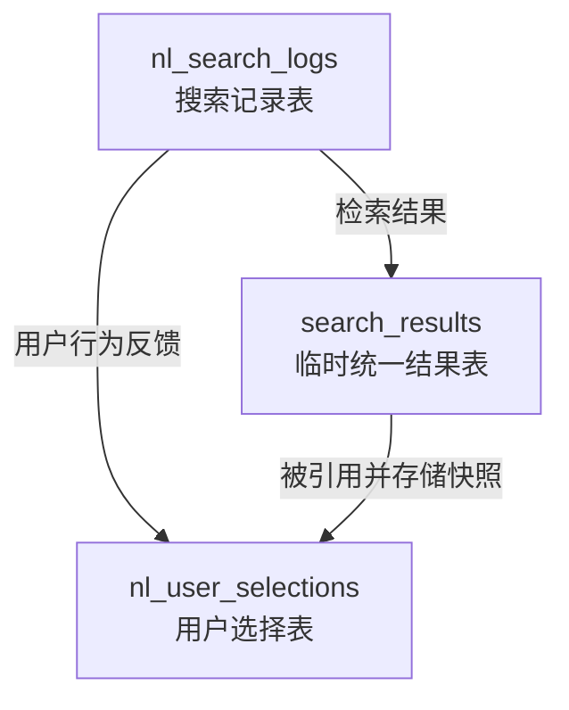

# 🧠 自然语言搜索系统 ER 关系图

本文件描述自然语言搜索系统中主要三张表的关系结构。

---

## 🗂 数据表结构概览

### 1️⃣ `nl_search_logs` — 自然语言搜索记录表
存储每次用户发起的自然语言查询。

| 字段名 | 类型 | 描述 |
|--------|------|------|
| id | BIGINT | 主键，自增 |
| user_id | BIGINT | 用户ID |
| query_text | TEXT | 原始自然语言搜索内容 |
| parsed_query | JSON | 解析后的结构化查询或关键词 |
| result_count | INT | 返回结果数量 |
| created_at | DATETIME | 创建时间 |

---

### 2️⃣ `search_results` — 临时统一结果主表
存储系统检索的所有结果（来源多样，可被清理）。

| 字段名 | 类型 | 描述 |
|--------|------|------|
| id | BIGINT | 主键，自增 |
| source | VARCHAR(255) | 数据来源标识 |
| title | VARCHAR(255) | 标题 |
| summary | TEXT | 简要说明 |
| content | TEXT | 原文或提要内容 |
| score | FLOAT | 匹配分数 |
| metadata | JSON | 附加信息（分类、时间等） |
| created_at | DATETIME | 创建时间 |

> ⚠️ 此表中数据可能被清理，用户行为数据需要在 `nl_user_selections` 表中存储快照副本以避免丢失。

---

### 3️⃣ `nl_user_selections` — 用户选择与快照表
记录用户在搜索结果中的点击、收藏、反馈等行为，并存储快照。

| 字段名 | 类型 | 描述 |
|--------|------|------|
| id | BIGINT | 主键，自增 |
| user_id | BIGINT | 用户ID |
| search_log_id | BIGINT | 对应搜索记录ID |
| result_id | BIGINT | 对应 search_results 的结果ID |
| action_type | ENUM | 用户行为类型（click, collect, like, share, feedback） |
| snapshot_title | VARCHAR(255) | 快照标题 |
| snapshot_summary | TEXT | 快照摘要 |
| snapshot_content | TEXT | 快照正文内容 |
| feedback | TEXT | 用户反馈 |
| created_at | DATETIME | 行为时间 |

---

## 🔗 表关系结构图

---

## 🧩 关系说明

- **nl_search_logs → search_results**：系统根据搜索记录生成候选结果。
- **nl_search_logs → nl_user_selections**：用户基于搜索记录进行交互。
- **search_results → nl_user_selections**：保存用户选择时，将相关内容快照化存储，避免后续数据清理导致丢失。

---

## 🖼 可视化关系图

