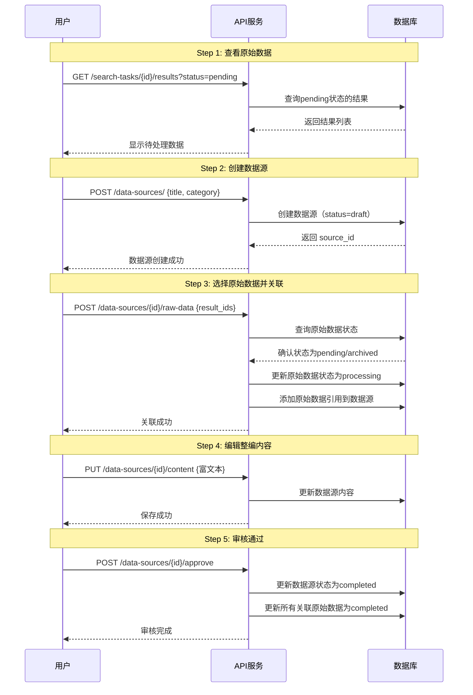
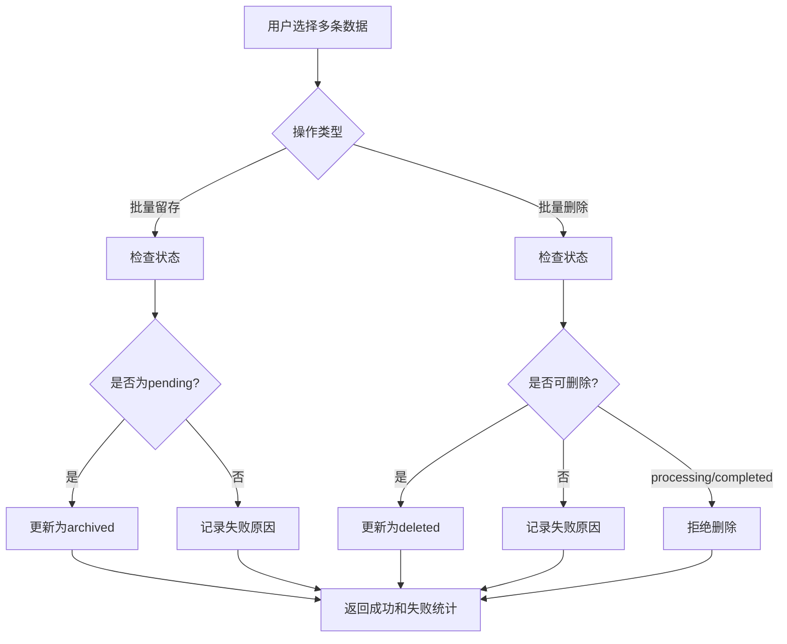
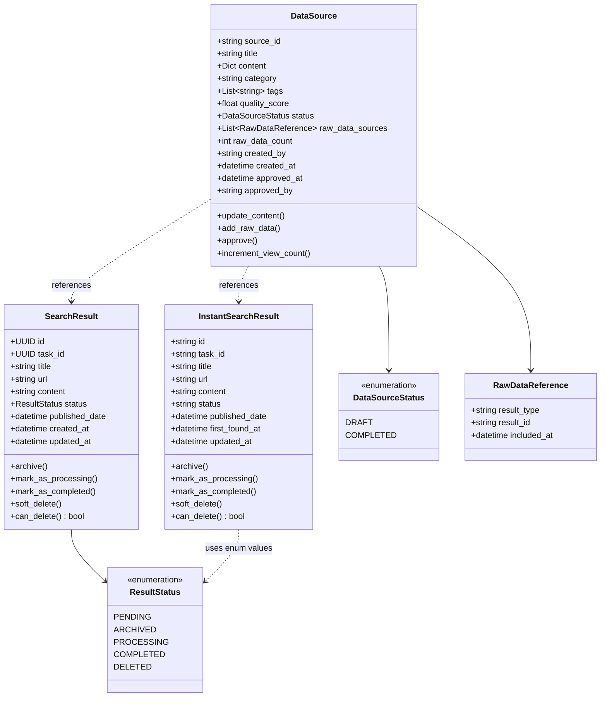
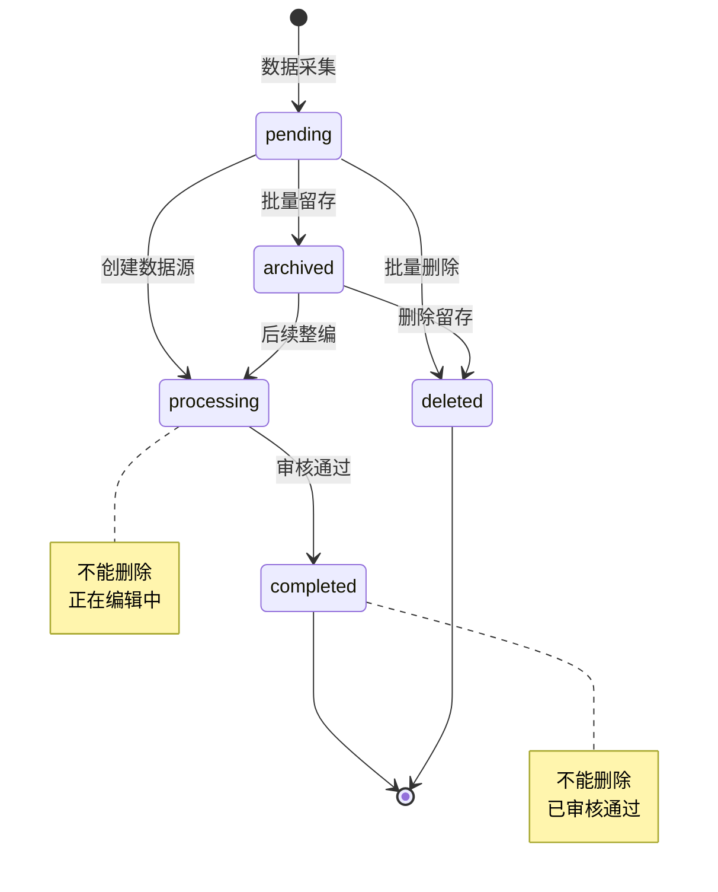

# 数据源状态管理与整编功能 - 技术设计文档

**版本**: v1.0.0
**创建日期**: 2025-10-23
**关联项目**: Summary Report V2.0
**设计目标**: 为原始搜索数据添加生命周期管理，实现数据源整编流程

---

## 📋 目录

1. [需求分析](#1-需求分析)
2. [核心概念](#2-核心概念)
3. [数据库设计](#3-数据库设计)
4. [实体层设计](#4-实体层设计)
5. [API设计](#5-api设计)
6. [业务流程](#6-业务流程)
7. [数据库迁移](#7-数据库迁移)
8. [实施计划](#8-实施计划)
9. [测试策略](#9-测试策略)

---

## 1. 需求分析

### 1.1 背景

当前系统存在以下问题：
1. **数据混乱**：原始搜索结果没有状态管理，无法区分已处理/未处理数据
2. **质量低下**：所有搜索结果直接用于报告生成，未经人工筛选
3. **数据重复**：相同内容可能被多次使用，缺乏整编机制
4. **前端报错风险**：现有数据库数据缺少status字段，查询可能出错

### 1.2 核心需求

#### 需求1：原始数据状态管理

为`search_results`（定时任务结果）和`instant_search_results`（即时搜索结果）添加5种状态：

| 状态 | 英文标识 | 说明 | 初始状态 |
|------|---------|------|---------|
| 待处理 | `pending` | 刚采集的原始数据 | ✅ 是 |
| 已留存 | `archived` | 用户标记为重要，暂不处理 | ❌ |
| 处理中 | `processing` | 已被选中用于整编，正在数据源表中编辑 | ❌ |
| 已完成 | `completed` | 整编完成且审核通过 | ❌ |
| 已删除 | `deleted` | 软删除，保留用于审计 | ❌ |

#### 需求2：数据源整编流程

用户工作流程：
```
1. 查看原始数据列表（pending状态）
   ↓
2. 进入单条数据详情
   ↓
3. 创建/编辑数据源（进入数据源表）
   ↓
4. 选择多条原始数据进行合并整编
   ↓
5. 生成富文本内容 + 分类
   ↓
6. 保存 → 原始数据状态变为 processing
   ↓
7. 审核通过 → 数据源和原始数据状态变为 completed
```

#### 需求3：查询增强

为原始数据查询添加：
- **状态过滤**：支持多状态筛选
- **时间查询**：
  - 发布时间范围（`published_date`）- 可为空
  - 采集时间范围（`created_at`/`first_found_at`）- 必有值
- **批量操作**：
  - 批量留存（pending → archived）
  - 批量删除（pending/archived → deleted）
  - 业务规则：processing/completed状态不能删除

#### 需求4：数据迁移

为避免前端查询出错，必须：
1. 为所有现有`search_results`数据添加`status`字段，默认值`pending`
2. 为所有现有`instant_search_results`数据添加`status`字段，默认值`pending`
3. 添加索引优化查询性能

---

## 2. 核心概念

### 2.1 术语定义

| 术语 | 定义 | 对应表 |
|------|------|--------|
| **原始数据** | 从搜索引擎/爬虫直接获取的未经处理的数据 | `search_results`, `instant_search_results` |
| **数据源** | 经过人工整编、分类的高质量内容，可用于生成报告 | `data_sources` |
| **整编** | 选择多条原始数据，合并、编辑、分类，生成富文本内容 | 用户操作流程 |
| **审核通过** | 数据源内容经过审核，确认质量，可用于报告生成 | 状态流转 |

### 2.2 状态转换图

```
┌─────────┐
│ pending │ ────────────────┐
└────┬────┘                 │
     │                      │
     │ 批量留存              │ 批量删除
     ↓                      │
┌──────────┐                │
│ archived │ ───────────────┤
└────┬─────┘                │
     │                      │
     │ 选择整编              │
     ↓                      ↓
┌────────────┐        ┌─────────┐
│ processing │        │ deleted │
└─────┬──────┘        └─────────┘
      │
      │ 审核通过
      ↓
┌───────────┐
│ completed │
└───────────┘
```

**状态转换规则**：
- ✅ `pending` → `archived` （批量留存）
- ✅ `pending` → `processing` （创建数据源并选择）
- ✅ `pending` → `deleted` （批量删除）
- ✅ `archived` → `processing` （后续选择整编）
- ✅ `archived` → `deleted` （删除留存数据）
- ✅ `processing` → `completed` （审核通过）
- ❌ `processing` → `deleted` （不允许删除）
- ❌ `completed` → `deleted` （不允许删除）

### 2.3 数据流架构

```
┌─────────────────────────────────────────────────────┐
│              原始数据采集层                          │
├─────────────────────┬───────────────────────────────┤
│  定时任务搜索结果    │    即时搜索结果                │
│  (search_results)   │  (instant_search_results)    │
│  status: pending    │   status: pending            │
└──────────┬──────────┴────────────┬──────────────────┘
           │                       │
           │  用户筛选 + 整编      │
           ↓                       ↓
┌──────────────────────────────────────────────────────┐
│                 数据源层                              │
│              (data_sources)                          │
│  • 富文本内容（合并整编）                             │
│  • 分类标签                                          │
│  • 质量评分                                          │
│  • 状态：draft/completed                             │
│  • 关联原始数据ID列表                                 │
└──────────┬───────────────────────────────────────────┘
           │
           │  用户选择数据源
           ↓
┌──────────────────────────────────────────────────────┐
│            智能总结报告层                             │
│         (summary_reports)                            │
│  • 选择多个数据源                                     │
│  • LLM生成总结                                       │
│  • 富文本编辑                                        │
└──────────────────────────────────────────────────────┘
```

---

## 3. 数据库设计

### 3.1 现有表修改

#### 3.1.1 search_results 表

**修改内容**：添加`status`字段

```javascript
{
  "id": "UUID",
  "task_id": "UUID",

  // 核心数据
  "title": "string",
  "url": "string",
  "content": "string",
  "snippet": "string",

  // 元数据
  "source": "string",
  "published_date": "datetime | null",  // 发布时间（可为空）
  "author": "string | null",
  "language": "string | null",

  // Firecrawl 字段
  "markdown_content": "string | null",
  "html_content": "string | null",
  "metadata": "object",

  // 质量指标
  "relevance_score": "float",
  "quality_score": "float",

  // ✨ 新增：状态管理
  "status": "string",  // pending, archived, processing, completed, deleted

  // 时间戳
  "created_at": "datetime",  // 采集时间
  "updated_at": "datetime",
  "processed_at": "datetime | null"
}
```

**索引设计**：
```javascript
// 1. 复合索引：状态 + 任务 + 创建时间（支持分页查询）
db.search_results.createIndex(
  { "status": 1, "task_id": 1, "created_at": -1 }
)

// 2. 发布时间索引（支持时间范围查询）
db.search_results.createIndex({ "published_date": 1 })

// 3. 采集时间索引（支持时间范围查询）
db.search_results.createIndex({ "created_at": 1 })
```

#### 3.1.2 instant_search_results 表

**修改内容**：添加`status`字段

```javascript
{
  "id": "string (雪花ID)",
  "task_id": "string",

  // 核心内容
  "title": "string",
  "url": "string",
  "content": "string",
  "snippet": "string | null",

  // v1.3.0 去重和规范化
  "content_hash": "string",  // MD5(title + url + content)
  "url_normalized": "string",

  // Firecrawl 字段
  "markdown_content": "string | null",
  "html_content": "string | null",

  // 元数据
  "source": "string",
  "published_date": "datetime | null",  // 发布时间（可为空）
  "author": "string | null",
  "language": "string | null",
  "metadata": "object",

  // 质量指标
  "relevance_score": "float",
  "quality_score": "float",

  // v1.3.0 发现统计
  "first_found_at": "datetime",  // 首次发现时间（可作为采集时间）
  "last_found_at": "datetime",
  "found_count": "int",
  "unique_searches": "int",

  // ✨ 新增：状态管理
  "status": "string",  // pending, archived, processing, completed, deleted

  // 时间戳
  "created_at": "datetime",
  "updated_at": "datetime"
}
```

**索引设计**：
```javascript
// 1. 复合索引：状态 + 任务 + 首次发现时间
db.instant_search_results.createIndex(
  { "status": 1, "task_id": 1, "first_found_at": -1 }
)

// 2. 发布时间索引
db.instant_search_results.createIndex({ "published_date": 1 })

// 3. 采集时间索引
db.instant_search_results.createIndex({ "first_found_at": 1 })
```

### 3.2 新增表：data_sources

**数据源表** - 存储经过整编的高质量内容

```javascript
{
  // 主键
  "source_id": "string (雪花ID)",

  // 核心内容
  "title": "string",
  "content": {
    "format": "markdown | html",
    "text": "string",  // 富文本内容
    "manual_edits": "boolean"
  },

  // 分类和标签
  "category": "string",  // 分类（新闻、学术、政策等）
  "tags": ["string"],    // 标签列表

  // 质量管理
  "quality_score": "float",  // 质量评分 (0.0-1.0)
  "status": "string",        // draft, completed

  // 关联原始数据
  "raw_data_sources": [
    {
      "result_type": "search_result | instant_search_result",
      "result_id": "string | UUID",
      "included_at": "datetime"
    }
  ],
  "raw_data_count": "int",

  // 元数据
  "created_by": "string",
  "created_at": "datetime",
  "updated_at": "datetime",
  "approved_at": "datetime | null",
  "approved_by": "string | null",

  // 统计信息
  "view_count": "int",
  "usage_count": "int"  // 被多少报告使用
}
```

**索引设计**：
```javascript
// 1. 状态 + 分类索引
db.data_sources.createIndex({ "status": 1, "category": 1, "created_at": -1 })

// 2. 标签索引（支持标签筛选）
db.data_sources.createIndex({ "tags": 1 })

// 3. 质量评分索引
db.data_sources.createIndex({ "quality_score": -1 })

// 4. 创建者索引
db.data_sources.createIndex({ "created_by": 1, "created_at": -1 })
```

### 3.3 数据关系图

```
┌──────────────────────┐
│   search_results     │
│   (定时任务结果)      │
│                      │
│ • status: pending    │
│ • published_date     │
│ • created_at         │
└──────────┬───────────┘
           │
           │ 1:N (一个结果可属于多个数据源)
           ↓
┌──────────────────────┐
│   data_sources       │
│   (整编后数据源)      │
│                      │
│ • raw_data_sources[] │
│ • status: draft/     │
│   completed          │
└──────────┬───────────┘
           ↑
           │ 1:N
           │
┌──────────┴───────────┐
│instant_search_results│
│  (即时搜索结果)       │
│                      │
│ • status: pending    │
│ • published_date     │
│ • first_found_at     │
└──────────────────────┘
```

---

## 4. 实体层设计

### 4.1 修改 ResultStatus 枚举

**文件**: `src/core/domain/entities/search_result.py`

```python
from enum import Enum

class ResultStatus(Enum):
    """结果状态枚举 - v2.0"""
    PENDING = "pending"         # 待处理（初始状态）
    ARCHIVED = "archived"       # 已留存
    PROCESSING = "processing"   # 处理中（正在整编）
    COMPLETED = "completed"     # 已完成（整编完成并审核通过）
    DELETED = "deleted"         # 已删除（软删除）
```

### 4.2 修改 SearchResult 实体

**修改内容**：
1. 更新`status`字段的枚举类型
2. 添加状态转换方法

```python
@dataclass
class SearchResult:
    """搜索结果实体 - v2.0"""
    id: UUID = field(default_factory=uuid4)
    task_id: UUID = field(default_factory=uuid4)

    # ... 其他字段保持不变 ...

    # 状态管理 - v2.0 更新
    status: ResultStatus = ResultStatus.PENDING
    created_at: datetime = field(default_factory=datetime.utcnow)
    updated_at: datetime = field(default_factory=datetime.utcnow)
    processed_at: Optional[datetime] = None

    def archive(self) -> None:
        """留存"""
        if self.status != ResultStatus.PENDING:
            raise ValueError(f"只能留存pending状态的数据，当前状态: {self.status.value}")
        self.status = ResultStatus.ARCHIVED
        self.updated_at = datetime.utcnow()

    def mark_as_processing(self) -> None:
        """标记为处理中"""
        if self.status not in [ResultStatus.PENDING, ResultStatus.ARCHIVED]:
            raise ValueError(f"只能标记pending或archived状态的数据为处理中，当前状态: {self.status.value}")
        self.status = ResultStatus.PROCESSING
        self.updated_at = datetime.utcnow()

    def mark_as_completed(self) -> None:
        """标记为已完成"""
        if self.status != ResultStatus.PROCESSING:
            raise ValueError(f"只能标记processing状态的数据为已完成，当前状态: {self.status.value}")
        self.status = ResultStatus.COMPLETED
        self.processed_at = datetime.utcnow()
        self.updated_at = datetime.utcnow()

    def soft_delete(self) -> None:
        """软删除"""
        if self.status in [ResultStatus.PROCESSING, ResultStatus.COMPLETED]:
            raise ValueError(f"不能删除{self.status.value}状态的数据")
        self.status = ResultStatus.DELETED
        self.updated_at = datetime.utcnow()

    def can_delete(self) -> bool:
        """检查是否可以删除"""
        return self.status not in [ResultStatus.PROCESSING, ResultStatus.COMPLETED]
```

### 4.3 修改 InstantSearchResult 实体

**文件**: `src/core/domain/entities/instant_search_result.py`

```python
@dataclass
class InstantSearchResult:
    """即时搜索结果实体 - v2.0"""
    id: str = field(default_factory=generate_string_id)
    task_id: str = ""

    # ... 其他字段保持不变 ...

    # ✨ 新增：状态管理
    status: str = "pending"  # pending, archived, processing, completed, deleted

    # 时间戳
    first_found_at: datetime = field(default_factory=datetime.utcnow)
    last_found_at: datetime = field(default_factory=datetime.utcnow)
    created_at: datetime = field(default_factory=datetime.utcnow)
    updated_at: datetime = field(default_factory=datetime.utcnow)

    def archive(self) -> None:
        """留存"""
        if self.status != "pending":
            raise ValueError(f"只能留存pending状态的数据，当前状态: {self.status}")
        self.status = "archived"
        self.updated_at = datetime.utcnow()

    def mark_as_processing(self) -> None:
        """标记为处理中"""
        if self.status not in ["pending", "archived"]:
            raise ValueError(f"只能标记pending或archived状态的数据为处理中，当前状态: {self.status}")
        self.status = "processing"
        self.updated_at = datetime.utcnow()

    def mark_as_completed(self) -> None:
        """标记为已完成"""
        if self.status != "processing":
            raise ValueError(f"只能标记processing状态的数据为已完成，当前状态: {self.status}")
        self.status = "completed"
        self.updated_at = datetime.utcnow()

    def soft_delete(self) -> None:
        """软删除"""
        if self.status in ["processing", "completed"]:
            raise ValueError(f"不能删除{self.status}状态的数据")
        self.status = "deleted"
        self.updated_at = datetime.utcnow()

    def can_delete(self) -> bool:
        """检查是否可以删除"""
        return self.status not in ["processing", "completed"]
```

### 4.4 新增 DataSource 实体

**文件**: `src/core/domain/entities/data_source.py`

```python
"""数据源实体模型"""

from dataclasses import dataclass, field
from datetime import datetime
from enum import Enum
from typing import Optional, Dict, Any, List

from src.infrastructure.id_generator import generate_string_id


class DataSourceStatus(Enum):
    """数据源状态枚举"""
    DRAFT = "draft"           # 草稿
    COMPLETED = "completed"   # 已完成（审核通过）


class RawDataType(Enum):
    """原始数据类型"""
    SEARCH_RESULT = "search_result"               # 定时任务结果
    INSTANT_SEARCH_RESULT = "instant_search_result"  # 即时搜索结果


@dataclass
class RawDataReference:
    """原始数据引用"""
    result_type: str  # "search_result" 或 "instant_search_result"
    result_id: str    # 原始数据ID
    included_at: datetime = field(default_factory=datetime.utcnow)


@dataclass
class DataSource:
    """
    数据源实体

    经过人工整编的高质量内容，用于生成智能总结报告
    """
    # 主键
    source_id: str = field(default_factory=generate_string_id)

    # 核心内容
    title: str = ""
    content: Dict[str, Any] = field(default_factory=lambda: {
        "format": "markdown",
        "text": "",
        "manual_edits": False
    })

    # 分类和标签
    category: str = ""
    tags: List[str] = field(default_factory=list)

    # 质量管理
    quality_score: float = 0.0  # 0.0-1.0
    status: DataSourceStatus = DataSourceStatus.DRAFT

    # 关联原始数据
    raw_data_sources: List[RawDataReference] = field(default_factory=list)
    raw_data_count: int = 0

    # 元数据
    created_by: str = ""
    created_at: datetime = field(default_factory=datetime.utcnow)
    updated_at: datetime = field(default_factory=datetime.utcnow)
    approved_at: Optional[datetime] = None
    approved_by: Optional[str] = None

    # 统计信息
    view_count: int = 0
    usage_count: int = 0

    def update_content(self, content_text: str, content_format: str = "markdown") -> None:
        """更新内容"""
        self.content = {
            "format": content_format,
            "text": content_text,
            "manual_edits": True
        }
        self.updated_at = datetime.utcnow()

    def add_raw_data(self, result_type: str, result_id: str) -> None:
        """添加原始数据引用"""
        ref = RawDataReference(
            result_type=result_type,
            result_id=result_id
        )
        self.raw_data_sources.append(ref)
        self.raw_data_count = len(self.raw_data_sources)
        self.updated_at = datetime.utcnow()

    def approve(self, approved_by: str) -> None:
        """审核通过"""
        if self.status != DataSourceStatus.DRAFT:
            raise ValueError(f"只能审核draft状态的数据源，当前状态: {self.status.value}")

        self.status = DataSourceStatus.COMPLETED
        self.approved_at = datetime.utcnow()
        self.approved_by = approved_by
        self.updated_at = datetime.utcnow()

    def increment_view_count(self) -> None:
        """增加查看次数"""
        self.view_count += 1

    def increment_usage_count(self) -> None:
        """增加使用次数"""
        self.usage_count += 1
```

---

## 5. API设计

### 5.1 查询增强 - 定时任务结果

**端点**: `GET /api/v1/search-tasks/{task_id}/results`

**查询参数**：
```python
class SearchResultsQueryParams(BaseModel):
    # 状态过滤
    status: Optional[List[str]] = Query(
        None,
        description="状态列表: pending, archived, processing, completed, deleted"
    )

    # 时间范围查询
    published_start: Optional[datetime] = Query(None, description="发布时间起始（可为空则忽略）")
    published_end: Optional[datetime] = Query(None, description="发布时间结束")
    crawled_start: Optional[datetime] = Query(None, description="采集时间起始")
    crawled_end: Optional[datetime] = Query(None, description="采集时间结束")

    # 游标分页
    cursor: Optional[str] = Query(None, description="分页游标")
    limit: int = Query(20, ge=1, le=100)
```

**响应示例**：
```json
{
  "items": [
    {
      "id": "uuid",
      "task_id": "uuid",
      "title": "缅甸政治新闻",
      "url": "https://example.com",
      "status": "pending",
      "published_date": "2025-10-20T10:00:00Z",
      "created_at": "2025-10-23T08:30:00Z",
      "relevance_score": 0.85,
      "quality_score": 0.78
    }
  ],
  "meta": {
    "has_next": true,
    "next_cursor": "eyJjcmVhdGVkX2F0IjogIjIwMjUtMTAtMjNUMDg6MDA6MDBaIn0=",
    "count": 20
  }
}
```

### 5.2 查询增强 - 即时搜索结果

**端点**: `GET /api/v1/instant-search/tasks/{task_id}/results`

**查询参数**：相同结构，时间字段使用`first_found_at`作为采集时间

### 5.3 批量留存

**端点**: `POST /api/v1/search-tasks/results/batch-archive`

**请求体**：
```json
{
  "result_ids": ["uuid1", "uuid2", "uuid3"],
  "result_type": "search_result"  // 或 "instant_search_result"
}
```

**响应**：
```json
{
  "success_count": 2,
  "failed_count": 1,
  "failures": [
    {
      "result_id": "uuid3",
      "reason": "数据状态不是pending，当前状态: processing"
    }
  ]
}
```

### 5.4 批量删除

**端点**: `POST /api/v1/search-tasks/results/batch-delete`

**请求体**：
```json
{
  "result_ids": ["uuid1", "uuid2"],
  "result_type": "search_result"
}
```

**响应**：
```json
{
  "success_count": 1,
  "failed_count": 1,
  "failures": [
    {
      "result_id": "uuid2",
      "reason": "不能删除processing或completed状态的数据"
    }
  ]
}
```

### 5.5 数据源管理API

#### 5.5.1 创建数据源

**端点**: `POST /api/v1/data-sources/`

**请求体**：
```json
{
  "title": "缅甸政治局势分析",
  "category": "新闻",
  "tags": ["政治", "缅甸", "东南亚"],
  "created_by": "user_id_123"
}
```

#### 5.5.2 关联原始数据

**端点**: `POST /api/v1/data-sources/{source_id}/raw-data`

**请求体**：
```json
{
  "raw_data_items": [
    {
      "result_type": "search_result",
      "result_id": "uuid1"
    },
    {
      "result_type": "instant_search_result",
      "result_id": "snowflake_id_123"
    }
  ]
}
```

**业务逻辑**：
1. 验证所有原始数据存在且状态为pending或archived
2. 将原始数据状态更新为processing
3. 将原始数据引用添加到数据源
4. 事务保证一致性

#### 5.5.3 更新数据源内容

**端点**: `PUT /api/v1/data-sources/{source_id}/content`

**请求体**：
```json
{
  "content_text": "# 缅甸政治局势\n\n经过整合多条新闻...",
  "content_format": "markdown",
  "updated_by": "user_id_123"
}
```

#### 5.5.4 审核通过

**端点**: `POST /api/v1/data-sources/{source_id}/approve`

**请求体**：
```json
{
  "approved_by": "user_id_123"
}
```

**业务逻辑**：
1. 验证数据源状态为draft
2. 更新数据源状态为completed
3. 更新所有关联原始数据的状态为completed
4. 记录审核时间和审核人

---

## 6. 业务流程

### 6.1 完整工作流程



### 6.2 批量操作流程



---

## 7. 数据库迁移

### 7.1 迁移脚本设计

**文件**: `migrations/add_status_to_results.py`

```python
"""
数据库迁移脚本：为搜索结果添加status字段

执行时机：部署前必须执行
风险等级：中等（修改现有数据）
回滚方案：可回滚（删除status字段）
"""

import asyncio
from motor.motor_asyncio import AsyncIOMotorClient
from datetime import datetime

from src.infrastructure.database.connection import get_mongodb_database
from src.utils.logger import get_logger

logger = get_logger(__name__)


async def migrate_search_results_status():
    """为search_results表添加status字段"""
    db = await get_mongodb_database()
    collection = db.search_results

    # 检查是否已迁移
    sample = await collection.find_one({"status": {"$exists": True}})
    if sample:
        logger.info("✅ search_results表已存在status字段，跳过迁移")
        return

    logger.info("开始迁移search_results表...")

    # 为所有现有文档添加status字段，默认值为pending
    result = await collection.update_many(
        {"status": {"$exists": False}},
        {
            "$set": {
                "status": "pending",
                "updated_at": datetime.utcnow()
            }
        }
    )

    logger.info(f"✅ 迁移完成：更新了 {result.modified_count} 条记录")

    # 创建索引
    await collection.create_index(
        [("status", 1), ("task_id", 1), ("created_at", -1)],
        name="idx_status_task_created"
    )
    logger.info("✅ 创建索引：idx_status_task_created")


async def migrate_instant_search_results_status():
    """为instant_search_results表添加status字段"""
    db = await get_mongodb_database()
    collection = db.instant_search_results

    # 检查是否已迁移
    sample = await collection.find_one({"status": {"$exists": True}})
    if sample:
        logger.info("✅ instant_search_results表已存在status字段，跳过迁移")
        return

    logger.info("开始迁移instant_search_results表...")

    # 为所有现有文档添加status字段
    result = await collection.update_many(
        {"status": {"$exists": False}},
        {
            "$set": {
                "status": "pending",
                "updated_at": datetime.utcnow()
            }
        }
    )

    logger.info(f"✅ 迁移完成：更新了 {result.modified_count} 条记录")

    # 创建索引
    await collection.create_index(
        [("status", 1), ("task_id", 1), ("first_found_at", -1)],
        name="idx_status_task_first_found"
    )
    logger.info("✅ 创建索引：idx_status_task_first_found")


async def create_data_sources_collection():
    """创建data_sources集合和索引"""
    db = await get_mongodb_database()

    # 检查集合是否已存在
    collections = await db.list_collection_names()
    if "data_sources" in collections:
        logger.info("✅ data_sources集合已存在，跳过创建")
        return

    logger.info("创建data_sources集合...")
    collection = db.data_sources

    # 创建索引
    await collection.create_index(
        [("status", 1), ("category", 1), ("created_at", -1)],
        name="idx_status_category_created"
    )
    await collection.create_index([("tags", 1)], name="idx_tags")
    await collection.create_index([("quality_score", -1)], name="idx_quality_score")
    await collection.create_index(
        [("created_by", 1), ("created_at", -1)],
        name="idx_created_by_created"
    )

    logger.info("✅ data_sources集合和索引创建完成")


async def verify_migration():
    """验证迁移结果"""
    db = await get_mongodb_database()

    # 验证search_results
    sr_count = await db.search_results.count_documents({"status": {"$exists": True}})
    sr_total = await db.search_results.count_documents({})
    logger.info(f"search_results: {sr_count}/{sr_total} 条记录有status字段")

    # 验证instant_search_results
    isr_count = await db.instant_search_results.count_documents({"status": {"$exists": True}})
    isr_total = await db.instant_search_results.count_documents({})
    logger.info(f"instant_search_results: {isr_count}/{isr_total} 条记录有status字段")

    # 验证data_sources
    collections = await db.list_collection_names()
    if "data_sources" in collections:
        logger.info("✅ data_sources集合存在")
    else:
        logger.warning("⚠️ data_sources集合不存在")


async def rollback_migration():
    """回滚迁移（仅用于紧急情况）"""
    db = await get_mongodb_database()

    logger.warning("⚠️ 开始回滚迁移...")

    # 删除status字段
    await db.search_results.update_many(
        {},
        {"$unset": {"status": ""}}
    )
    await db.instant_search_results.update_many(
        {},
        {"$unset": {"status": ""}}
    )

    # 删除索引
    await db.search_results.drop_index("idx_status_task_created")
    await db.instant_search_results.drop_index("idx_status_task_first_found")

    logger.info("✅ 回滚完成")


async def main():
    """主函数"""
    logger.info("=" * 60)
    logger.info("数据源状态管理 - 数据库迁移脚本")
    logger.info("=" * 60)

    try:
        # 执行迁移
        await migrate_search_results_status()
        await migrate_instant_search_results_status()
        await create_data_sources_collection()

        # 验证迁移
        await verify_migration()

        logger.info("=" * 60)
        logger.info("✅ 迁移完成！")
        logger.info("=" * 60)

    except Exception as e:
        logger.error(f"❌ 迁移失败: {str(e)}")
        logger.error("请检查错误并考虑回滚")
        raise


if __name__ == "__main__":
    asyncio.run(main())
```

### 7.2 迁移执行计划

1. **备份数据库**（必须）
   ```bash
   # 备份MongoDB数据库
   mongodump --uri="mongodb://..." --out=./backups/before_status_migration
   ```

2. **执行迁移**
   ```bash
   # 运行迁移脚本
   python migrations/add_status_to_results.py
   ```

3. **验证结果**
   ```bash
   # 检查迁移结果
   python scripts/verify_status_migration.py
   ```

4. **如需回滚**
   ```bash
   # 紧急回滚
   python migrations/add_status_to_results.py --rollback

   # 或恢复备份
   mongorestore --uri="mongodb://..." ./backups/before_status_migration
   ```

---

## 8. 实施计划

### 8.1 开发阶段

**Phase 1: 数据库迁移（1天）** - 最高优先级
- [ ] 编写迁移脚本
- [ ] 本地测试迁移
- [ ] 生产环境备份
- [ ] 执行迁移
- [ ] 验证结果

**Phase 2: 实体层修改（1天）**
- [ ] 修改`ResultStatus`枚举
- [ ] 更新`SearchResult`实体
- [ ] 更新`InstantSearchResult`实体
- [ ] 创建`DataSource`实体
- [ ] 编写单元测试

**Phase 3: 仓储层实现（1天）**
- [ ] 修改`SearchResultRepository`
- [ ] 修改`InstantSearchResultRepository`
- [ ] 创建`DataSourceRepository`
- [ ] 实现批量操作方法
- [ ] 实现状态查询方法

**Phase 4: 服务层实现（2天）**
- [ ] 实现状态转换服务
- [ ] 实现批量操作服务
- [ ] 实现数据源管理服务
- [ ] 实现查询增强服务
- [ ] 编写服务层测试

**Phase 5: API层实现（2天）**
- [ ] 增强查询端点
- [ ] 实现批量操作端点
- [ ] 实现数据源管理端点
- [ ] 编写API测试
- [ ] 更新API文档

**Phase 6: 集成测试（1天）**
- [ ] 完整流程测试
- [ ] 边界条件测试
- [ ] 性能测试
- [ ] 并发测试

### 8.2 时间估算

| 阶段 | 工作量 | 关键路径 |
|------|--------|---------|
| Phase 1 | 1天 | ✅ 是 |
| Phase 2 | 1天 | ✅ 是 |
| Phase 3 | 1天 | ✅ 是 |
| Phase 4 | 2天 | ✅ 是 |
| Phase 5 | 2天 | ✅ 是 |
| Phase 6 | 1天 | ✅ 是 |
| **总计** | **8天** | |

### 8.3 风险控制

| 风险 | 影响 | 概率 | 缓解措施 |
|------|------|------|---------|
| 数据迁移失败 | 高 | 低 | 完整备份 + 回滚脚本 |
| 前端查询报错 | 高 | 中 | 渐进式部署 + 灰度测试 |
| 性能下降 | 中 | 中 | 索引优化 + 查询优化 |
| 状态不一致 | 中 | 低 | 事务保证 + 验证脚本 |

---

## 9. 测试策略

### 9.1 单元测试

**测试文件**: `tests/unit/test_result_status_management.py`

```python
import pytest
from datetime import datetime
from src.core.domain.entities.search_result import SearchResult, ResultStatus
from src.core.domain.entities.data_source import DataSource


class TestResultStatusTransitions:
    """测试状态转换逻辑"""

    def test_archive_from_pending(self):
        """测试从pending留存为archived"""
        result = SearchResult(status=ResultStatus.PENDING)
        result.archive()
        assert result.status == ResultStatus.ARCHIVED

    def test_cannot_archive_from_processing(self):
        """测试不能留存processing状态的数据"""
        result = SearchResult(status=ResultStatus.PROCESSING)
        with pytest.raises(ValueError):
            result.archive()

    def test_mark_as_processing_from_pending(self):
        """测试从pending标记为processing"""
        result = SearchResult(status=ResultStatus.PENDING)
        result.mark_as_processing()
        assert result.status == ResultStatus.PROCESSING

    def test_mark_as_completed_from_processing(self):
        """测试从processing标记为completed"""
        result = SearchResult(status=ResultStatus.PROCESSING)
        result.mark_as_completed()
        assert result.status == ResultStatus.COMPLETED
        assert result.processed_at is not None

    def test_can_delete_pending(self):
        """测试可以删除pending状态"""
        result = SearchResult(status=ResultStatus.PENDING)
        assert result.can_delete() is True
        result.soft_delete()
        assert result.status == ResultStatus.DELETED

    def test_cannot_delete_processing(self):
        """测试不能删除processing状态"""
        result = SearchResult(status=ResultStatus.PROCESSING)
        assert result.can_delete() is False
        with pytest.raises(ValueError):
            result.soft_delete()

    def test_cannot_delete_completed(self):
        """测试不能删除completed状态"""
        result = SearchResult(status=ResultStatus.COMPLETED)
        assert result.can_delete() is False


class TestDataSourceManagement:
    """测试数据源管理"""

    def test_create_data_source(self):
        """测试创建数据源"""
        source = DataSource(
            title="测试数据源",
            category="新闻",
            created_by="user_123"
        )
        assert source.status == DataSourceStatus.DRAFT
        assert source.raw_data_count == 0

    def test_add_raw_data_reference(self):
        """测试添加原始数据引用"""
        source = DataSource()
        source.add_raw_data("search_result", "uuid-123")
        assert len(source.raw_data_sources) == 1
        assert source.raw_data_count == 1

    def test_approve_data_source(self):
        """测试审核通过"""
        source = DataSource(status=DataSourceStatus.DRAFT)
        source.approve("admin_123")
        assert source.status == DataSourceStatus.COMPLETED
        assert source.approved_at is not None
        assert source.approved_by == "admin_123"
```

### 9.2 集成测试

**测试文件**: `tests/integration/test_data_source_workflow.py`

```python
import pytest
from httpx import AsyncClient

from src.main import app


@pytest.mark.asyncio
class TestDataSourceWorkflow:
    """测试完整的数据源整编流程"""

    async def test_complete_workflow(self, async_client: AsyncClient):
        """测试完整流程"""

        # Step 1: 查询pending状态的结果
        response = await async_client.get(
            "/api/v1/search-tasks/test-task-id/results",
            params={"status": ["pending"]}
        )
        assert response.status_code == 200
        results = response.json()["items"]
        assert len(results) > 0
        result_id = results[0]["id"]

        # Step 2: 创建数据源
        response = await async_client.post(
            "/api/v1/data-sources/",
            json={
                "title": "测试数据源",
                "category": "新闻",
                "created_by": "test_user"
            }
        )
        assert response.status_code == 201
        source_id = response.json()["source_id"]

        # Step 3: 关联原始数据
        response = await async_client.post(
            f"/api/v1/data-sources/{source_id}/raw-data",
            json={
                "raw_data_items": [
                    {
                        "result_type": "search_result",
                        "result_id": result_id
                    }
                ]
            }
        )
        assert response.status_code == 200

        # Step 4: 验证原始数据状态变为processing
        response = await async_client.get(
            f"/api/v1/search-results/{result_id}"
        )
        assert response.json()["status"] == "processing"

        # Step 5: 更新数据源内容
        response = await async_client.put(
            f"/api/v1/data-sources/{source_id}/content",
            json={
                "content_text": "# 测试内容\n\n这是整编后的内容",
                "content_format": "markdown",
                "updated_by": "test_user"
            }
        )
        assert response.status_code == 200

        # Step 6: 审核通过
        response = await async_client.post(
            f"/api/v1/data-sources/{source_id}/approve",
            json={"approved_by": "admin"}
        )
        assert response.status_code == 200

        # Step 7: 验证数据源和原始数据都变为completed
        response = await async_client.get(f"/api/v1/data-sources/{source_id}")
        assert response.json()["status"] == "completed"

        response = await async_client.get(f"/api/v1/search-results/{result_id}")
        assert response.json()["status"] == "completed"
```

### 9.3 性能测试

**测试场景**：
1. 批量查询10,000条结果（带状态过滤）
2. 批量留存1,000条结果
3. 批量删除1,000条结果
4. 并发创建100个数据源

**性能目标**：
- 查询响应时间：<500ms
- 批量操作：<2s
- 并发创建：<5s

---

## 10. 附录

### 10.1 UML类图



### 10.2 状态机图



### 10.3 参考文档

- [Summary Report V2.0 Implementation](./SUMMARY_REPORT_V2_IMPLEMENTATION.md)
- [Summary Report V2.0 Cleanup Completed](../claudedocs/SUMMARY_REPORT_V2_CLEANUP_COMPLETED.md)
- [Firecrawl API Documentation](https://docs.firecrawl.dev)
- [MongoDB Update Operators](https://docs.mongodb.com/manual/reference/operator/update/)

---

**文档版本**: v1.0.0
**最后更新**: 2025-10-23
**作者**: Claude Code
**审核状态**: 待审核
