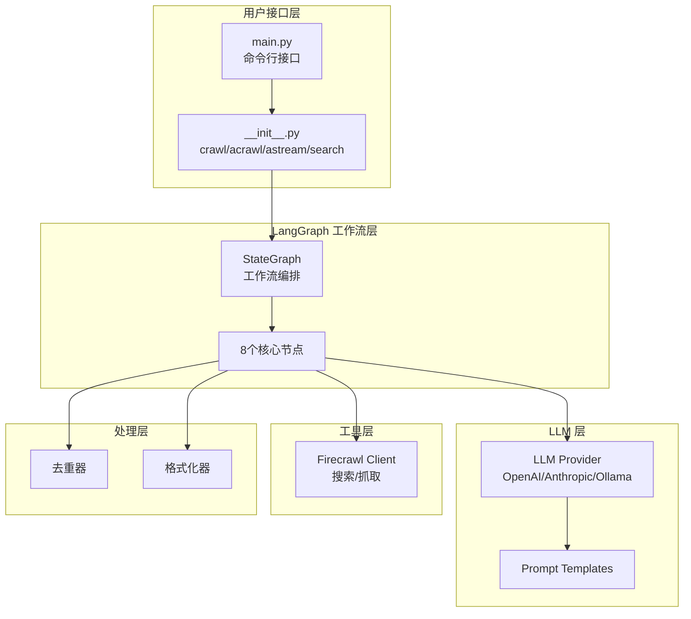
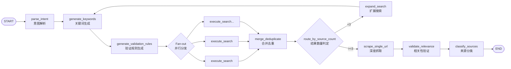

# gs-ai-crawl 项目分析报告

> 为生成简化版本而准备的技术分析文档
>
> 分析日期: 2026-01-23
> 项目路径: `/Users/lanxionggao/Documents/gs-ai-crawl`
> 版本: 0.1.0

---

## 目录

1. [项目概述](#1-项目概述)
2. [核心架构](#2-核心架构)
3. [数据模型](#3-数据模型)
4. [工作流程](#4-工作流程)
5. [关键节点详解](#5-关键节点详解)
6. [外部依赖](#6-外部依赖)
7. [简化建议](#7-简化建议)

---

## 1. 项目概述

### 1.1 项目定位

**gs-ai-crawl** 是一个基于 **LangGraph + Firecrawl** 的 AI 驱动智能搜索 Agent Python 库。

### 1.2 核心特性

| 特性 | 描述 |
|------|------|
| **自然语言理解** | 自动解析用户查询意图，提取实体和时间约束 |
| **智能关键词生成** | 基于 LLM 生成多样化搜索关键词 |
| **并行搜索** | 使用 LangGraph Fan-out 模式并行执行多个搜索任务 |
| **深度抓取** | 可选的 URL 深度抓取功能 |
| **内容清洗** | 自动去重和内容清洗 |
| **摘要生成** | 基于 LLM 的结果摘要 |
| **多 LLM 支持** | 支持 OpenAI、Anthropic 和 Ollama |

### 1.3 项目结构

```
gs-ai-crawl/
├── src/gsac/
│   ├── __init__.py              # 公开 API (crawl, acrawl, astream, search)
│   ├── agent/
│   │   ├── graph.py             # LangGraph 定义 (状态图)
│   │   ├── nodes.py             # 8个核心节点实现
│   │   └── validation_rules.py  # 验证规则配置
│   ├── tools/
│   │   ├── client.py            # Firecrawl 客户端
│   │   ├── search.py            # 搜索工具
│   │   └── scrape.py            # 抓取工具
│   ├── llm/
│   │   ├── provider.py          # LLM 提供者管理
│   │   └── prompts.py           # Prompt 模板
│   ├── models/
│   │   ├── schemas.py           # 数据模型 (Pydantic)
│   │   └── state.py             # LangGraph 状态定义
│   ├── processors/
│   │   ├── deduplicator.py      # 去重处理器
│   │   ├── formatter.py         # 格式化输出
│   │   └── cleaner.py           # 内容清洗
│   ├── config/
│   │   └── settings.py          # 配置管理
│   └── utils/
│       ├── logging.py           # 日志工具
│       └── errors.py            # 错误定义
├── main.py                       # CLI 入口
├── pyproject.toml                # 项目配置
└── README.md
```

---

## 2. 核心架构

### 2.1 整体架构图



### 2.2 LangGraph 状态图结构



---

## 3. 数据模型

### 3.1 核心状态 - OSINTSearchState

```python
class OSINTSearchState(TypedDict):
    # ===== 输入 =====
    user_query: str                                    # 用户原始查询
    
    # ===== 要素澄清 =====
    skip_element_clarification: bool                   # 跳过询问
    user_provided_elements: UserProvidedElements | None
    clarification_needed: bool
    clarification_questions: list[str] | None
    missing_elements: MissingElements | None
    
    # ===== 意图解析 =====
    parsed_intent: ParsedIntent | None                 # 6要素意图
    
    # ===== 关键词 (支持并行聚合) =====
    keyword_groups: Annotated[list[KeywordGroup], operator.add]
    
    # ===== 搜索结果 =====
    raw_results: Annotated[list[SearchResult], operator.add]
    deduplicated_results: list[SearchResult]
    
    # ===== 深度抓取 =====
    scraped_contents: Annotated[list[ScrapedContent], operator.add]
    
    # ===== 相关性验证 =====
    validation_rules: ValidationRules | None
    relevance_results: list[RelevanceResult]
    validated_results: list[SearchResult]
    discarded_count: int
    
    # ===== 分类 =====
    classified_sources: list[ClassifiedSource]
    
    # ===== 控制流 =====
    iteration_count: int
    confidence_score: float
    
    # ===== 调试 =====
    error_messages: Annotated[list[str], operator.add]
    messages: Annotated[list, add_messages]
    
    # ===== 元数据 =====
    metadata: dict
```

### 3.2 关键数据模型

#### ParsedIntent (意图解析结果)

| 字段 | 类型 | 说明 |
|------|------|------|
| investigation_target | str | 调查对象 (核心目标) |
| time_range | str \| None | 时间范围 |
| source_type_constraint | str | 信息源约束 |
| output_format | str | 输出格式 |
| tool_constraint | str \| None | 工具限制 |
| investigation_type | Literal | 调查类型 |

#### KeywordGroup (关键词组)

| 字段 | 类型 | 说明 |
|------|------|------|
| keywords | list[str] | 关键词列表 |
| layer | int (0-5) | 层级: 0=官方 → 5=百科 |
| language | Literal | zh/en/mixed |
| search_type | Literal | web/news |
| site_constraint | str \| None | 站点限制 |

#### SearchResult (搜索结果)

| 字段 | 类型 | 说明 |
|------|------|------|
| url | str | 结果 URL |
| title | str | 标题 |
| description | str \| None | 描述 |
| content | str \| None | 内容 |
| source | str | 来源类型 |
| keyword | str | 匹配关键词 |
| score | float | 相关性评分 |
| source_domain | str | 来源域名 |
| published_date | str \| None | 发布日期 |
| layer | int | 关键词层级 |

#### ValidationRules (验证规则)

| 字段 | 类型 | 说明 |
|------|------|------|
| required_location | list[str] | 地点必要条件 |
| required_subject | list[str] | 主体必要条件 |
| required_event | list[str] | 事件必要条件 |
| exclude_patterns | list[str] | 排除模式 |

#### ClassifiedSource (分类来源)

| 字段 | 类型 | 说明 |
|------|------|------|
| url | str | 来源 URL |
| title | str | 标题 |
| category | Literal | 官方/本地主流/国际主流/智库/其他 |
| credibility_score | float (0-1) | 可信度评分 |
| time_confidence | Literal | HIGH/MEDIUM/LOW/REJECTED |
| content_summary | str | 内容摘要 |
| relevance_status | Literal | keep/downgrade |

---

## 4. 工作流程

### 4.1 完整执行流程

```
┌─────────────────────────────────────────────────────────────────┐
│                        用户输入查询                               │
│                    "红旗大桥垮塌 四川 2025-11"                    │
└────────────────────────────┬────────────────────────────────────┘
                             │
                             ▼
┌─────────────────────────────────────────────────────────────────┐
│  节点1: parse_intent (LLM 意图解析)                              │
│  输出: ParsedIntent {                                            │
│    investigation_target: "红旗大桥垮塌",                          │
│    time_range: "2025-11",                                        │
│    source_type_constraint: "官方来源",                           │
│    investigation_type: "event"                                  │
│  }                                                              │
└────────────────────────────┬────────────────────────────────────┘
                             │
                             ▼
┌─────────────────────────────────────────────────────────────────┐
│  节点2: generate_keywords (LLM 关键词生成)                        │
│  输出: KeywordGroup[]                                            │
│    - Layer 0: ["site:gov.cn 红旗大桥 垮塌"]                       │
│    - Layer 1: ["四川 红旗大桥 事故", "site:sc.gov.cn 垮塌"]        │
│    - Layer 2: ["阿坝 红旗大桥", "四川 桥梁 事故"]                  │
│    - Layer 3-5: 更多泛化关键词...                                │
└────────────────────────────┬────────────────────────────────────┘
                             │
                             ▼
┌─────────────────────────────────────────────────────────────────┐
│  节点3: generate_validation_rules (LLM 验证规则)                 │
│  输出: ValidationRules {                                         │
│    required_location: ["四川", "阿坝", "Sichuan"],                │
│    required_subject: ["红旗大桥", "桥梁"],                         │
│    required_event: ["垮塌", "事故", "倒塌"],                      │
│    exclude_patterns: ["验收", "通车"]                             │
│  }                                                              │
└────────────────────────────┬────────────────────────────────────┘
                             │
                             ▼
┌─────────────────────────────────────────────────────────────────┐
│  Fan-out: 并行搜索分发                                           │
│  每个 KeywordGroup 创建一个独立搜索任务                           │
└────────────────────────────┬────────────────────────────────────┘
                             │
                ┌────────────┼────────────┐
                ▼            ▼            ▼
        [Task: Layer0] [Task: Layer1] [Task: Layer2] ...
                             │
                             ▼ (聚合)
┌─────────────────────────────────────────────────────────────────┐
│  节点4: execute_single_search (Firecrawl 搜索)                    │
│  输出: SearchResult[] (每个任务的搜索结果)                         │
└────────────────────────────┬────────────────────────────────────┘
                             │
                             ▼
┌─────────────────────────────────────────────────────────────────┐
│  节点5: merge_deduplicate (合并去重)                              │
│  - URL + 标题相似度去重                                           │
│  - 状态聚合: raw_results → deduplicated_results                  │
└────────────────────────────┬────────────────────────────────────┘
                             │
                             ▼
                    ┌───────────────┐
                    │ 结果数量判定?  │
                    └───┬───────┬───┘
                   <3│       │≥3
                      ▼       ▼
        ┌─────────────────┐  │
        │ expand_search   │  │
        │ (扩展搜索循环)   │  │
        │   │             │  │
        │   └─────────────┘  │
        │    返回 generate_keywords
                          │
                          ▼
┌─────────────────────────────────────────────────────────────────┐
│  节点6: scrape_single_url (Firecrawl 深度抓取)                   │
│  - 并行抓取 top-N 结果的完整内容                                  │
│  - 获取 Markdown + HTML                                           │
└────────────────────────────┬────────────────────────────────────┘
                             │
                             ▼
┌─────────────────────────────────────────────────────────────────┐
│  节点7: validate_relevance (LLM 相关性验证)                       │
│  验证逻辑:                                                       │
│  1. 必要条件 AND (地点 AND 主体 AND 事件)                        │
│  2. 排除模式检查 (不包含 exclude_patterns)                       │
│  3. 置信度评分                                                   │
│  输出: validated_results + discarded_count                       │
└────────────────────────────┬────────────────────────────────────┘
                             │
                             ▼
┌─────────────────────────────────────────────────────────────────┐
│  节点8: classify_sources (LLM 来源分类)                           │
│  - 官方/本地主流/国际主流/智库/其他                              │
│  - 可信度评分 (0-1)                                             │
│  - 内容摘要生成                                                  │
└────────────────────────────┬────────────────────────────────────┘
                             │
                             ▼
┌─────────────────────────────────────────────────────────────────┐
│                        最终输出                                   │
│  - OSINTSearchOutput / CrawlOutput                               │
│  - 格式化: markdown / json / structured                          │
└─────────────────────────────────────────────────────────────────┘
```

### 4.2 路由决策逻辑

#### route_by_source_count

```python
def route_by_source_count(state: OSINTSearchState) -> Literal["expand_search", "deep_scrape"]:
    """
    路由决策:
    - 结果数 < 3 且 迭代次数 < 3 → expand_search (继续搜索)
    - 其他情况 → deep_scrape (进入深度抓取)
    """
    source_count = len(state.get("deduplicated_results", []))
    iteration = state.get("iteration_count", 0)
    
    if source_count < 3 and iteration < 3:
        return "expand_search"
    else:
        return "deep_scrape"
```

---

## 5. 关键节点详解

### 5.1 节点1: parse_intent

**功能**: LLM 解析用户查询意图，提取 6 要素

**输入**: `user_query: str`

**输出**: `parsed_intent: ParsedIntent`

**LLM Prompt**: `INTENT_PARSE_PROMPT`

**降级策略**: LLM 失败时使用基础解析

```python
def _fallback_parse_intent(query: str) -> ParsedIntent:
    return ParsedIntent(
        investigation_target=query,
        time_range=None,
        source_type_constraint="all",
        # ...
    )
```

---

### 5.2 节点2: generate_keywords

**功能**: 根据意图生成分层关键词组 (Layer 0-5)

**输入**: `parsed_intent: ParsedIntent`

**输出**: `keyword_groups: list[KeywordGroup]`

**分层策略**:

| Layer | 描述 | 示例关键词 |
|-------|------|-----------|
| 0 | 官方来源 | `site:gov.cn 红旗大桥 垮塌` |
| 1 | 本地主流 | `四川 红旗大桥 事故` |
| 2 | 区域媒体 | `阿坝 红旗大桥` |
| 3 | 国际主流 | `Sichuan bridge collapse` |
| 4 | 智库/学术 | `四川 基础设施 安全` |
| 5 | 百科/档案 | `红旗大桥 四川` |

**LLM Prompt**: `KEYWORD_GEN_PROMPT_V2`

---

### 5.3 节点3: generate_validation_rules

**功能**: 生成动态验证规则

**输入**: `parsed_intent: ParsedIntent`

**输出**: `validation_rules: ValidationRules`

**规则结构**:

```python
class ValidationRules(BaseModel):
    required_location: list[str]    # 地点必要条件 (OR)
    required_subject: list[str]     # 主体必要条件 (OR)
    required_event: list[str]       # 事件必要条件 (OR)
    exclude_patterns: list[str]     # 排除模式
```

**验证逻辑**: `(地点 OR 地点...) AND (主体 OR 主体...) AND (事件 OR 事件...)` - 排除

---

### 5.4 节点4: execute_single_search

**功能**: 执行单个搜索任务

**输入**: `SearchTask`

**输出**: `list[SearchResult]`

**Firecrawl API 调用**:

```python
response = client.search(
    query=task.keyword,
    limit=task.limit,
    sources=[task.source],
    tbs=task.tbs,
    location=task.location,
)
```

---

### 5.5 节点5: merge_deduplicate

**功能**: 合并并行搜索结果并去重

**输入**: `raw_results: list[SearchResult]`

**输出**: `deduplicated_results: list[SearchResult]`

**去重策略**:
- URL 去重
- 标题相似度去重 (可选)

---

### 5.6 节点6: scrape_single_url

**功能**: 深度抓取 URL 完整内容

**输入**: `deduplicated_results` 中的 top-N

**输出**: `scraped_contents: list[ScrapedContent]`

**Firecrawl API 调用**:

```python
response = client.scrape(
    url=url,
    formats=["markdown", "html"],
)
```

---

### 5.7 节点7: validate_relevance

**功能**: LLM 验证结果相关性

**输入**: `scraped_contents + validation_rules`

**输出**: `validated_results + discarded_count`

**LLM Prompt**: `RELEVANCE_VALIDATE_PROMPT`

**验证输出**:

```python
class RelevanceResult(BaseModel):
    url: str
    title: str
    relevance: Literal["keep", "downgrade", "discard"]
    reason: str
    matched_elements: list[str]
    confidence: float
```

---

### 5.8 节点8: classify_sources

**功能**: LLM 来源分类和摘要

**输入**: `validated_results`

**输出**: `classified_sources`

**LLM Prompt**: `CLASSIFY_SOURCE_PROMPT`

**分类体系**:

| Category | 描述 | Credibility |
|----------|------|------------|
| official | 政府/官方机构 | 0.9-1.0 |
| local_mainstream | 本地主流媒体 | 0.7-0.9 |
| intl_mainstream | 国际主流媒体 | 0.6-0.8 |
| think_tank | 智库/学术 | 0.5-0.7 |
| other | 其他 | 0.0-0.5 |

---

## 6. 外部依赖

### 6.1 核心依赖

| 依赖 | 版本 | 用途 |
|------|------|------|
| langgraph | ^1.0.6 | 工作流编排 |
| langchain-core | ^1.2.7 | LLM 集成 |
| firecrawl-py | ^4.13.0 | 搜索/抓取 API |
| pydantic | ^2.5.0 | 数据模型 |

### 6.2 LLM 依赖

| Provider | 模型示例 | 环境变量 |
|----------|----------|----------|
| OpenAI | gpt-4o-mini | `GS_CRAWL_LLM_API_KEY` |
| Anthropic | claude-3-haiku | `GS_CRAWL_LLM_API_KEY` |
| Ollama | llama3.2 | `GS_CRAWL_LLM_BASE_URL` |

### 6.3 环境变量

```bash
# 必需
GS_CRAWL_FIRECRAWL_API_KEY=fc-xxx
GS_CRAWL_LLM_PROVIDER=openai|anthropic|ollama
GS_CRAWL_LLM_MODEL=gpt-4o-mini
GS_CRAWL_LLM_API_KEY=sk-xxx

# 可选
GS_CRAWL_LLM_BASE_URL=http://localhost:11434  # Ollama
CUSTOM_CLAUDE_BASE_URL=https://api.xxx        # 自定义 Claude
CUSTOM_CLAUDE_API_KEY=sk-xxx
CUSTOM_CLAUDE_MODEL=claude-opus-4-5
```

---

## 7. 简化建议

### 7.1 可移除的功能 (简化版可考虑)

| 功能 | 复杂度 | 建议 |
|------|--------|------|
| 要素澄清 (交互式询问) | 中 | 可移除，改为纯 CLI 参数 |
| 扩展搜索循环 | 高 | 简化为单次搜索 |
| 来源分类 (classify_sources) | 中 | 可选功能 |
| 动态验证规则生成 | 高 | 简化为固定规则 |
| 深度抓取 (scrape) | 中 | 可选功能 |
| 流式输出 (astream) | 低 | 保留 |

### 7.2 简化版核心流程

```
简化版工作流:
  START → parse_intent → generate_keywords → execute_search 
       → merge_deduplicate → validate_relevance → format_output → END
```

### 7.3 简化版最小依赖

```
必需:
- langgraph (工作流)
- langchain-core (LLM)
- firecrawl-py (搜索)
- pydantic (模型)

可选:
- 扩展搜索功能
- 深度抓取功能
- 来源分类功能
```

### 7.4 简化版配置

```python
@dataclass
class SimpleConfig:
    # 必需
    firecrawl_api_key: str
    llm_api_key: str
    llm_model: str = "gpt-4o-mini"
    
    # 搜索参数
    max_keywords: int = 3          # 降低默认值
    max_results: int = 10
    similarity_threshold: float = 0.8
    
    # 功能开关
    enable_deep_scrape: bool = False
    enable_validation: bool = True
    enable_classification: bool = False
```

---

## 附录

### A. 公开 API

```python
# 同步
result = crawl("查询内容")

# 异步
result = await acrawl("查询内容")

# 流式
async for event in astream("查询内容"):
    print(event)

# 简单搜索 (无 LLM)
results = search("关键词", limit=10)
```

### B. 配置参数

```python
CrawlConfig(
    max_keywords=5,              # 最大关键词数
    max_results_per_keyword=10,  # 每关键词结果数
    enable_deep_scrape=False,    # 深度抓取
    max_scrape_urls=3,           # 抓取 URL 数
    similarity_threshold=0.8,    # 去重阈值
    enable_summary=True,         # 生成摘要
    output_format="markdown",    # 输出格式
)
```

### C. 输出格式

```python
CrawlOutput(
    query="原始查询",
    keywords_used=["关键词1", "关键词2"],
    results=[SearchResult(...)],
    total_found=10,
    execution_time=5.2,
    summary="摘要内容...",
    errors=None
)
```

---

*文档生成时间: 2026-01-23*
*分析工具: Claude Code SuperClaude*
