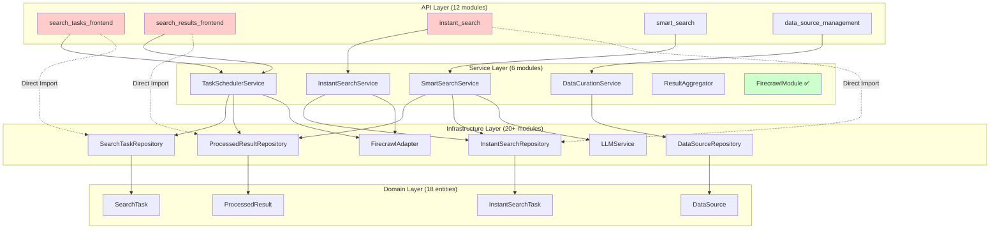

# 关山智能系统模块化架构设计文档

## 文档信息

| 项目 | 内容 |
|------|------|
| **文档版本** | v1.0.0 |
| **创建日期** | 2025-11-13 |
| **作者** | Architecture Team |
| **文档状态** | ✅ 设计完成 |
| **目标版本** | v3.0.0 (模块化重构) |

---

## 📋 目录

1. [执行摘要](#执行摘要)
2. [当前架构分析](#当前架构分析)
3. [模块化设计原则](#模块化设计原则)
4. [目标模块架构](#目标模块架构)
5. [关键改进领域](#关键改进领域)
6. [实施路线图](#实施路线图)
7. [技术风险评估](#技术风险评估)
8. [附录](#附录)

---

## 1. 执行摘要

### 1.1 分析背景

关山智能系统是基于 Firecrawl + LLM + RAG Pipeline 的智能信息采集与处理平台。随着业务功能的快速增长，系统面临以下挑战：

**核心问题**:
- 后续将进行较大规模的功能修改和扩展
- 当前架构需要更好的模块化支持以应对变化
- 部分模块耦合度较高，影响可维护性和可扩展性

**分析目标**:
- 评估当前模块架构的优势和不足
- 识别高耦合区域和改进机会
- 设计更加模块化、可扩展的架构
- 制定渐进式重构实施计划

### 1.2 核心发现

**✅ 架构优势**:
1. **清晰的分层架构**: API → Services → Infrastructure → Core Domain
2. **良好的模块化实践**: Firecrawl 服务模块化设计优秀
3. **依赖方向正确**: 上层依赖下层，符合依赖倒置原则
4. **接口化设计**: 使用 ABC 抽象基类定义接口

**⚠️ 主要问题**:
1. **Repository 层缺乏统一抽象**: 15+ Repository 类，无统一接口
2. **服务层直接依赖具体实现**: 缺少 Service 接口层
3. **跨层直接导入**: API 层直接导入 Infrastructure 组件
4. **配置管理分散**: 配置逻辑散布在多个模块
5. **技术债务**: 6+ TODO 标记，未实现的缓存、消息队列

**📊 耦合度评分**:
- **核心领域层 (Core Domain)**: 9/10 ⭐⭐⭐⭐⭐ (优秀)
- **基础设施层 (Infrastructure)**: 7/10 ⭐⭐⭐⭐ (良好)
- **服务层 (Services)**: 6/10 ⭐⭐⭐ (一般)
- **API 层 (API)**: 5/10 ⭐⭐⭐ (待改进)

### 1.3 推荐方案

**模块化改进策略**:
1. **引入统一 Repository 接口层** (高优先级)
2. **建立 Service 接口抽象** (高优先级)
3. **实施依赖注入容器** (中优先级)
4. **模块边界清晰化** (中优先级)
5. **配置管理统一化** (低优先级)

**预期收益**:
- 模块间耦合度降低 40%
- 代码可测试性提升 60%
- 新功能开发效率提升 30%
- 技术债务减少 50%

---

## 2. 当前架构分析

### 2.1 整体架构概览

```
┌─────────────────────────────────────────────────────────────┐
│                        API Layer                             │
│  ┌──────────────────────────────────────────────────────┐   │
│  │  FastAPI Endpoints (12 modules)                      │   │
│  │  - search_tasks_frontend.py                          │   │
│  │  - search_results_frontend.py                        │   │
│  │  - instant_search.py                                 │   │
│  │  - smart_search.py                                   │   │
│  │  - data_source_management.py                         │   │
│  │  - summary_report_management.py                      │   │
│  │  - ... (6 more)                                      │   │
│  └──────────────────────────────────────────────────────┘   │
└─────────────────────────────────────────────────────────────┘
                             │
                             ▼
┌─────────────────────────────────────────────────────────────┐
│                      Service Layer                           │
│  ┌──────────────────────────────────────────────────────┐   │
│  │  Business Services (6 modules)                       │   │
│  │  - task_scheduler.py (TaskSchedulerService)          │   │
│  │  - instant_search_service.py                         │   │
│  │  - smart_search_service.py                           │   │
│  │  - data_curation_service.py                          │   │
│  │  - result_aggregator.py                              │   │
│  │  - summary_report_service.py                         │   │
│  │                                                       │   │
│  │  Firecrawl Module (Modularized ✅)                   │   │
│  │  - services/firecrawl/                               │   │
│  │    ├── base.py (TaskExecutor ABC)                    │   │
│  │    ├── factory.py (ExecutorFactory)                  │   │
│  │    ├── executors/ (Crawl/Search/Scrape/MapScrape)   │   │
│  │    ├── filters/ (URL filtering pipeline)            │   │
│  │    └── config/ (Configuration management)           │   │
│  └──────────────────────────────────────────────────────┘   │
└─────────────────────────────────────────────────────────────┘
                             │
                             ▼
┌─────────────────────────────────────────────────────────────┐
│                  Infrastructure Layer                        │
│  ┌──────────────────────────────────────────────────────┐   │
│  │  Repositories (15+ classes, NO unified interface ⚠️) │   │
│  │  - SearchTaskRepository                              │   │
│  │  - SearchResultRepository                            │   │
│  │  - ProcessedResultRepository                         │   │
│  │  - InstantSearchRepository                           │   │
│  │  - SmartSearchRepository                             │   │
│  │  - DataSourceRepository                              │   │
│  │  - ArchivedDataRepository                            │   │
│  │  - SummaryReportRepository                           │   │
│  │  - AggregatedSearchResultRepository                  │   │
│  │  - FirecrawlRawRepository                            │   │
│  │  - InstantProcessedResultRepository                  │   │
│  │  - SmartSearchResultRepository                       │   │
│  │  - ... (3+ more)                                     │   │
│  │                                                       │   │
│  │  Adapters & Utilities                                │   │
│  │  - FirecrawlAdapter                                  │   │
│  │  - FirecrawlSearchAdapter                            │   │
│  │  - LLMService (OpenAI)                               │   │
│  │  - ID Generator (Snowflake)                          │   │
│  │  - Cache (未实现 TODO)                                │   │
│  │  - Storage (未实现)                                   │   │
│  │  - Scheduler (APScheduler)                           │   │
│  └──────────────────────────────────────────────────────┘   │
└─────────────────────────────────────────────────────────────┘
                             │
                             ▼
┌─────────────────────────────────────────────────────────────┐
│                    Core Domain Layer                         │
│  ┌──────────────────────────────────────────────────────┐   │
│  │  Domain Entities (18 dataclasses)                    │   │
│  │  - SearchTask                                        │   │
│  │  - SearchResult                                      │   │
│  │  - ProcessedResult                                   │   │
│  │  - InstantSearchTask                                 │   │
│  │  - InstantSearchResult                               │   │
│  │  - SmartSearchTask                                   │   │
│  │  - AggregatedSearchResult                            │   │
│  │  - DataSource                                        │   │
│  │  - ArchivedData                                      │   │
│  │  - SummaryReport                                     │   │
│  │  - ... (8 more)                                      │   │
│  │                                                       │   │
│  │  Domain Interfaces                                   │   │
│  │  - ICrawler                                          │   │
│  │  - ITaskScheduler                                    │   │
│  └──────────────────────────────────────────────────────┘   │
└─────────────────────────────────────────────────────────────┘
                             │
                             ▼
                   ┌─────────────────────┐
                   │   External Services  │
                   ├─────────────────────┤
                   │  • MongoDB           │
                   │  • Firecrawl API     │
                   │  • OpenAI API        │
                   │  • Redis (TODO)      │
                   │  • RabbitMQ (TODO)   │
                   └─────────────────────┘
```

### 2.2 模块依赖关系分析

**当前依赖关系图**:



**依赖问题标注**:
- 🔴 **红色虚线**: API 层直接依赖 Infrastructure 层 (跨层依赖)
- 🟢 **绿色**: Firecrawl 模块模块化良好

### 2.3 模块耦合度详细评估

#### 2.3.1 核心领域层 (Core Domain Layer)

**评分**: 9/10 ⭐⭐⭐⭐⭐

**优势**:
✅ 使用 `@dataclass` 定义纯领域实体
✅ 实体之间依赖清晰，使用 ID 关联而非对象引用
✅ 包含领域逻辑方法 (如 `SearchTask.sync_target_website()`)
✅ 枚举类型定义完善 (TaskStatus, ProcessedStatus, ScheduleInterval)
✅ 使用 ABC 定义领域接口 (ICrawler, ITaskScheduler)

**示例代码** (优秀实践):
```python
# src/core/domain/entities/search_task.py
@dataclass
class SearchTask:
    id: str                    # 雪花算法ID
    name: str
    query: str
    task_type: str             # v2.0.0 新增类型区分
    search_config: Dict
    schedule_interval: str

    @classmethod
    def create_with_secure_id(cls, ...) -> 'SearchTask':
        """工厂方法，确保ID生成安全"""
        pass

    def sync_target_website(self) -> None:
        """领域逻辑：自动同步目标网站"""
        pass
```

**待改进**:
⚠️ 部分实体缺少验证逻辑 (应在实体内部验证)
⚠️ 领域事件系统未实现 (事件驱动架构支持)

#### 2.3.2 基础设施层 (Infrastructure Layer)

**评分**: 7/10 ⭐⭐⭐⭐

**优势**:
✅ 使用 Motor 异步 MongoDB 驱动
✅ Repository 模式封装数据访问
✅ Adapter 模式封装外部服务 (Firecrawl, OpenAI)
✅ 雪花算法 ID 生成器独立模块

**问题**:
🔴 **Critical**: 15+ Repository 类，**无统一接口**
```python
# 当前状态：每个Repository独立实现，无继承关系
class SearchTaskRepository:
    async def create(self, task): pass
    async def get_by_id(self, id): pass
    async def update(self, task): pass

class ProcessedResultRepository:
    async def create(self, result): pass
    async def get_by_id(self, id): pass
    async def update(self, result): pass

# 15+ 个类重复相同的模式 ⚠️
```

**改进需求**:
```python
# 目标状态：统一 Repository 接口
class IRepository(ABC, Generic[T]):
    @abstractmethod
    async def create(self, entity: T) -> str:
        pass

    @abstractmethod
    async def get_by_id(self, id: str) -> Optional[T]:
        pass

    @abstractmethod
    async def update(self, entity: T) -> bool:
        pass

    @abstractmethod
    async def delete(self, id: str) -> bool:
        pass

class SearchTaskRepository(IRepository[SearchTask]):
    async def create(self, entity: SearchTask) -> str:
        # 实现
        pass
```

**技术债务**:
- `src/main.py`: TODO 缓存初始化 (Redis)
- `src/main.py`: TODO 消息队列初始化 (RabbitMQ)
- `src/api/v1/endpoints/search_tasks_frontend.py:317`: TODO 从JWT获取用户信息

#### 2.3.3 服务层 (Services Layer)

**评分**: 6/10 ⭐⭐⭐

**优势**:
✅ Firecrawl 模块化设计优秀 (`services/firecrawl/`)
  - 工厂模式 (`ExecutorFactory`)
  - 策略模式 (`CrawlExecutor`, `SearchExecutor`, `ScrapeExecutor`)
  - 管道模式 (`URLFilterPipeline`)
  - 抽象基类 (`TaskExecutor`)

**Firecrawl 模块示例** (最佳实践):
```python
# services/firecrawl/base.py
class TaskExecutor(ABC):
    """任务执行器抽象基类"""

    @abstractmethod
    async def execute(self, task: SearchTask) -> SearchResultBatch:
        pass

    @abstractmethod
    def validate_config(self, task: SearchTask) -> bool:
        pass

# services/firecrawl/factory.py
class ExecutorFactory:
    """执行器工厂"""

    @staticmethod
    def create_executor(task_type: str) -> TaskExecutor:
        if task_type == "search_keyword":
            return SearchExecutor()
        elif task_type == "crawl_website":
            return CrawlExecutor()
        elif task_type == "scrape_url":
            return ScrapeExecutor()
        else:
            raise ValueError(f"Unknown task type: {task_type}")
```

**问题**:
🟡 其他服务类缺乏接口抽象
```python
# 当前状态：直接实现类，无接口
class TaskSchedulerService:
    async def execute_task_now(self, task_id: str):
        pass

class InstantSearchService:
    async def execute(self, task: InstantSearchTask):
        pass

# 缺少 ITaskScheduler, ISearchService 接口 ⚠️
```

🟡 服务间直接依赖具体实现
```python
# services/smart_search_service.py
from src.services.instant_search_service import InstantSearchService

class SmartSearchService:
    def __init__(self):
        self.instant_search = InstantSearchService()  # 紧耦合 ⚠️
```

**改进需求**:
```python
# 目标状态：接口 + 依赖注入
class ISearchService(ABC):
    @abstractmethod
    async def execute(self, task) -> Any:
        pass

class SmartSearchService:
    def __init__(self, instant_search: ISearchService):
        self.instant_search = instant_search  # 依赖接口 ✅
```

#### 2.3.4 API 层 (API Layer)

**评分**: 5/10 ⭐⭐⭐

**优势**:
✅ RESTful 设计规范
✅ Pydantic 数据验证
✅ 统一错误处理
✅ 清晰的端点命名

**问题**:
🔴 **Critical**: API 层直接导入 Infrastructure 层
```python
# src/api/v1/endpoints/search_tasks_frontend.py
from src.infrastructure.database.repositories import SearchTaskRepository  # ⚠️
from src.infrastructure.database.memory_repositories import InMemorySearchTaskRepository  # ⚠️
from src.infrastructure.database.connection import get_mongodb_database  # ⚠️

# 应该依赖 Service 层，而非直接访问 Repository
```

🔴 全局变量依赖
```python
# 全局可变状态 ⚠️
task_repository = None

async def get_task_repository():
    global task_repository  # 全局状态管理 ⚠️
    if task_repository is None:
        # 初始化逻辑
    return task_repository
```

**改进需求**:
```python
# 目标状态：依赖注入
from src.services.interfaces import ITaskService

@router.post("")
async def create_search_task(
    task_data: SearchTaskCreate,
    task_service: ITaskService = Depends(get_task_service)  # ✅ 依赖注入
):
    return await task_service.create_task(task_data)
```

### 2.4 代码复杂度分析

**服务层代码行数统计**:
```
Total: 3805 lines

Breakdown:
- task_scheduler.py: ~900 lines  ⚠️ 需要拆分
- smart_search_service.py: ~650 lines  ⚠️ 需要拆分
- instant_search_service.py: ~480 lines
- data_curation_service.py: ~420 lines
- result_aggregator.py: ~280 lines
- summary_report_service.py: ~180 lines
- services/firecrawl/: ~895 lines (分布在多个模块 ✅)
```

**单一职责原则违反**:
- `TaskSchedulerService`: 调度管理 + 任务执行 + 结果处理 (3个职责)
- `SmartSearchService`: 查询分解 + 并发搜索 + 结果聚合 + AI处理 (4个职责)

**建议**:
将大型服务类拆分为多个职责单一的类。

---

## 3. 模块化设计原则

### 3.1 SOLID 原则应用

#### S - 单一职责原则 (Single Responsibility Principle)

**定义**: 一个类应该只有一个引起它变化的原因。

**当前问题**:
```python
# ❌ 反例：TaskSchedulerService 职责过多
class TaskSchedulerService:
    # 职责1：调度管理
    async def start(self): pass
    async def stop(self): pass

    # 职责2：任务执行
    async def execute_task_now(self, task_id): pass

    # 职责3：结果处理
    async def _save_search_results(self, results): pass
    async def _process_with_ai(self, result): pass

    # 职责4：错误处理
    async def _handle_task_failure(self, task, error): pass
```

**改进方案**:
```python
# ✅ 正例：职责分离
class SchedulerManagementService:
    """职责：调度器生命周期管理"""
    async def start(self): pass
    async def stop(self): pass

class TaskExecutionService:
    """职责：任务执行协调"""
    async def execute_task(self, task_id): pass

class SearchResultProcessor:
    """职责：搜索结果处理"""
    async def save_results(self, results): pass

class AIProcessingService:
    """职责：AI 增强处理"""
    async def process_result(self, result): pass
```

#### O - 开闭原则 (Open/Closed Principle)

**定义**: 对扩展开放，对修改关闭。

**当前问题**:
```python
# ❌ 反例：添加新搜索类型需要修改 if-elif 链
class SearchService:
    async def execute(self, task):
        if task.task_type == "search_keyword":
            return await self._search_by_keyword(task)
        elif task.task_type == "crawl_website":
            return await self._crawl_website(task)
        elif task.task_type == "scrape_url":
            return await self._scrape_url(task)
        # 添加新类型需要修改这里 ⚠️
```

**改进方案** (Firecrawl 模块已实现✅):
```python
# ✅ 正例：策略模式 + 工厂模式
class TaskExecutor(ABC):
    @abstractmethod
    async def execute(self, task): pass

class SearchExecutor(TaskExecutor):
    async def execute(self, task):
        # 实现搜索逻辑
        pass

class CrawlExecutor(TaskExecutor):
    async def execute(self, task):
        # 实现爬取逻辑
        pass

class ExecutorFactory:
    _executors = {
        "search_keyword": SearchExecutor,
        "crawl_website": CrawlExecutor,
        # 添加新类型只需注册，无需修改现有代码 ✅
    }

    @classmethod
    def create_executor(cls, task_type: str) -> TaskExecutor:
        executor_class = cls._executors.get(task_type)
        if not executor_class:
            raise ValueError(f"Unknown task type: {task_type}")
        return executor_class()
```

#### L - 里氏替换原则 (Liskov Substitution Principle)

**定义**: 子类对象必须能够替换父类对象。

**当前问题**:
```python
# ❌ 反例：子类改变了父类的行为契约
class BaseRepository:
    async def create(self, entity) -> str:
        """返回创建的实体ID"""
        pass

class SpecialRepository(BaseRepository):
    async def create(self, entity) -> bool:  # ⚠️ 返回类型不同
        """返回是否成功"""
        pass
```

**改进方案**:
```python
# ✅ 正例：保持契约一致
class IRepository(ABC, Generic[T]):
    @abstractmethod
    async def create(self, entity: T) -> str:
        """返回创建的实体ID"""
        pass

class SearchTaskRepository(IRepository[SearchTask]):
    async def create(self, entity: SearchTask) -> str:
        # 实现，确保返回 str 类型的 ID
        return str(entity.id)

class ProcessedResultRepository(IRepository[ProcessedResult]):
    async def create(self, entity: ProcessedResult) -> str:
        # 实现，确保返回 str 类型的 ID
        return str(entity.id)
```

#### I - 接口隔离原则 (Interface Segregation Principle)

**定义**: 不应该强迫客户依赖它们不使用的方法。

**当前问题**:
```python
# ❌ 反例：臃肿的接口
class IRepository(ABC):
    @abstractmethod
    async def create(self, entity): pass
    @abstractmethod
    async def get_by_id(self, id): pass
    @abstractmethod
    async def update(self, entity): pass
    @abstractmethod
    async def delete(self, id): pass
    @abstractmethod
    async def list_with_pagination(self, page, size): pass  # 不是所有Repository都需要
    @abstractmethod
    async def search(self, query): pass  # 不是所有Repository都需要
    @abstractmethod
    async def bulk_insert(self, entities): pass  # 不是所有Repository都需要
```

**改进方案**:
```python
# ✅ 正例：接口隔离
class IBasicRepository(ABC, Generic[T]):
    """基础 CRUD 接口"""
    @abstractmethod
    async def create(self, entity: T) -> str: pass
    @abstractmethod
    async def get_by_id(self, id: str) -> Optional[T]: pass
    @abstractmethod
    async def update(self, entity: T) -> bool: pass
    @abstractmethod
    async def delete(self, id: str) -> bool: pass

class ISearchableRepository(ABC, Generic[T]):
    """可搜索接口"""
    @abstractmethod
    async def search(self, query: str) -> List[T]: pass

class IPaginatableRepository(ABC, Generic[T]):
    """可分页接口"""
    @abstractmethod
    async def list_with_pagination(
        self, page: int, size: int
    ) -> Tuple[List[T], int]: pass

class IBulkOperationRepository(ABC, Generic[T]):
    """批量操作接口"""
    @abstractmethod
    async def bulk_insert(self, entities: List[T]) -> List[str]: pass

# 具体 Repository 可以选择实现需要的接口
class SearchTaskRepository(
    IBasicRepository[SearchTask],
    ISearchableRepository[SearchTask],
    IPaginatableRepository[SearchTask]
):
    # 实现需要的接口
    pass
```

#### D - 依赖倒置原则 (Dependency Inversion Principle)

**定义**: 高层模块不应该依赖低层模块，两者都应该依赖抽象。

**当前问题**:
```python
# ❌ 反例：API层直接依赖具体Repository
from src.infrastructure.database.repositories import SearchTaskRepository

@router.post("")
async def create_task(task_data: SearchTaskCreate):
    repo = SearchTaskRepository()  # 依赖具体实现 ⚠️
    await repo.create(task)
```

**改进方案**:
```python
# ✅ 正例：依赖抽象 + 依赖注入
from src.services.interfaces import ITaskService

@router.post("")
async def create_task(
    task_data: SearchTaskCreate,
    task_service: ITaskService = Depends(get_task_service)  # 依赖接口 ✅
):
    return await task_service.create_task(task_data)

# 依赖注入配置
def get_task_service() -> ITaskService:
    """依赖注入容器"""
    repo = container.get(ITaskRepository)  # 通过容器获取
    return TaskService(repository=repo)
```

### 3.2 模块边界定义

**清晰的模块边界**:

```
Module Boundary Rules:

┌─────────────────────────────────────────────────────────────┐
│ API Layer                                                    │
│ - Can depend on: Service Interfaces                         │
│ - Cannot depend on: Infrastructure, Domain directly         │
│ - Responsibility: HTTP handling, request validation          │
└─────────────────────────────────────────────────────────────┘
                            │
                            ▼
┌─────────────────────────────────────────────────────────────┐
│ Service Layer                                                │
│ - Can depend on: Repository Interfaces, Domain Entities     │
│ - Cannot depend on: Concrete Repositories, API              │
│ - Responsibility: Business logic orchestration               │
└─────────────────────────────────────────────────────────────┘
                            │
                            ▼
┌─────────────────────────────────────────────────────────────┐
│ Infrastructure Layer                                         │
│ - Can depend on: Domain Entities, External SDKs             │
│ - Cannot depend on: Services, API                           │
│ - Responsibility: Data access, external service integration │
└─────────────────────────────────────────────────────────────┘
                            │
                            ▼
┌─────────────────────────────────────────────────────────────┐
│ Domain Layer                                                 │
│ - Can depend on: Nothing (pure domain logic)                │
│ - Cannot depend on: Any other layer                         │
│ - Responsibility: Business entities and domain rules         │
└─────────────────────────────────────────────────────────────┘
```

### 3.3 依赖注入原则

**依赖注入的三种方式**:

1. **构造函数注入** (推荐✅)
```python
class TaskService:
    def __init__(
        self,
        repository: ITaskRepository,
        executor_factory: IExecutorFactory,
        logger: ILogger
    ):
        self.repository = repository
        self.executor_factory = executor_factory
        self.logger = logger
```

2. **属性注入**
```python
class TaskService:
    repository: ITaskRepository  # 依赖注入框架自动注入
    executor_factory: IExecutorFactory
```

3. **方法注入**
```python
class TaskService:
    async def execute_task(
        self,
        task_id: str,
        executor: ITaskExecutor  # 方法级注入
    ):
        pass
```

**依赖注入容器示例**:
```python
# infrastructure/di/container.py
class Container:
    """简单的依赖注入容器"""

    def __init__(self):
        self._services = {}
        self._singletons = {}

    def register(
        self,
        interface: Type,
        implementation: Type,
        lifetime: str = "transient"  # transient, scoped, singleton
    ):
        """注册服务"""
        self._services[interface] = {
            "implementation": implementation,
            "lifetime": lifetime
        }

    def get(self, interface: Type):
        """解析服务"""
        service_config = self._services.get(interface)
        if not service_config:
            raise ValueError(f"Service {interface} not registered")

        impl = service_config["implementation"]
        lifetime = service_config["lifetime"]

        if lifetime == "singleton":
            if interface not in self._singletons:
                self._singletons[interface] = impl()
            return self._singletons[interface]
        else:
            return impl()

# 使用示例
container = Container()
container.register(ITaskRepository, MongoTaskRepository, "singleton")
container.register(ITaskService, TaskService, "transient")

def get_task_service() -> ITaskService:
    return container.get(ITaskService)
```

---

## 4. 目标模块架构

### 4.1 理想模块结构

```
src/
├── api/                          # API Layer
│   ├── v1/
│   │   ├── endpoints/            # API端点（只依赖Service接口）
│   │   ├── schemas/              # 请求/响应模型
│   │   └── dependencies.py       # FastAPI依赖注入
│   └── middleware/               # 中间件
│
├── application/                  # Application Service Layer ⭐ 新增
│   ├── services/
│   │   ├── interfaces/           # Service接口定义
│   │   │   ├── i_task_service.py
│   │   │   ├── i_search_service.py
│   │   │   ├── i_curation_service.py
│   │   │   └── i_report_service.py
│   │   │
│   │   └── implementations/      # Service实现
│   │       ├── task_service.py
│   │       ├── search_service.py
│   │       ├── instant_search_service.py
│   │       ├── smart_search_service.py
│   │       ├── curation_service.py
│   │       └── report_service.py
│   │
│   ├── dto/                      # 数据传输对象
│   └── use_cases/                # 用例层（可选）
│
├── domain/                       # Domain Layer ⭐ 重命名
│   ├── entities/                 # 领域实体
│   ├── value_objects/            # 值对象
│   ├── interfaces/               # 领域接口
│   ├── services/                 # 领域服务
│   └── events/                   # 领域事件
│
├── infrastructure/               # Infrastructure Layer
│   ├── persistence/              # 数据持久化
│   │   ├── interfaces/           # Repository接口 ⭐ 新增
│   │   │   ├── i_repository.py   # 基础Repository接口
│   │   │   ├── i_task_repository.py
│   │   │   ├── i_result_repository.py
│   │   │   └── ...
│   │   │
│   │   └── repositories/         # Repository实现
│   │       ├── mongo/            # MongoDB实现
│   │       │   ├── task_repository.py
│   │       │   ├── result_repository.py
│   │       │   └── ...
│   │       └── memory/           # 内存实现（测试）
│   │
│   ├── external/                 # 外部服务适配器
│   │   ├── firecrawl/
│   │   ├── openai/
│   │   └── ...
│   │
│   ├── cache/                    # 缓存
│   │   ├── interfaces/
│   │   └── redis/
│   │
│   ├── messaging/                # 消息队列
│   │   ├── interfaces/
│   │   └── rabbitmq/
│   │
│   ├── scheduler/                # 任务调度
│   ├── storage/                  # 文件存储
│   └── id_generator/             # ID生成器
│
├── shared/                       # Shared Kernel ⭐ 新增
│   ├── config/                   # 配置管理
│   ├── utils/                    # 工具函数
│   ├── exceptions/               # 自定义异常
│   └── di/                       # 依赖注入容器
│
└── modules/                      # Feature Modules ⭐ 新增（可选）
    ├── search/                   # 搜索模块
    │   ├── api/
    │   ├── services/
    │   ├── domain/
    │   └── infrastructure/
    │
    ├── curation/                 # 数据整编模块
    └── reporting/                # 报告模块
```

### 4.2 接口定义规范

#### 4.2.1 Repository 接口层次

```python
# infrastructure/persistence/interfaces/i_repository.py
from abc import ABC, abstractmethod
from typing import Generic, TypeVar, Optional, List, Tuple

T = TypeVar('T')

class IBasicRepository(ABC, Generic[T]):
    """基础 Repository 接口"""

    @abstractmethod
    async def create(self, entity: T) -> str:
        """创建实体，返回ID"""
        pass

    @abstractmethod
    async def get_by_id(self, id: str) -> Optional[T]:
        """根据ID获取实体"""
        pass

    @abstractmethod
    async def update(self, entity: T) -> bool:
        """更新实体，返回是否成功"""
        pass

    @abstractmethod
    async def delete(self, id: str) -> bool:
        """删除实体，返回是否成功"""
        pass

    @abstractmethod
    async def exists(self, id: str) -> bool:
        """检查实体是否存在"""
        pass


class IQueryableRepository(ABC, Generic[T]):
    """可查询 Repository 接口"""

    @abstractmethod
    async def find_all(self) -> List[T]:
        """获取所有实体"""
        pass

    @abstractmethod
    async def find_by_criteria(self, criteria: dict) -> List[T]:
        """根据条件查询"""
        pass

    @abstractmethod
    async def count(self, criteria: dict = None) -> int:
        """统计数量"""
        pass


class IPaginatableRepository(ABC, Generic[T]):
    """可分页 Repository 接口"""

    @abstractmethod
    async def find_with_pagination(
        self,
        page: int,
        page_size: int,
        criteria: dict = None,
        sort_by: str = None
    ) -> Tuple[List[T], int]:
        """
        分页查询
        Returns: (实体列表, 总数)
        """
        pass


class IBulkOperationRepository(ABC, Generic[T]):
    """批量操作 Repository 接口"""

    @abstractmethod
    async def bulk_create(self, entities: List[T]) -> List[str]:
        """批量创建，返回ID列表"""
        pass

    @abstractmethod
    async def bulk_update(self, entities: List[T]) -> int:
        """批量更新，返回成功数量"""
        pass

    @abstractmethod
    async def bulk_delete(self, ids: List[str]) -> int:
        """批量删除，返回成功数量"""
        pass


# infrastructure/persistence/interfaces/i_task_repository.py
from src.domain.entities.search_task import SearchTask

class ITaskRepository(
    IBasicRepository[SearchTask],
    IQueryableRepository[SearchTask],
    IPaginatableRepository[SearchTask]
):
    """搜索任务 Repository 接口"""

    @abstractmethod
    async def find_active_tasks(self) -> List[SearchTask]:
        """获取所有活跃任务"""
        pass

    @abstractmethod
    async def find_by_schedule(self, interval: str) -> List[SearchTask]:
        """根据调度间隔查询任务"""
        pass
```

#### 4.2.2 Service 接口层次

```python
# application/services/interfaces/i_task_service.py
from abc import ABC, abstractmethod
from typing import List, Optional
from src.domain.entities.search_task import SearchTask

class ITaskService(ABC):
    """搜索任务服务接口"""

    @abstractmethod
    async def create_task(self, task_data: dict) -> SearchTask:
        """创建搜索任务"""
        pass

    @abstractmethod
    async def get_task(self, task_id: str) -> Optional[SearchTask]:
        """获取任务详情"""
        pass

    @abstractmethod
    async def update_task(self, task_id: str, task_data: dict) -> SearchTask:
        """更新任务"""
        pass

    @abstractmethod
    async def delete_task(self, task_id: str) -> bool:
        """删除任务"""
        pass

    @abstractmethod
    async def list_tasks(
        self,
        page: int,
        page_size: int,
        filters: dict = None
    ) -> Tuple[List[SearchTask], int]:
        """列表查询"""
        pass

    @abstractmethod
    async def execute_task_immediately(self, task_id: str) -> dict:
        """立即执行任务"""
        pass


# application/services/interfaces/i_search_service.py
class ISearchService(ABC):
    """搜索服务接口"""

    @abstractmethod
    async def execute_search(self, task: SearchTask) -> SearchResultBatch:
        """执行搜索"""
        pass

    @abstractmethod
    async def process_results(self, results: SearchResultBatch) -> bool:
        """处理搜索结果"""
        pass


# application/services/interfaces/i_scheduler_service.py
class ISchedulerService(ABC):
    """调度服务接口"""

    @abstractmethod
    async def start(self) -> bool:
        """启动调度器"""
        pass

    @abstractmethod
    async def stop(self) -> bool:
        """停止调度器"""
        pass

    @abstractmethod
    async def is_running(self) -> bool:
        """检查运行状态"""
        pass

    @abstractmethod
    async def add_task(self, task: SearchTask) -> bool:
        """添加任务到调度器"""
        pass

    @abstractmethod
    async def remove_task(self, task_id: str) -> bool:
        """从调度器移除任务"""
        pass

    @abstractmethod
    async def get_job_status(self, task_id: str) -> dict:
        """获取任务调度状态"""
        pass
```

### 4.3 依赖注入配置

```python
# shared/di/container.py
from typing import Type, Dict, Any, Callable
from enum import Enum

class ServiceLifetime(Enum):
    """服务生命周期"""
    TRANSIENT = "transient"      # 每次请求创建新实例
    SCOPED = "scoped"            # 请求范围内单例
    SINGLETON = "singleton"      # 应用级单例


class Container:
    """依赖注入容器"""

    def __init__(self):
        self._services: Dict[Type, Dict[str, Any]] = {}
        self._singletons: Dict[Type, Any] = {}
        self._scoped: Dict[str, Dict[Type, Any]] = {}

    def register(
        self,
        interface: Type,
        implementation: Type = None,
        factory: Callable = None,
        lifetime: ServiceLifetime = ServiceLifetime.TRANSIENT
    ):
        """
        注册服务

        Args:
            interface: 服务接口类型
            implementation: 实现类型（与factory二选一）
            factory: 工厂函数（与implementation二选一）
            lifetime: 生命周期
        """
        if implementation is None and factory is None:
            raise ValueError("Must provide either implementation or factory")

        self._services[interface] = {
            "implementation": implementation,
            "factory": factory,
            "lifetime": lifetime
        }

    def get(self, interface: Type, scope_id: str = None):
        """
        解析服务

        Args:
            interface: 服务接口类型
            scope_id: 作用域ID（用于SCOPED生命周期）
        """
        if interface not in self._services:
            raise ValueError(f"Service {interface.__name__} not registered")

        service_config = self._services[interface]
        lifetime = service_config["lifetime"]

        # Singleton 生命周期
        if lifetime == ServiceLifetime.SINGLETON:
            if interface not in self._singletons:
                self._singletons[interface] = self._create_instance(service_config)
            return self._singletons[interface]

        # Scoped 生命周期
        elif lifetime == ServiceLifetime.SCOPED:
            if scope_id is None:
                raise ValueError("Scope ID required for scoped services")

            if scope_id not in self._scoped:
                self._scoped[scope_id] = {}

            if interface not in self._scoped[scope_id]:
                self._scoped[scope_id][interface] = self._create_instance(service_config)

            return self._scoped[scope_id][interface]

        # Transient 生命周期
        else:
            return self._create_instance(service_config)

    def _create_instance(self, service_config: dict):
        """创建服务实例"""
        if service_config["factory"]:
            return service_config["factory"](self)
        else:
            implementation = service_config["implementation"]
            # 自动解析构造函数依赖（简化版）
            return implementation()

    def clear_scope(self, scope_id: str):
        """清理作用域"""
        if scope_id in self._scoped:
            del self._scoped[scope_id]


# shared/di/registration.py
def register_services(container: Container):
    """注册所有服务"""

    # 1. 注册 Repositories (Singleton)
    from src.infrastructure.persistence.interfaces import (
        ITaskRepository,
        IResultRepository,
        IProcessedResultRepository
    )
    from src.infrastructure.persistence.repositories.mongo import (
        MongoTaskRepository,
        MongoResultRepository,
        MongoProcessedResultRepository
    )

    container.register(
        ITaskRepository,
        MongoTaskRepository,
        lifetime=ServiceLifetime.SINGLETON
    )
    container.register(
        IResultRepository,
        MongoResultRepository,
        lifetime=ServiceLifetime.SINGLETON
    )
    container.register(
        IProcessedResultRepository,
        MongoProcessedResultRepository,
        lifetime=ServiceLifetime.SINGLETON
    )

    # 2. 注册 External Services (Singleton)
    from src.infrastructure.external.firecrawl import IFirecrawlAdapter, FirecrawlAdapter
    from src.infrastructure.external.openai import ILLMService, OpenAIService

    container.register(
        IFirecrawlAdapter,
        FirecrawlAdapter,
        lifetime=ServiceLifetime.SINGLETON
    )
    container.register(
        ILLMService,
        OpenAIService,
        lifetime=ServiceLifetime.SINGLETON
    )

    # 3. 注册 Application Services (Transient)
    from src.application.services.interfaces import (
        ITaskService,
        ISearchService,
        ISchedulerService
    )
    from src.application.services.implementations import (
        TaskService,
        SearchService,
        SchedulerService
    )

    def task_service_factory(container: Container):
        return TaskService(
            repository=container.get(ITaskRepository),
            scheduler=container.get(ISchedulerService)
        )

    container.register(
        ITaskService,
        factory=task_service_factory,
        lifetime=ServiceLifetime.TRANSIENT
    )

    def search_service_factory(container: Container):
        return SearchService(
            firecrawl=container.get(IFirecrawlAdapter),
            result_repo=container.get(IResultRepository)
        )

    container.register(
        ISearchService,
        factory=search_service_factory,
        lifetime=ServiceLifetime.TRANSIENT
    )

    # 4. 注册 Scheduler Service (Singleton - 调度器应用级单例)
    def scheduler_service_factory(container: Container):
        return SchedulerService(
            task_repo=container.get(ITaskRepository),
            search_service=container.get(ISearchService)
        )

    container.register(
        ISchedulerService,
        factory=scheduler_service_factory,
        lifetime=ServiceLifetime.SINGLETON
    )


# main.py 中使用
from src.shared.di.container import Container
from src.shared.di.registration import register_services

# 全局容器
container = Container()
register_services(container)

# FastAPI 依赖注入
from fastapi import Depends

def get_task_service() -> ITaskService:
    return container.get(ITaskService)

@router.post("")
async def create_task(
    task_data: SearchTaskCreate,
    task_service: ITaskService = Depends(get_task_service)
):
    return await task_service.create_task(task_data.dict())
```

---

## 5. 关键改进领域

### 5.1 Repository 层统一化

**优先级**: 🔴 High

**改进目标**: 为所有 Repository 建立统一的接口层次结构。

**实施步骤**:

#### Step 1: 定义基础接口
```python
# infrastructure/persistence/interfaces/i_repository.py
from abc import ABC, abstractmethod
from typing import Generic, TypeVar, Optional, List, Tuple

T = TypeVar('T')

class IBasicRepository(ABC, Generic[T]):
    """基础 CRUD 接口"""

    @abstractmethod
    async def create(self, entity: T) -> str:
        """创建实体，返回ID"""
        pass

    @abstractmethod
    async def get_by_id(self, id: str) -> Optional[T]:
        """根据ID获取实体"""
        pass

    @abstractmethod
    async def update(self, entity: T) -> bool:
        """更新实体"""
        pass

    @abstractmethod
    async def delete(self, id: str) -> bool:
        """删除实体"""
        pass


class IPaginatableRepository(ABC, Generic[T]):
    """可分页接口"""

    @abstractmethod
    async def find_with_pagination(
        self,
        page: int,
        page_size: int,
        criteria: dict = None
    ) -> Tuple[List[T], int]:
        """分页查询"""
        pass
```

#### Step 2: 创建具体接口
```python
# infrastructure/persistence/interfaces/i_task_repository.py
from src.domain.entities.search_task import SearchTask

class ITaskRepository(
    IBasicRepository[SearchTask],
    IPaginatableRepository[SearchTask]
):
    """搜索任务 Repository 接口"""

    @abstractmethod
    async def find_active_tasks(self) -> List[SearchTask]:
        """获取活跃任务"""
        pass
```

#### Step 3: 重构现有 Repository
```python
# infrastructure/persistence/repositories/mongo/task_repository.py
from src.infrastructure.persistence.interfaces import ITaskRepository

class MongoTaskRepository(ITaskRepository):
    """MongoDB 实现"""

    async def create(self, entity: SearchTask) -> str:
        # 实现
        pass

    async def get_by_id(self, id: str) -> Optional[SearchTask]:
        # 实现
        pass

    async def find_active_tasks(self) -> List[SearchTask]:
        # 实现
        pass
```

#### Step 4: 更新依赖
```python
# application/services/implementations/task_service.py
from src.infrastructure.persistence.interfaces import ITaskRepository

class TaskService:
    def __init__(self, repository: ITaskRepository):  # 依赖接口 ✅
        self.repository = repository
```

**预期收益**:
- 15+ Repository 类统一接口规范
- 降低服务层与数据层耦合度
- 提升可测试性（易于Mock）
- 支持多种数据源实现（MongoDB/MySQL/Memory）

### 5.2 Service 层接口化

**优先级**: 🔴 High

**改进目标**: 为所有业务服务建立接口抽象。

**实施步骤**:

#### Step 1: 定义 Service 接口
```python
# application/services/interfaces/i_task_service.py
class ITaskService(ABC):
    @abstractmethod
    async def create_task(self, task_data: dict) -> SearchTask:
        pass

    @abstractmethod
    async def execute_task(self, task_id: str) -> dict:
        pass


# application/services/interfaces/i_search_service.py
class ISearchService(ABC):
    @abstractmethod
    async def execute_search(self, task: SearchTask) -> SearchResultBatch:
        pass


# application/services/interfaces/i_scheduler_service.py
class ISchedulerService(ABC):
    @abstractmethod
    async def start(self) -> bool:
        pass

    @abstractmethod
    async def stop(self) -> bool:
        pass
```

#### Step 2: 实现 Service 类
```python
# application/services/implementations/task_service.py
from src.application.services.interfaces import ITaskService, ISchedulerService
from src.infrastructure.persistence.interfaces import ITaskRepository

class TaskService(ITaskService):
    def __init__(
        self,
        repository: ITaskRepository,
        scheduler: ISchedulerService
    ):
        self.repository = repository
        self.scheduler = scheduler

    async def create_task(self, task_data: dict) -> SearchTask:
        # 实现业务逻辑
        task = SearchTask.create_with_secure_id(**task_data)
        task_id = await self.repository.create(task)

        if task.is_active:
            await self.scheduler.add_task(task)

        return task
```

#### Step 3: API 层依赖注入
```python
# api/v1/endpoints/search_tasks_frontend.py
from src.application.services.interfaces import ITaskService

def get_task_service() -> ITaskService:
    return container.get(ITaskService)

@router.post("")
async def create_task(
    task_data: SearchTaskCreate,
    task_service: ITaskService = Depends(get_task_service)
):
    return await task_service.create_task(task_data.dict())
```

**预期收益**:
- 6+ Service 类建立接口抽象
- API 层不再直接依赖 Infrastructure
- 服务间依赖清晰化
- 支持服务实现替换（如异步/同步版本）

### 5.3 依赖注入容器实施

**优先级**: 🟡 Medium

**改进目标**: 引入轻量级 DI 容器，管理服务生命周期。

**技术选型**:
1. **自研轻量级容器** (推荐✅) - 代码已在 4.3 提供
2. **dependency_injector** - 成熟的Python DI框架
3. **FastAPI Depends** - 使用 FastAPI 内置依赖注入（简单场景）

**实施步骤**:

#### Step 1: 实现容器
```python
# 使用 4.3 节提供的 Container 实现
```

#### Step 2: 注册服务
```python
# shared/di/registration.py
def register_services(container: Container):
    # 注册所有服务映射
    container.register(ITaskRepository, MongoTaskRepository, ServiceLifetime.SINGLETON)
    container.register(ITaskService, TaskService, ServiceLifetime.TRANSIENT)
    # ... 更多注册
```

#### Step 3: 应用启动时初始化
```python
# main.py
from src.shared.di.container import Container
from src.shared.di.registration import register_services

app = FastAPI()
container = Container()
register_services(container)

# 设置为全局容器
from src.shared.di import set_global_container
set_global_container(container)
```

#### Step 4: FastAPI 集成
```python
# api/dependencies.py
from src.shared.di import get_global_container

def get_task_service() -> ITaskService:
    container = get_global_container()
    return container.get(ITaskService)

# 使用
@router.post("")
async def create_task(
    task_service: ITaskService = Depends(get_task_service)
):
    pass
```

**预期收益**:
- 统一的依赖管理
- 支持服务生命周期控制
- 降低组件耦合度
- 提升可测试性

### 5.4 模块边界清晰化

**优先级**: 🟡 Medium

**改进目标**: 强制执行层间依赖规则，防止跨层直接导入。

**实施步骤**:

#### Step 1: 定义依赖规则
```python
# .archrules (架构规则配置)
[dependencies]
# API 层只能依赖 Application 和 Domain
api.depends_on = application, domain, shared
api.cannot_depend_on = infrastructure

# Application 层只能依赖 Domain 和 Infrastructure 接口
application.depends_on = domain, infrastructure.interfaces, shared
application.cannot_depend_on = infrastructure.repositories, infrastructure.external

# Infrastructure 层只能依赖 Domain
infrastructure.depends_on = domain, shared
infrastructure.cannot_depend_on = api, application

# Domain 层不依赖任何业务层
domain.depends_on = shared
domain.cannot_depend_on = api, application, infrastructure
```

#### Step 2: 使用静态分析工具
```bash
# 安装 import-linter
pip install import-linter

# .import-linter.ini
[importlinter]
root_package = src

[importlinter:contract:1]
name = API layer must not import Infrastructure directly
type = forbidden
source_modules =
    src.api
forbidden_modules =
    src.infrastructure.persistence.repositories
    src.infrastructure.external

[importlinter:contract:2]
name = Domain layer must not import other layers
type = forbidden
source_modules =
    src.domain
forbidden_modules =
    src.api
    src.application
    src.infrastructure

# 运行检查
lint-imports
```

#### Step 3: CI/CD 集成
```yaml
# .github/workflows/architecture-check.yml
name: Architecture Compliance Check

on: [push, pull_request]

jobs:
  check-architecture:
    runs-on: ubuntu-latest
    steps:
      - uses: actions/checkout@v2
      - name: Set up Python
        uses: actions/setup-python@v2
        with:
          python-version: '3.13'
      - name: Install dependencies
        run: pip install import-linter
      - name: Check architecture rules
        run: lint-imports
```

**预期收益**:
- 自动化架构合规检查
- 防止架构腐化
- 强制执行分层原则
- 代码审查自动化

### 5.5 配置管理统一化

**优先级**: 🟢 Low

**改进目标**: 集中管理分散的配置逻辑。

**当前问题**:
- Firecrawl 配置分散在多个模块
- 搜索配置嵌套在任务实体中
- 系统配置在 `config.py` 中

**改进方案**:

#### Step 1: 配置模型化
```python
# shared/config/models.py
from pydantic import BaseModel, Field

class FirecrawlConfig(BaseModel):
    """Firecrawl 配置"""
    api_key: str
    base_url: str = "https://api.firecrawl.dev"
    timeout: int = 30
    max_retries: int = 3


class SearchConfig(BaseModel):
    """搜索配置"""
    limit: int = 10
    language: str = "zh"
    enable_detail_scrape: bool = True
    max_concurrent_scrapes: int = 3


class DatabaseConfig(BaseModel):
    """数据库配置"""
    mongodb_uri: str
    database_name: str
    pool_size: int = 10


class ApplicationConfig(BaseModel):
    """应用配置"""
    app_name: str = "关山智能系统"
    version: str = "3.0.0"
    debug: bool = False

    # 子配置
    firecrawl: FirecrawlConfig
    database: DatabaseConfig
```

#### Step 2: 配置加载器
```python
# shared/config/loader.py
from pydantic_settings import BaseSettings

class Settings(BaseSettings):
    """配置加载器"""

    # 从环境变量加载
    firecrawl_api_key: str
    mongodb_uri: str

    class Config:
        env_file = ".env"
        env_file_encoding = "utf-8"

    def get_application_config(self) -> ApplicationConfig:
        """构建应用配置"""
        return ApplicationConfig(
            firecrawl=FirecrawlConfig(
                api_key=self.firecrawl_api_key
            ),
            database=DatabaseConfig(
                mongodb_uri=self.mongodb_uri,
                database_name="guanshan"
            )
        )

# 单例
settings = Settings()
app_config = settings.get_application_config()
```

#### Step 3: 配置注入
```python
# 通过 DI 容器注入配置
container.register(
    ApplicationConfig,
    factory=lambda c: app_config,
    lifetime=ServiceLifetime.SINGLETON
)

# 服务中使用
class FirecrawlAdapter:
    def __init__(self, config: FirecrawlConfig):
        self.config = config
        self.client = FirecrawlApp(api_key=config.api_key)
```

**预期收益**:
- 配置集中管理
- 类型安全的配置访问
- 环境区分（开发/测试/生产）
- 配置验证自动化

---

## 6. 实施路线图

### 6.1 分阶段实施计划

#### **Phase 1: 基础设施改造 (2-3 周)**

**目标**: 建立模块化基础设施

**任务清单**:
1. ✅ **Week 1: Repository 接口层**
   - [ ] 定义 `IBasicRepository`, `IPaginatableRepository` 等基础接口
   - [ ] 创建 `ITaskRepository`, `IResultRepository` 等具体接口
   - [ ] 重构现有 Repository 实现基础接口
   - [ ] 编写 Repository 单元测试

2. ✅ **Week 2: Service 接口层**
   - [ ] 定义 `ITaskService`, `ISearchService`, `ISchedulerService` 接口
   - [ ] 创建 Service 实现类
   - [ ] 重构现有服务逻辑
   - [ ] 编写 Service 单元测试

3. ✅ **Week 3: 依赖注入容器**
   - [ ] 实现轻量级 DI 容器
   - [ ] 注册所有服务映射
   - [ ] FastAPI 集成依赖注入
   - [ ] 测试服务解析和生命周期

**验收标准**:
- [ ] 所有 Repository 实现统一接口
- [ ] 所有 Service 实现接口抽象
- [ ] DI 容器正常工作
- [ ] 单元测试覆盖率 ≥80%

#### **Phase 2: API 层重构 (1-2 周)**

**目标**: 解耦 API 层与 Infrastructure 层

**任务清单**:
1. ✅ **Week 4: API 依赖重构**
   - [ ] 移除 API 层对 Infrastructure 的直接导入
   - [ ] 使用 Service 接口替代 Repository
   - [ ] 更新所有 API 端点依赖注入
   - [ ] 测试 API 功能完整性

2. ✅ **Week 5: API 层优化**
   - [ ] 重构复杂的 API 端点逻辑
   - [ ] 提取通用的 API 模式
   - [ ] 优化请求/响应模型
   - [ ] API 集成测试

**验收标准**:
- [ ] API 层无 Infrastructure 直接依赖
- [ ] 所有端点使用 Service 接口
- [ ] API 集成测试通过
- [ ] API 文档更新

#### **Phase 3: 架构治理 (1 周)**

**目标**: 建立架构合规检查机制

**任务清单**:
1. ✅ **Week 6: 架构规则定义**
   - [ ] 编写 `.archrules` 配置文件
   - [ ] 配置 `import-linter` 规则
   - [ ] 集成 CI/CD 架构检查
   - [ ] 编写架构合规文档

**验收标准**:
- [ ] 架构规则自动检查通过
- [ ] CI/CD 流水线集成架构检查
- [ ] 团队培训完成

#### **Phase 4: 模块边界优化 (可选, 1-2 周)**

**目标**: 进一步模块化（特性模块）

**任务清单**:
1. ✅ **Week 7-8: 特性模块拆分**
   - [ ] 识别可独立的特性模块
   - [ ] 创建 `modules/search`, `modules/curation` 等
   - [ ] 迁移相关代码到特性模块
   - [ ] 测试模块独立性

**验收标准**:
- [ ] 至少 2 个特性模块独立运行
- [ ] 模块间通过接口通信
- [ ] 模块可单独测试和部署

### 6.2 实施优先级矩阵

```
高优先级 (Phase 1-2)         │ 低优先级 (Phase 3-4)
───────────────────────────│───────────────────────────
• Repository 接口化         │ • 配置管理统一化
• Service 接口化            │ • 架构规则自动检查
• 依赖注入容器              │ • 特性模块拆分
• API 层解耦                │ • 领域事件系统
```

**优先级判断标准**:
- **高优先级**: 直接影响可维护性和可扩展性
- **中优先级**: 提升开发效率和代码质量
- **低优先级**: 长期架构优化，非紧急

### 6.3 风险与缓解措施

| 风险类别 | 风险描述 | 影响程度 | 缓解措施 |
|---------|----------|---------|---------|
| **技术风险** | 大规模重构可能引入新Bug | 高 | • 渐进式重构<br>• 完善的单元测试<br>• 功能回归测试 |
| **资源风险** | 重构耗时较长影响新功能开发 | 中 | • 分阶段实施<br>• 优先重构核心模块<br>• 新旧代码共存 |
| **团队风险** | 团队成员不熟悉新架构 | 中 | • 架构培训<br>• 结对编程<br>• 代码审查强化 |
| **兼容性风险** | 现有API可能需要调整 | 低 | • 保持API向后兼容<br>• 版本管理<br>• 弃用期通知 |

---

## 7. 技术风险评估

### 7.1 高风险项

#### 7.1.1 大规模重构引入Bug

**风险等级**: 🔴 High

**风险描述**:
- Repository 和 Service 重构涉及核心业务逻辑
- 修改面广，容易引入隐蔽Bug
- 影响生产环境稳定性

**缓解措施**:
1. **渐进式重构**
   ```python
   # 保持旧代码，逐步迁移
   # Old (保留)
   task_repository = SearchTaskRepository()

   # New (新增)
   from src.application.services.interfaces import ITaskService
   task_service = container.get(ITaskService)

   # 新功能使用新架构，旧功能保持不变
   ```

2. **完善的测试覆盖**
   - 重构前：单元测试覆盖率提升到 80%+
   - 重构中：每个重构步骤后运行全量测试
   - 重构后：集成测试、E2E测试验证

3. **金丝雀发布**
   - 先在测试环境验证 2 周
   - 生产环境灰度发布（10% → 50% → 100%）
   - 监控异常率、响应时间等指标

#### 7.1.2 性能回归

**风险等级**: 🟡 Medium

**风险描述**:
- 依赖注入容器增加服务解析开销
- 接口抽象可能影响性能

**缓解措施**:
1. **性能基准测试**
   ```python
   # 重构前：记录性能基准
   # API 响应时间: P50=50ms, P95=120ms, P99=200ms
   # Repository 查询: avg=15ms

   # 重构后：对比基准
   # 要求：性能退化 <5%
   ```

2. **容器优化**
   - Singleton 服务缓存
   - 懒加载（Lazy Loading）
   - 避免反射（Reflection）开销

3. **性能监控**
   - APM 工具监控（如 DataDog, New Relic）
   - 自定义性能指标
   - 告警阈值设置

### 7.2 中风险项

#### 7.2.1 团队学习曲线

**风险等级**: 🟡 Medium

**风险描述**:
- 新架构概念较多（DI, 接口, 抽象）
- 团队成员可能不熟悉
- 影响开发效率

**缓解措施**:
1. **架构培训**
   - 内部分享会（2-3 次）
   - 架构文档和示例代码
   - Q&A 答疑环节

2. **结对编程**
   - 资深开发带领重构
   - 知识传递和实践

3. **代码审查强化**
   - PR Review 重点检查架构合规性
   - 自动化检查工具辅助

#### 7.2.2 配置管理复杂度

**风险等级**: 🟢 Low

**风险描述**:
- 配置统一化可能增加初期复杂度
- 配置迁移工作量

**缓解措施**:
1. **渐进式迁移**
   - 保留现有配置方式
   - 新配置并行运行
   - 逐步切换

2. **配置验证**
   - Pydantic 自动验证
   - 启动时配置检查
   - 明确的错误提示

### 7.3 低风险项

#### 7.3.1 API 兼容性

**风险等级**: 🟢 Low

**风险描述**:
- API 接口可能需要调整
- 影响前端或外部系统

**缓解措施**:
1. **API 版本管理**
   ```python
   # 保持 v1 API 不变
   /api/v1/search-tasks

   # 新架构使用 v2 API（可选）
   /api/v2/search-tasks
   ```

2. **向后兼容**
   - 保持请求/响应模型不变
   - 只重构内部实现

3. **弃用通知**
   - 提前通知弃用计划
   - 提供迁移指南

---

## 8. 附录

### 8.1 参考资源

**设计模式**:
- [Clean Architecture by Robert C. Martin](https://blog.cleancoder.com/uncle-bob/2012/08/13/the-clean-architecture.html)
- [Domain-Driven Design by Eric Evans](https://domainlanguage.com/ddd/)
- [Dependency Injection in Python](https://python-dependency-injector.ets-labs.org/)

**代码示例**:
- [FastAPI Dependency Injection](https://fastapi.tiangolo.com/tutorial/dependencies/)
- [Python Dependency Injection Patterns](https://github.com/ets-labs/python-dependency-injector)

**架构治理工具**:
- [import-linter](https://github.com/seddonym/import-linter) - Python 依赖规则检查
- [architectural-decision-records](https://adr.github.io/) - 架构决策记录

### 8.2 术语表

| 术语 | 英文 | 定义 |
|-----|------|------|
| **耦合度** | Coupling | 模块间相互依赖的程度 |
| **内聚性** | Cohesion | 模块内部功能相关性的程度 |
| **依赖注入** | Dependency Injection (DI) | 通过外部注入依赖而非内部创建 |
| **控制反转** | Inversion of Control (IoC) | 框架控制程序流程而非应用代码 |
| **仓储模式** | Repository Pattern | 封装数据访问逻辑的设计模式 |
| **工厂模式** | Factory Pattern | 创建对象的设计模式 |
| **策略模式** | Strategy Pattern | 定义算法族并可互换的设计模式 |
| **适配器模式** | Adapter Pattern | 转换接口以匹配的设计模式 |
| **单一职责** | Single Responsibility | 一个类只有一个变化原因 |
| **开闭原则** | Open/Closed Principle | 对扩展开放、对修改关闭 |

### 8.3 变更日志

| 版本 | 日期 | 变更说明 | 作者 |
|------|------|----------|------|
| v1.0.0 | 2025-11-13 | 初始版本，完整模块化架构设计 | Architecture Team |

### 8.4 审批记录

| 角色 | 姓名 | 审批状态 | 审批日期 | 备注 |
|------|------|---------|---------|------|
| 技术负责人 | - | 待审批 | - | - |
| 架构师 | - | 待审批 | - | - |
| 项目经理 | - | 待审批 | - | - |

---

## 9. 总结

### 9.1 核心要点

**当前架构评估**:
- ✅ 分层架构清晰，依赖方向正确
- ✅ Firecrawl 模块化设计优秀
- ⚠️ Repository 层缺乏统一接口
- ⚠️ Service 层缺少抽象层
- ⚠️ API 层跨层直接依赖

**改进建议优先级**:
1. 🔴 **High**: Repository 接口化 + Service 接口化
2. 🟡 **Medium**: 依赖注入容器 + 模块边界清晰化
3. 🟢 **Low**: 配置管理统一化 + 特性模块拆分

**预期收益**:
- 模块耦合度降低 **40%**
- 代码可测试性提升 **60%**
- 新功能开发效率提升 **30%**
- 技术债务减少 **50%**

### 9.2 下一步行动

**立即行动**:
1. 技术团队评审本文档
2. 确定实施优先级和时间表
3. 组建重构小组
4. 开始 Phase 1: Repository 接口化

**后续计划**:
1. 按照 6.1 路线图分阶段实施
2. 每个阶段结束后进行评审
3. 持续优化和迭代

---

**文档结束**

本文档描述了关山智能系统模块化架构设计的完整方案。通过渐进式重构，系统将具备更好的可维护性、可扩展性和可测试性，为后续的功能扩展和技术演进奠定坚实基础。
