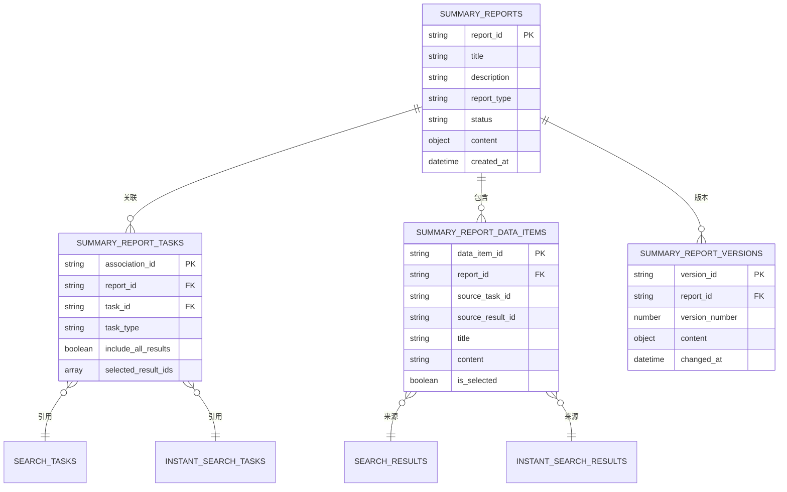

# 智能总结报告系统 - 产品需求文档（PRD）

**版本**: v1.1.0
**创建日期**: 2025-10-20
**最后更新**: 2025-10-21
**负责人**: 后端团队
**状态**: 开发中

---

## 📝 版本历史

### v1.1.0 (2025-10-21)
**功能优化**:
- ✅ **批量任务关联**: 创建报告时支持直接关联多个任务，减少API调用次数
- ✅ **任务结果集成**: 获取报告详情时支持返回关联任务的结果数据，解决前端数据初始化问题
- ✅ **游标分页**: 实现高效的游标分页机制，支持大量任务结果查询
- ✅ **灵活过滤**: 支持通过task_ids参数过滤特定任务的结果

**实现状态**:
- API端点已实现并测试通过
- Service层方法已完成
- 数据库连接验证完成
- PRD文档已更新

### v1.0.0 (2025-10-20)
**初始版本**:
- 基础报告管理功能
- 任务关联机制
- 数据库设计
- 性能优化方案

---

## 📋 目录

1. [版本历史](#版本历史)
2. [项目背景](#项目背景)
3. [功能需求](#功能需求)
4. [数据库设计](#数据库设计)
5. [API设计](#api设计)
6. [系统架构](#系统架构)
7. [性能优化](#性能优化)
8. [开发计划](#开发计划)

---

## 🎯 项目背景

### 业务需求
为了更好地管理和利用搜索任务产生的数据，需要一个智能总结报告系统，能够：
- 整合定时搜索任务和即时搜索任务的结果
- 使用 LLM/AI 自动生成分析报告和总结
- 支持用户手动编辑和完善报告内容
- 提供灵活的数据检索和关联能力

### 技术背景
- **现有系统**: 已有定时搜索任务（SearchTask）和即时搜索任务（InstantSearchTask）
- **数据库**: MongoDB（NoSQL）
- **后端框架**: FastAPI + Motor（异步）
- **架构模式**: 分层架构（Entity → Repository → Service → API）

---

## 🎨 功能需求

### 1. 总结报告管理

#### 1.1 创建总结报告
- 用户可以创建新的总结报告
- 报告可以包含以下信息：
  - 报告标题
  - 报告描述
  - 报告类型（综合分析、专题报告、数据统计等）
  - 关联的任务列表

**用户故事**:
```
作为用户，
我希望创建一个总结报告，
以便整合多个搜索任务的结果进行分析。
```

#### 1.2 关联搜索任务
- 支持关联多个定时搜索任务（SearchTask）
- 支持关联多个即时搜索任务（InstantSearchTask）
- 支持灵活地添加或移除关联任务

**用户故事**:
```
作为用户，
我希望在报告中关联多个搜索任务，
以便从不同维度分析数据。
```

#### 1.3 查看报告列表
- 支持分页查询
- 支持按创建时间、更新时间排序
- 支持按状态筛选（草稿、生成中、已完成等）

**用户故事**:
```
作为用户，
我希望查看所有的总结报告列表，
以便快速找到需要的报告。
```

### 2. 数据检索与聚合

#### 2.1 模糊搜索
- 支持在关联的任务结果中进行模糊搜索
- 搜索范围：标题、内容、URL、描述等字段
- 返回匹配的结果列表

**用户故事**:
```
作为用户，
我希望在报告关联的任务数据中进行模糊搜索，
以便快速找到相关信息。
```

#### 2.2 联表查询
- 自动聚合关联任务的结果数据
- 支持按时间范围、来源任务筛选
- 支持去重和排序

**技术需求**:
```javascript
// MongoDB 联表查询示例
db.summary_reports.aggregate([
  { $match: { report_id: "report_xxx" } },
  { $lookup: {
      from: "summary_report_tasks",
      localField: "report_id",
      foreignField: "report_id",
      as: "tasks"
  }},
  { $unwind: "$tasks" },
  // 根据 task_type 查询对应的结果表
  ...
])
```

### 3. AI/LLM 集成

#### 3.1 自动生成总结（预留接口）
- 调用 LLM API 生成报告总结
- 支持多种生成模式：
  - 数据统计摘要
  - 趋势分析
  - 关键词提取
  - 情感分析

**接口设计**:
```python
class LLMService:
    async def generate_summary(
        self,
        report_id: str,
        mode: str = "comprehensive"
    ) -> Dict[str, Any]:
        """
        生成报告总结

        Args:
            report_id: 报告ID
            mode: 生成模式（comprehensive/statistical/trend）

        Returns:
            生成的总结内容
        """
        # 预留接口，待LLM模块开发完成后实现
        pass
```

#### 3.2 AI 数据分析（预留接口）
- 调用 AI 模型进行数据分析
- 生成可视化图表数据
- 提供智能推荐

**接口设计**:
```python
class AIAnalysisService:
    async def analyze_data(
        self,
        report_id: str,
        analysis_type: str = "trend"
    ) -> Dict[str, Any]:
        """
        AI 数据分析

        Args:
            report_id: 报告ID
            analysis_type: 分析类型（trend/keyword/sentiment）

        Returns:
            分析结果
        """
        # 预留接口，待AI模块开发完成后实现
        pass
```

### 4. 内容编辑

#### 4.1 富文本编辑
- 支持富文本编辑器（Markdown 或 HTML）
- 支持插入图片、表格、链接
- 自动保存草稿

**数据格式**:
```json
{
  "content_type": "markdown",  // 或 "html"
  "content": "## 报告标题\\n\\n内容...",
  "is_auto_generated": false,
  "edited_by": "user_id",
  "edited_at": "2025-10-20T10:00:00Z"
}
```

#### 4.2 版本管理
- 自动保存编辑历史
- 支持版本对比
- 支持回滚到历史版本

**用户故事**:
```
作为用户，
我希望编辑报告内容时能看到历史版本，
以便在需要时恢复之前的内容。
```

### 5. 数据选择与管理

#### 5.1 手动选择数据
- 用户可以浏览关联任务的所有结果
- 支持批量选择数据项
- 选中的数据会加入到报告数据集

**用户故事**:
```
作为用户，
我希望从任务结果中手动选择特定的数据项，
以便只在报告中包含我关心的内容。
```

#### 5.2 数据去重
- 自动识别重复数据
- 提供去重选项（保留最新/最早/合并）

---

## 💾 数据库设计

### MongoDB 集合设计

#### 1. `summary_reports` - 总结报告主表

```javascript
{
  _id: ObjectId,
  report_id: String,  // 雪花算法ID
  title: String,
  description: String,
  report_type: String,  // 报告类型：comprehensive/thematic/statistical
  status: String,  // 状态：draft/generating/completed/failed

  // 元数据
  created_by: String,
  created_at: DateTime,
  updated_at: DateTime,

  // 统计信息
  total_tasks: Number,  // 关联任务数
  total_data_items: Number,  // 总数据项数

  // 内容
  content: {
    type: String,  // markdown/html
    text: String,
    is_auto_generated: Boolean,
    generated_by: String,  // llm/ai/user
    generated_at: DateTime,
    edited_by: String,
    edited_at: DateTime
  },

  // 版本信息
  version: Number,
  history_versions: Array,  // 历史版本ID列表

  // 扩展字段
  metadata: Object
}
```

**索引**:
```javascript
db.summary_reports.createIndex({ report_id: 1 }, { unique: true })
db.summary_reports.createIndex({ created_by: 1 })
db.summary_reports.createIndex({ status: 1 })
db.summary_reports.createIndex({ created_at: -1 })
db.summary_reports.createIndex({ updated_at: -1 })
```

---

#### 2. `summary_report_tasks` - 报告任务关联表

```javascript
{
  _id: ObjectId,
  association_id: String,  // 关联ID（雪花算法）
  report_id: String,  // 报告ID
  task_id: String,  // 任务ID
  task_type: String,  // 任务类型：search_task/instant_search_task

  // 关联配置
  include_all_results: Boolean,  // 是否包含所有结果
  selected_result_ids: Array,  // 手动选择的结果ID列表

  // 时间范围（可选）
  date_range_start: DateTime,
  date_range_end: DateTime,

  // 元数据
  added_by: String,
  added_at: DateTime,

  // 统计
  result_count: Number  // 包含的结果数量
}
```

**索引**:
```javascript
db.summary_report_tasks.createIndex({ association_id: 1 }, { unique: true })
db.summary_report_tasks.createIndex({ report_id: 1 })
db.summary_report_tasks.createIndex({ task_id: 1 })
db.summary_report_tasks.createIndex({ report_id: 1, task_type: 1 })
// 复合唯一索引：同一报告不能重复关联同一任务
db.summary_report_tasks.createIndex(
  { report_id: 1, task_id: 1, task_type: 1 },
  { unique: true }
)
```

---

#### 3. `summary_report_data_items` - 报告数据项表

```javascript
{
  _id: ObjectId,
  data_item_id: String,  // 数据项ID（雪花算法）
  report_id: String,

  // 来源信息
  source_task_id: String,
  source_task_type: String,  // search_task/instant_search_task
  source_result_id: String,  // 原始结果ID

  // 数据内容（冗余存储，提升查询性能）
  title: String,
  content: String,
  url: String,
  metadata: Object,

  // 状态
  is_selected: Boolean,  // 是否被选中
  is_duplicate: Boolean,  // 是否为重复数据

  // 元数据
  added_by: String,
  added_at: DateTime
}
```

**索引**:
```javascript
db.summary_report_data_items.createIndex({ data_item_id: 1 }, { unique: true })
db.summary_report_data_items.createIndex({ report_id: 1 })
db.summary_report_data_items.createIndex({ source_task_id: 1 })
db.summary_report_data_items.createIndex({ report_id: 1, is_selected: 1 })
// 全文搜索索引
db.summary_report_data_items.createIndex({ title: "text", content: "text" })
```

---

#### 4. `summary_report_versions` - 报告版本历史表

```javascript
{
  _id: ObjectId,
  version_id: String,  // 版本ID
  report_id: String,
  version_number: Number,

  // 版本内容
  content: {
    type: String,
    text: String
  },

  // 变更信息
  changed_by: String,
  changed_at: DateTime,
  change_description: String
}
```

**索引**:
```javascript
db.summary_report_versions.createIndex({ version_id: 1 }, { unique: true })
db.summary_report_versions.createIndex({ report_id: 1, version_number: -1 })
```

---

### ER 图（Mermaid）



---

## 🔌 API 设计

### 基础路径
```
/api/v1/summary-reports
```

### 端点列表

#### 1. 报告管理

##### 1.1 创建报告（支持批量关联任务）
```http
POST /api/v1/summary-reports/
```

**功能优化** (v1.1.0):
- ✅ 支持创建报告时直接批量关联任务
- ✅ 减少用户操作，一次API调用完成报告创建和任务关联
- ✅ 失败的任务关联不影响报告创建，记录到metadata

**请求体**:
```json
{
  "title": "2025年10月搜索数据综合分析报告",
  "description": "整合本月所有搜索任务的数据进行分析",
  "report_type": "comprehensive",
  "created_by": "user_001",
  "task_associations": [
    {
      "task_id": "task_123",
      "task_type": "scheduled",
      "task_name": "定时搜索任务1",
      "priority": 1
    },
    {
      "task_id": "task_456",
      "task_type": "instant",
      "task_name": "即时搜索任务1",
      "priority": 0
    }
  ]
}
```

**字段说明**:
- `task_associations` (可选): 创建时直接关联的任务列表
  - `task_id`: 任务ID
  - `task_type`: 任务类型 (scheduled/instant)
  - `task_name`: 任务名称
  - `priority`: 优先级（默认0）

**响应**:
```json
{
  "report_id": "1234567890123456789",
  "title": "2025年10月搜索数据综合分析报告",
  "status": "draft",
  "created_at": "2025-10-20T10:00:00Z",
  "total_tasks": 2,
  "metadata": {
    "failed_task_associations": []
  }
}
```

---

##### 1.2 获取报告列表
```http
GET /api/v1/summary-reports/?page=1&limit=20&status=completed
```

**响应**:
```json
{
  "total": 100,
  "page": 1,
  "limit": 20,
  "reports": [
    {
      "report_id": "...",
      "title": "...",
      "status": "completed",
      "total_tasks": 5,
      "total_data_items": 120,
      "created_at": "...",
      "updated_at": "..."
    }
  ]
}
```

---

##### 1.3 获取报告详情（支持返回任务结果）
```http
GET /api/v1/summary-reports/{report_id}?include_task_results=true&task_ids=xxx,yyy&cursor=xxx&limit=50
```

**功能优化** (v1.1.0):
- ✅ 支持获取报告详情时返回关联任务的结果数据
- ✅ 解决前端数据列表初始化问题，一次API调用获取完整数据
- ✅ 支持游标分页，高效处理大量结果
- ✅ 支持指定任务ID过滤，灵活控制返回数据

**查询参数**:
- `include_task_results` (boolean, 可选): 是否包含任务结果，默认false
- `task_ids` (string, 可选): 指定任务ID（逗号分隔），不指定则返回所有任务结果
- `cursor` (string, 可选): 分页游标
- `limit` (integer, 可选): 分页大小，默认50，最大200

**响应（基础信息）**:
```json
{
  "report": {
    "report_id": "...",
    "title": "...",
    "description": "...",
    "status": "completed",
    "content": {
      "type": "markdown",
      "text": "## 报告内容\\n\\n...",
      "is_auto_generated": true,
      "generated_by": "llm",
      "generated_at": "..."
    },
    "associated_tasks": [
      {
        "task_id": "...",
        "task_type": "search_task",
        "task_name": "..."
      }
    ],
    "statistics": {
      "total_tasks": 5,
      "total_data_items": 120
    }
  }
}
```

**响应（包含任务结果）** - `include_task_results=true`:
```json
{
  "report": {
    "report_id": "...",
    "title": "...",
    // ... 基础信息同上
  },
  "task_results": {
    "items": [
      {
        "result_id": "...",
        "task_id": "...",
        "title": "搜索结果标题",
        "url": "https://...",
        "markdown_content": "内容...",
        "created_at": "2025-10-20T10:00:00Z",
        "metadata": {}
      }
    ],
    "meta": {
      "has_next": true,
      "next_cursor": "scheduled:1234567890",
      "count": 50,
      "task_stats": {
        "scheduled_count": 3,
        "instant_count": 2,
        "total_count": 5
      }
    }
  }
}
```

**使用场景**:
1. **前端列表初始化**: `?include_task_results=true&limit=20` - 首次加载获取报告和前20条结果
2. **分页加载更多**: `?include_task_results=true&cursor=xxx&limit=20` - 使用游标加载下一页
3. **特定任务结果**: `?include_task_results=true&task_ids=task1,task2` - 只获取指定任务的结果
4. **仅获取报告信息**: 不传`include_task_results`或设为false - 只返回报告基础信息

---

##### 1.4 更新报告
```http
PUT /api/v1/summary-reports/{report_id}
```

**请求体**:
```json
{
  "title": "更新的标题",
  "description": "更新的描述"
}
```

---

##### 1.5 删除报告
```http
DELETE /api/v1/summary-reports/{report_id}
```

---

#### 2. 任务关联

##### 2.1 关联任务
```http
POST /api/v1/summary-reports/{report_id}/tasks
```

**请求体**:
```json
{
  "task_id": "task_123",
  "task_type": "search_task",
  "include_all_results": true,
  "date_range_start": "2025-10-01T00:00:00Z",
  "date_range_end": "2025-10-20T23:59:59Z"
}
```

---

##### 2.2 获取关联任务列表
```http
GET /api/v1/summary-reports/{report_id}/tasks
```

---

##### 2.3 移除关联任务
```http
DELETE /api/v1/summary-reports/{report_id}/tasks/{association_id}
```

---

#### 3. 数据检索

##### 3.1 模糊搜索
```http
GET /api/v1/summary-reports/{report_id}/search?q=关键词&page=1&limit=20
```

**响应**:
```json
{
  "total": 45,
  "results": [
    {
      "data_item_id": "...",
      "title": "包含关键词的标题...",
      "content": "包含关键词的内容...",
      "source_task_id": "...",
      "source_task_type": "search_task",
      "url": "..."
    }
  ]
}
```

---

##### 3.2 获取聚合数据
```http
GET /api/v1/summary-reports/{report_id}/data?task_id=xxx&is_selected=true
```

---

#### 4. 内容编辑

##### 4.1 更新报告内容
```http
PUT /api/v1/summary-reports/{report_id}/content
```

**请求体**:
```json
{
  "content_type": "markdown",
  "content": "## 编辑后的内容\\n\\n...",
  "edited_by": "user_001"
}
```

---

##### 4.2 获取版本历史
```http
GET /api/v1/summary-reports/{report_id}/versions
```

---

##### 4.3 回滚到历史版本
```http
POST /api/v1/summary-reports/{report_id}/versions/{version_id}/restore
```

---

#### 5. AI/LLM 生成（预留）

##### 5.1 生成总结
```http
POST /api/v1/summary-reports/{report_id}/generate
```

**请求体**:
```json
{
  "mode": "comprehensive",  // comprehensive/statistical/trend
  "options": {
    "max_length": 1000,
    "language": "zh-CN"
  }
}
```

**响应**:
```json
{
  "status": "generating",
  "job_id": "job_xxx",
  "estimated_time": 30  // 秒
}
```

---

##### 5.2 查询生成状态
```http
GET /api/v1/summary-reports/{report_id}/generate/{job_id}/status
```

---

## 🏗️ 系统架构

### 分层架构

```
┌─────────────────────────────────────────────────┐
│              API Layer (FastAPI)                │
│    summary_report_management.py                 │
└─────────────────────────────────────────────────┘
                       ↓
┌─────────────────────────────────────────────────┐
│            Service Layer                        │
│  - SummaryReportService                         │
│  - LLMService (预留)                            │
│  - AIAnalysisService (预留)                     │
└─────────────────────────────────────────────────┘
                       ↓
┌─────────────────────────────────────────────────┐
│          Repository Layer                       │
│  - SummaryReportRepository                      │
│  - SummaryReportTaskRepository                  │
│  - SummaryReportDataItemRepository              │
└─────────────────────────────────────────────────┘
                       ↓
┌─────────────────────────────────────────────────┐
│           Entity Layer                          │
│  - SummaryReport                                │
│  - SummaryReportTask                            │
│  - SummaryReportDataItem                        │
└─────────────────────────────────────────────────┘
                       ↓
┌─────────────────────────────────────────────────┐
│         Database (MongoDB)                      │
└─────────────────────────────────────────────────┘
```

### 模块化设计

```
src/
├── core/domain/entities/
│   ├── summary_report.py           # 报告实体
│   ├── summary_report_task.py      # 任务关联实体
│   └── summary_report_data_item.py # 数据项实体
│
├── infrastructure/database/
│   ├── summary_report_repositories.py  # 仓储实现
│   └── connection.py (更新索引)
│
├── services/
│   ├── summary_report_service.py   # 报告服务
│   ├── llm_service.py              # LLM服务（预留）
│   └── ai_analysis_service.py      # AI分析服务（预留）
│
└── api/v1/endpoints/
    └── summary_report_management.py # API端点
```

---

## ⚡ 性能优化

### 性能目标

#### 响应时间目标

| 操作类型 | 目标响应时间 | 最大响应时间 | 备注 |
|---------|-------------|-------------|------|
| 报告列表查询 | < 300ms | < 500ms | 分页查询，每页20条 |
| 报告详情查询 | < 200ms | < 300ms | 单个报告基础信息 |
| 模糊搜索（单任务） | < 500ms | < 1s | 全文搜索，返回50条 |
| **联表查询（2个任务）** | **< 500ms** | **< 1s** | **核心优化目标** |
| **联表查询（3-5个任务）** | **< 1s** | **< 2s** | **核心优化目标** |
| **联表查询（6-10个任务）** | **< 2s** | **< 3s** | **推荐异步处理** |
| 联表查询（>10个任务） | 异步处理 | N/A | 后台任务 |
| 内容更新 | < 200ms | < 300ms | 普通更新操作 |
| LLM生成（预留） | 5-30s | 60s | 异步任务 |

#### 吞吐量目标

- **并发用户**: 支持 100+ 并发用户
- **QPS**: 联表查询 50+ QPS
- **数据规模**: 单报告支持关联 100+ 任务，10000+ 数据项

---

### 联表查询优化

#### 1. 索引优化策略

##### 1.1 复合索引设计

针对联表查询场景，优化复合索引：

```javascript
// summary_report_tasks 集合 - 联表查询核心索引
db.summary_report_tasks.createIndex(
  { report_id: 1, task_type: 1, task_id: 1 },
  { name: "idx_report_task_lookup" }
)

// summary_report_tasks - 按优先级排序的索引
db.summary_report_tasks.createIndex(
  { report_id: 1, is_active: 1, priority: -1 },
  { name: "idx_report_active_priority" }
)

// search_results 集合 - 联表查询外键索引
db.search_results.createIndex(
  { task_id: 1, created_at: -1 },
  { name: "idx_task_created" }
)

// instant_search_results 集合 - 联表查询外键索引
db.instant_search_results.createIndex(
  { execution_id: 1, created_at: -1 },
  { name: "idx_execution_created" }
)

// summary_report_data_items - 覆盖索引
db.summary_report_data_items.createIndex(
  { report_id: 1, is_visible: 1, display_order: 1 },
  { name: "idx_report_visible_order" }
)

// 全文搜索优化索引（带权重）
db.summary_report_data_items.createIndex(
  {
    title: "text",
    content: "text",
    tags: "text"
  },
  {
    weights: {
      title: 10,      // 标题权重最高
      tags: 5,        // 标签次之
      content: 1      // 内容基础权重
    },
    name: "idx_fulltext_weighted"
  }
)
```

##### 1.2 覆盖索引（Covered Index）

设计覆盖索引，避免回表查询：

```javascript
// 联表查询只需返回ID的场景
db.summary_report_tasks.createIndex(
  { report_id: 1, is_active: 1 },
  {
    name: "idx_report_active_covered",
    partialFilterExpression: { is_active: true }  // 部分索引
  }
)

// 数据项查询覆盖索引（只返回基础字段）
db.summary_report_data_items.createIndex(
  { report_id: 1, item_id: 1, title: 1, source_task_id: 1 },
  { name: "idx_report_item_covered" }
)
```

##### 1.3 部分索引（Partial Index）

针对常用查询条件创建部分索引，减少索引大小：

```javascript
// 只为活跃任务创建索引
db.summary_report_tasks.createIndex(
  { report_id: 1, task_id: 1 },
  {
    partialFilterExpression: { is_active: true },
    name: "idx_active_tasks_only"
  }
)

// 只为已选中的数据项创建索引
db.summary_report_data_items.createIndex(
  { report_id: 1, added_at: -1 },
  {
    partialFilterExpression: { is_visible: true },
    name: "idx_visible_items_only"
  }
)
```

---

#### 2. 查询优化方案

##### 2.1 分阶段查询策略

将复杂联表查询拆分为多个阶段，提升性能：

```python
async def optimized_cross_task_search(
    self,
    report_id: str,
    search_query: str,
    limit: int = 50
) -> Dict[str, Any]:
    """
    优化的跨任务联表查询

    策略：
    1. 先查询关联任务（小表）
    2. 并行查询各任务结果（利用索引）
    3. 合并和排序结果
    4. 限制返回数量
    """

    # 阶段1: 获取活跃任务列表（使用覆盖索引）
    report_tasks = await self.task_repo.find_by_report(
        report_id,
        is_active=True
    )

    if not report_tasks:
        return {"results": [], "total_count": 0}

    # 阶段2: 分离任务类型（避免复杂条件）
    scheduled_tasks = [t.task_id for t in report_tasks if t.task_type == "scheduled"]
    instant_tasks = [t.task_id for t in report_tasks if t.task_type == "instant"]

    # 阶段3: 并行查询（使用asyncio.gather）
    results = await asyncio.gather(
        self._search_scheduled_results(scheduled_tasks, search_query, limit),
        self._search_instant_results(instant_tasks, search_query, limit),
        return_exceptions=True
    )

    # 阶段4: 合并结果并排序
    return self._merge_and_rank_results(results, limit)
```

##### 2.2 优化的聚合管道

针对MongoDB聚合查询进行优化：

```javascript
// 优化前（慢）：先联表后过滤
db.summary_reports.aggregate([
  { $match: { report_id: "xxx" } },
  { $lookup: { from: "summary_report_tasks", ... } },
  { $unwind: "$tasks" },
  { $match: { "tasks.is_active": true } },  // 联表后过滤，效率低
  { $lookup: { from: "search_results", ... } }
])

// 优化后（快）：先过滤后联表
db.summary_reports.aggregate([
  // 第一阶段：精确匹配（使用索引）
  { $match: { report_id: "xxx" } },

  // 第二阶段：联表查询任务（只查询活跃任务）
  { $lookup: {
      from: "summary_report_tasks",
      let: { reportId: "$report_id" },
      pipeline: [
        { $match: {
          $expr: { $eq: ["$report_id", "$$reportId"] },
          is_active: true  // 提前过滤，减少数据量
        }},
        { $sort: { priority: -1 } },
        { $limit: 10 }  // 限制任务数量
      ],
      as: "tasks"
  }},

  // 第三阶段：展开任务
  { $unwind: { path: "$tasks", preserveNullAndEmptyArrays: false } },

  // 第四阶段：条件联表（分scheduled和instant）
  { $lookup: {
      from: "search_results",
      let: {
        taskId: "$tasks.task_id",
        taskType: "$tasks.task_type"
      },
      pipeline: [
        { $match: {
          $expr: {
            $and: [
              { $eq: ["$task_id", "$$taskId"] },
              { $eq: ["$$taskType", "scheduled"] }
            ]
          }
        }},
        { $sort: { created_at: -1 } },
        { $limit: 20 }  // 每个任务限制结果数
      ],
      as: "scheduled_results"
  }},

  // 第五阶段：投影（只返回需要的字段）
  { $project: {
      _id: 0,
      report_id: 1,
      "tasks.task_id": 1,
      "tasks.task_name": 1,
      "scheduled_results.result_id": 1,
      "scheduled_results.title": 1,
      "scheduled_results.url": 1
  }}
])
```

##### 2.3 查询提示（Query Hints）

强制使用最优索引：

```python
# 在查询中指定使用特定索引
cursor = self.collection.find(
    {"report_id": report_id, "is_active": True}
).hint("idx_report_active_priority")  # 强制使用指定索引
```

---

#### 3. 缓存策略

##### 3.1 多级缓存架构

```
┌─────────────────────────────────────────────┐
│         L1: 应用内存缓存（LRU）              │
│         - 热点报告基础信息                   │
│         - 任务关联列表                       │
│         - TTL: 5分钟                        │
└─────────────────────────────────────────────┘
                    ↓ (Miss)
┌─────────────────────────────────────────────┐
│         L2: Redis缓存                       │
│         - 联表查询结果                       │
│         - 聚合统计数据                       │
│         - TTL: 30分钟                       │
└─────────────────────────────────────────────┘
                    ↓ (Miss)
┌─────────────────────────────────────────────┐
│         L3: MongoDB（数据源）                │
└─────────────────────────────────────────────┘
```

##### 3.2 缓存实现

```python
from functools import lru_cache
from typing import Optional
import hashlib
import json

class SummaryReportCache:
    """报告缓存管理"""

    def __init__(self, redis_client):
        self.redis = redis_client
        self.cache_prefix = "summary_report"

    def _make_cache_key(self, report_id: str, operation: str, **params) -> str:
        """生成缓存键"""
        param_str = json.dumps(params, sort_keys=True)
        param_hash = hashlib.md5(param_str.encode()).hexdigest()[:8]
        return f"{self.cache_prefix}:{operation}:{report_id}:{param_hash}"

    async def get_or_compute(
        self,
        cache_key: str,
        compute_func,
        ttl: int = 1800  # 30分钟
    ):
        """获取缓存或计算"""
        # 尝试从Redis获取
        cached = await self.redis.get(cache_key)
        if cached:
            return json.loads(cached)

        # 缓存未命中，计算结果
        result = await compute_func()

        # 存入缓存
        await self.redis.setex(
            cache_key,
            ttl,
            json.dumps(result)
        )

        return result

    async def invalidate_report(self, report_id: str):
        """失效报告相关的所有缓存"""
        pattern = f"{self.cache_prefix}:*:{report_id}:*"
        keys = await self.redis.keys(pattern)
        if keys:
            await self.redis.delete(*keys)
```

##### 3.3 缓存使用示例

```python
async def get_cross_task_search_cached(
    self,
    report_id: str,
    search_query: str,
    limit: int = 50
) -> Dict[str, Any]:
    """带缓存的跨任务搜索"""

    cache_key = self.cache._make_cache_key(
        report_id,
        "cross_task_search",
        query=search_query,
        limit=limit
    )

    return await self.cache.get_or_compute(
        cache_key,
        lambda: self.search_across_tasks(report_id, search_query, limit),
        ttl=1800  # 30分钟缓存
    )
```

##### 3.4 缓存失效策略

```python
# 在数据更新时失效缓存
async def add_task_to_report(self, report_id: str, ...):
    """添加任务到报告"""
    # 添加任务
    result = await self.task_repo.create(report_task)

    # 失效缓存
    await self.cache.invalidate_report(report_id)

    return result
```

---

#### 4. 分页和限流优化

##### 4.1 游标分页（Cursor Pagination）

避免深分页问题，使用游标分页：

```python
async def get_report_data_items_cursor(
    self,
    report_id: str,
    cursor: Optional[str] = None,
    limit: int = 50
) -> Dict[str, Any]:
    """
    游标分页获取数据项

    优势：
    - 避免深分页性能问题
    - 一致性更好（不会遗漏或重复）
    - 支持实时数据流
    """
    query = {"report_id": report_id, "is_visible": True}

    # 如果有游标，添加游标条件
    if cursor:
        query["_id"] = {"$gt": ObjectId(cursor)}

    # 查询 limit+1 条，用于判断是否有下一页
    items = await self.collection.find(query).sort("_id", 1).limit(limit + 1).to_list()

    has_next = len(items) > limit
    if has_next:
        items = items[:-1]

    next_cursor = str(items[-1]["_id"]) if items and has_next else None

    return {
        "items": items,
        "next_cursor": next_cursor,
        "has_next": has_next
    }
```

##### 4.2 查询限制

设置合理的查询限制，防止资源耗尽：

```python
# 配置文件
MAX_TASKS_PER_REPORT = 100  # 单报告最多关联任务数
MAX_ITEMS_PER_PAGE = 100    # 单页最多返回数据项
MAX_SEARCH_RESULTS = 1000   # 搜索最多返回结果数
MAX_CONCURRENT_TASKS = 10   # 联表查询最多并发任务数

# 查询限制实现
async def search_across_tasks(
    self,
    report_id: str,
    search_query: str,
    limit: int = 50
):
    # 限制返回数量
    limit = min(limit, MAX_SEARCH_RESULTS)

    # 获取任务列表（限制数量）
    tasks = await self.task_repo.find_by_report(report_id, is_active=True)
    if len(tasks) > MAX_CONCURRENT_TASKS:
        # 任务数过多，建议异步处理
        return {
            "error": "Too many tasks, please use async search",
            "task_count": len(tasks),
            "max_allowed": MAX_CONCURRENT_TASKS
        }

    # 执行查询...
```

##### 4.3 API限流

使用令牌桶算法限流：

```python
from slowapi import Limiter, _rate_limit_exceeded_handler
from slowapi.util import get_remote_address

limiter = Limiter(key_func=get_remote_address)

@router.get("/summary-reports/{report_id}/search")
@limiter.limit("30/minute")  # 每分钟最多30次搜索
async def search_report_data(
    report_id: str,
    q: str,
    limit: int = 50
):
    """联表搜索（带限流）"""
    return await service.search_across_tasks(report_id, q, limit)
```

---

#### 5. 大数据量处理

##### 5.1 异步任务处理

对于超过阈值的联表查询，使用异步任务：

```python
# 异步任务定义（使用Celery）
@celery_app.task
def async_cross_task_search(report_id: str, search_query: str):
    """异步跨任务搜索"""
    # 执行耗时查询
    results = await service.search_across_tasks(report_id, search_query, limit=10000)

    # 存储结果到临时集合
    await db.temp_search_results.insert_one({
        "job_id": self.request.id,
        "report_id": report_id,
        "results": results,
        "created_at": datetime.utcnow(),
        "expires_at": datetime.utcnow() + timedelta(hours=1)  # 1小时后过期
    })

    return {"job_id": self.request.id, "status": "completed"}

# API端点
@router.post("/summary-reports/{report_id}/search/async")
async def async_search(report_id: str, q: str):
    """提交异步搜索任务"""
    task = async_cross_task_search.delay(report_id, q)
    return {
        "job_id": task.id,
        "status": "processing",
        "estimated_time": 30  # 秒
    }

@router.get("/summary-reports/{report_id}/search/async/{job_id}")
async def get_async_search_result(job_id: str):
    """获取异步搜索结果"""
    result = await db.temp_search_results.find_one({"job_id": job_id})
    if not result:
        return {"status": "processing"}
    return {"status": "completed", "results": result["results"]}
```

##### 5.2 批量操作优化

```python
async def bulk_add_data_items(
    self,
    report_id: str,
    items: List[Dict[str, Any]]
):
    """批量添加数据项（优化版）"""

    # 分批处理，避免单次操作过大
    BATCH_SIZE = 100
    for i in range(0, len(items), BATCH_SIZE):
        batch = items[i:i + BATCH_SIZE]

        # 使用 insert_many 而不是多次 insert_one
        await self.collection.insert_many(
            [SummaryReportDataItem(**item).model_dump() for item in batch],
            ordered=False  # 无序插入，提升性能
        )

    # 更新计数（一次性更新）
    total_count = len(items)
    await self.report_repo.update(
        report_id,
        {"$inc": {"data_item_count": total_count}}
    )
```

---

#### 6. 监控和性能分析

##### 6.1 查询性能监控

```python
import time
from functools import wraps

def monitor_query_performance(operation_name: str):
    """查询性能监控装饰器"""
    def decorator(func):
        @wraps(func)
        async def wrapper(*args, **kwargs):
            start_time = time.time()
            try:
                result = await func(*args, **kwargs)
                duration = time.time() - start_time

                # 记录慢查询（>1s）
                if duration > 1.0:
                    logger.warning(
                        f"Slow query detected: {operation_name} "
                        f"took {duration:.2f}s"
                    )

                # 发送监控指标
                metrics.histogram(
                    f"query.{operation_name}.duration",
                    duration
                )

                return result
            except Exception as e:
                logger.error(f"Query failed: {operation_name} - {e}")
                raise
        return wrapper
    return decorator

# 使用示例
@monitor_query_performance("cross_task_search")
async def search_across_tasks(self, report_id: str, search_query: str):
    """跨任务搜索（带监控）"""
    # 执行查询...
```

##### 6.2 MongoDB查询分析

```javascript
// 分析查询执行计划
db.summary_report_tasks.find({
  report_id: "xxx",
  is_active: true
}).explain("executionStats")

// 查看慢查询日志
db.setProfilingLevel(1, { slowms: 100 })  // 记录>100ms的查询
db.system.profile.find().sort({ ts: -1 }).limit(10)

// 索引使用统计
db.summary_report_tasks.aggregate([
  { $indexStats: {} }
])
```

---

### 性能优化清单

#### 实施阶段

- [ ] **阶段1：索引优化**（Day 1）
  - [ ] 创建复合索引
  - [ ] 创建覆盖索引
  - [ ] 创建部分索引
  - [ ] 优化全文搜索索引

- [ ] **阶段2：查询优化**（Day 2）
  - [ ] 实现分阶段查询
  - [ ] 优化聚合管道
  - [ ] 添加查询提示

- [ ] **阶段3：缓存实现**（Day 3）
  - [ ] 实现Redis缓存
  - [ ] 实现缓存失效策略
  - [ ] 添加应用内存缓存

- [ ] **阶段4：限流和监控**（Day 4）
  - [ ] 实现游标分页
  - [ ] 添加API限流
  - [ ] 实现性能监控
  - [ ] 配置慢查询告警

---

## 📅 开发计划

### 阶段一：核心功能 + 性能优化（优先级：高）

**预计时间**: 4-5天

- [ ] **Day 1**: 数据库设计与实体模型
  - 创建实体类（SummaryReport, SummaryReportTask, SummaryReportDataItem）
  - 创建基础索引
  - **创建性能优化索引（复合索引、覆盖索引、部分索引）**

- [ ] **Day 2**: 仓储层与服务层
  - 实现 Repository 类
  - 实现基础 Service 方法
  - **实现分阶段查询策略**
  - **添加查询提示（Query Hints）**

- [ ] **Day 3**: API 端点
  - 报告CRUD API
  - 任务关联 API
  - **实现游标分页**
  - **添加API限流**

- [ ] **Day 4**: 缓存和监控
  - **实现Redis缓存**
  - **实现缓存失效策略**
  - **添加性能监控装饰器**
  - **配置慢查询告警**

- [ ] **Day 5**: 测试与优化
  - 单元测试
  - 集成测试
  - **联表查询性能测试（2/5/10个任务场景）**
  - 性能基准测试

### 阶段二：高级功能（优先级：中）

**预计时间**: 2-3天

- [ ] 模糊搜索功能
- [ ] 数据聚合与统计
- [ ] 版本管理功能

### 阶段三：AI/LLM 集成（优先级：低，待AI模块完成）

**预计时间**: 待定

- [ ] LLM 服务接口实现
- [ ] AI 分析服务实现
- [ ] 异步任务队列（Celery/RabbitMQ）

---

## ✅ 验收标准

### 功能验收
1. ✅ 用户可以创建、查看、编辑、删除总结报告
2. ✅ 用户可以关联多个搜索任务到报告
3. ✅ 用户可以在报告中进行模糊搜索
4. ✅ 系统可以聚合多个任务的数据
5. ✅ 用户可以编辑报告内容（富文本）
6. ✅ 系统预留了 LLM/AI 接口

### 性能验收
1. ✅ 报告列表查询响应时间 < 500ms
2. ✅ 单个报告详情查询响应时间 < 300ms
3. ✅ 模糊搜索响应时间 < 1s
4. ✅ **联表查询（2个任务）响应时间 < 1s**
5. ✅ **联表查询（3-5个任务）响应时间 < 2s**
6. ✅ **联表查询（6-10个任务）响应时间 < 3s**
7. ✅ **单报告支持关联100+任务，10000+数据项**
8. ✅ 支持并发 100+ 用户访问
9. ✅ 联表查询 QPS >= 50

### 代码质量
1. ✅ 模块化设计，代码耦合度低
2. ✅ 完整的类型注解
3. ✅ 完善的错误处理
4. ✅ 单元测试覆盖率 > 80%

---

## 📝 附录

### A. 术语表

| 术语 | 说明 |
|------|------|
| 总结报告 | Summary Report，整合多个任务数据的分析报告 |
| 定时搜索任务 | SearchTask，按计划周期性执行的搜索任务 |
| 即时搜索任务 | InstantSearchTask，用户手动触发的一次性搜索 |
| 联表查询 | MongoDB 的 $lookup 聚合操作 |
| 富文本 | Rich Text，支持格式化的文本内容 |

### B. 参考资料

- [MongoDB 聚合操作文档](https://docs.mongodb.com/manual/aggregation/)
- [FastAPI 最佳实践](https://fastapi.tiangolo.com/tutorial/)
- [Motor 异步驱动文档](https://motor.readthedocs.io/)

---

## 🔄 变更日志

### 2025-10-21
- ✅ 实现批量任务关联功能
- ✅ 实现任务结果查询功能
- ✅ 完成MongoDB数据库连接验证
- ✅ 更新API文档说明

### 2025-10-20
- ✅ 完成PRD初稿
- ✅ 完成数据库设计
- ✅ 完成性能优化方案设计

---

**文档状态**: ✅ v1.1.0 已完成并实现
**下一步**: 继续开发高级功能（模糊搜索、AI集成等）
