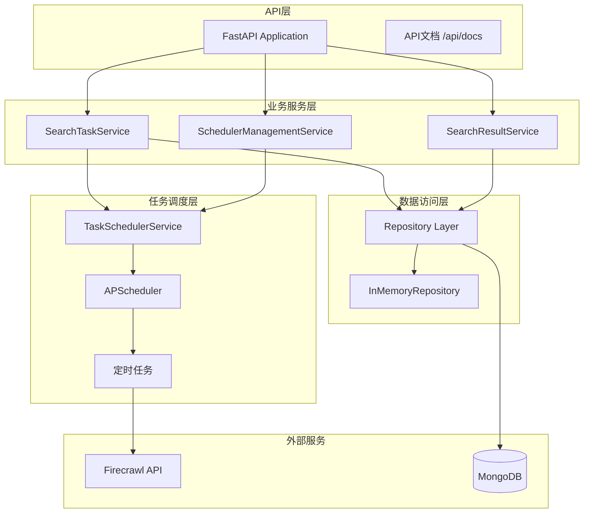

# 关山智能系统架构文档

## 系统概述

关山智能系统是基于Firecrawl + LLM + RAG Pipeline的智能信息采集与处理平台，核心功能是定时搜索任务管理系统。

## 技术架构

### 核心技术栈
- **后端框架**: FastAPI
- **数据库**: MongoDB (主数据存储)
- **任务调度**: APScheduler (AsyncIOScheduler)
- **搜索服务**: Firecrawl API
- **开发语言**: Python 3.13

### 系统架构图



## 核心组件

### 1. 定时搜索任务系统

#### 1.1 任务管理
- **任务实体**: `SearchTask` - 支持安全ID生成
- **任务状态**: ACTIVE, PAUSED, FAILED, COMPLETED, DISABLED
- **调度间隔**: 6种预定义间隔（每小时到每周）

#### 1.2 调度器服务
- **实现**: `TaskSchedulerService` 基于APScheduler
- **接口**: `ITaskScheduler` 标准接口
- **功能**: 启动/停止、任务增删改、手动执行、状态监控

#### 1.3 搜索配置
- **三层配置**: 系统默认 → 模板 → 用户覆盖
- **测试模式**: 自动限制结果数量控制成本
- **多语言支持**: 8种语言选项

### 2. API接口设计

#### 2.1 搜索任务管理
```
POST   /api/v1/search-tasks              # 创建任务
GET    /api/v1/search-tasks              # 列表查询
GET    /api/v1/search-tasks/{id}         # 任务详情
GET    /api/v1/search-tasks/{id}/status  # 任务状态监控 (专为前端设计)
PUT    /api/v1/search-tasks/{id}         # 更新任务
DELETE /api/v1/search-tasks/{id}         # 删除任务
PATCH  /api/v1/search-tasks/{id}/status  # 状态控制 (启用/禁用)
```

**任务状态监控端点特点**:
- 专为前端状态监控设计的轻量级接口
- 返回完整的任务信息，包括执行统计、资源使用和调度信息
- 与任务详情端点使用统一的响应模型`SearchTaskResponse`
- 包含成功/失败次数、成功率、平均结果数等关键指标
- 支持实时查询下次运行时间和调度间隔信息

#### 2.2 调度器管理
```
GET    /api/v1/scheduler/status          # 调度器状态
POST   /api/v1/scheduler/start           # 启动调度器
POST   /api/v1/scheduler/stop            # 停止调度器
POST   /api/v1/scheduler/tasks/{id}/execute  # 手动执行
POST   /api/v1/scheduler/tasks/{id}/pause    # 暂停任务
POST   /api/v1/scheduler/tasks/{id}/resume   # 恢复任务
```

#### 2.3 搜索结果查询
```
GET    /api/v1/search-results/tasks/{id} # 任务结果
GET    /api/v1/search-results/{id}       # 结果详情
```

### 3. 数据模型

#### 3.1 搜索任务 (SearchTask)
```python
@dataclass
class SearchTask:
    id: str                    # 雪花算法安全ID
    name: str                  # 任务名称
    description: str           # 任务描述
    query: str                 # 搜索关键词
    search_config: Dict        # 搜索配置JSON
    schedule_interval: str     # 调度间隔枚举
    is_active: bool           # 是否启用
    status: TaskStatus        # 任务状态
    created_by: str           # 创建者
    created_at: datetime      # 创建时间
    updated_at: datetime      # 更新时间
    last_executed_at: datetime # 最后执行时间
    next_run_time: datetime   # 下次运行时间
    execution_count: int      # 执行次数
    success_count: int        # 成功次数
    failure_count: int        # 失败次数
    total_results: int        # 总结果数
    total_credits_used: int   # 总消耗积分
```

#### 3.2 调度间隔 (ScheduleInterval)
```python
class ScheduleInterval(Enum):
    HOURLY_1 = ("HOURLY_1", "0 * * * *", "每小时", 60)
    HOURLY_6 = ("HOURLY_6", "0 */6 * * *", "每6小时", 360)
    HOURLY_12 = ("HOURLY_12", "0 */12 * * *", "每12小时", 720)
    DAILY = ("DAILY", "0 9 * * *", "每天", 1440)
    DAYS_3 = ("DAYS_3", "0 9 */3 * *", "每3天", 4320)
    WEEKLY = ("WEEKLY", "0 9 * * 1", "每周", 10080)
```

### 4. 安全特性

#### 4.1 ID安全性
- **雪花算法**: 生成不可预测的64位ID
- **防枚举**: 替代简单递增ID防止任务枚举攻击
- **分布式友好**: 支持高并发和分布式环境

#### 4.2 配置安全
- **输入验证**: 严格的配置参数验证
- **资源限制**: 测试模式自动限制资源消耗
- **错误处理**: 完善的异常处理和日志记录

### 5. 性能优化

#### 5.1 调度性能
- **异步执行**: 基于AsyncIOScheduler异步处理
- **内存调度**: MemoryJobStore高性能任务存储
- **错误容忍**: 配置任务错过时间容忍度

#### 5.2 数据库性能
- **仓储模式**: 抽象数据访问层
- **内存回退**: MongoDB不可用时自动切换内存存储
- **连接管理**: 自动数据库连接管理

### 6. 监控与运维

#### 6.1 健康检查
```
GET /health                   # 系统健康检查
GET /api/v1/scheduler/health  # 调度器健康检查
```

#### 6.2 状态监控
- **调度器状态**: 运行状态、活跃任务数、下次执行时间
- **任务统计**: 执行次数、成功率、平均结果数
- **资源监控**: 积分消耗、执行耗时

### 7. 扩展性设计

#### 7.1 接口化设计
- **调度器接口**: `ITaskScheduler` 支持多种调度器实现
- **仓储接口**: 支持多种数据存储后端
- **适配器模式**: `FirecrawlSearchAdapter` 可扩展其他搜索服务

#### 7.2 配置灵活性
- **三层配置**: 系统→模板→用户的灵活配置体系
- **多语言支持**: 支持8种语言的搜索配置
- **域名过滤**: 支持包含/排除域名的灵活过滤

## 部署架构

### 开发环境
```
FastAPI (localhost:8000)
├── MongoDB (可选)
├── APScheduler (内存)
└── Firecrawl API
```

### 生产环境
```
Load Balancer
├── FastAPI Instance 1
├── FastAPI Instance 2
└── FastAPI Instance 3
    ├── MongoDB Cluster
    ├── Redis (缓存)
    └── Firecrawl API
```

## 文档结构

### API文档
- `API_FIELD_REFERENCE.md` - 字段参考手册
- `API_USAGE_GUIDE.md` - 使用指南和示例

### 系统文档
- `SYSTEM_ARCHITECTURE.md` - 系统架构 (本文档)
- FastAPI自动生成文档: `/api/docs`

### 项目文档
- `README.md` - 项目概述和快速开始
- 其他项目管理文档位于docs目录

## 总结

关山智能系统采用现代化的微服务架构设计，具备：

✅ **完整的功能实现**: 任务管理、调度执行、结果查询  
✅ **安全的设计**: 雪花算法ID、输入验证、资源限制  
✅ **高性能架构**: 异步调度、内存存储、连接管理  
✅ **良好的扩展性**: 接口化设计、多层配置、适配器模式  
✅ **运维友好**: 健康检查、状态监控、错误处理  

系统已投入使用并持续迭代优化中。