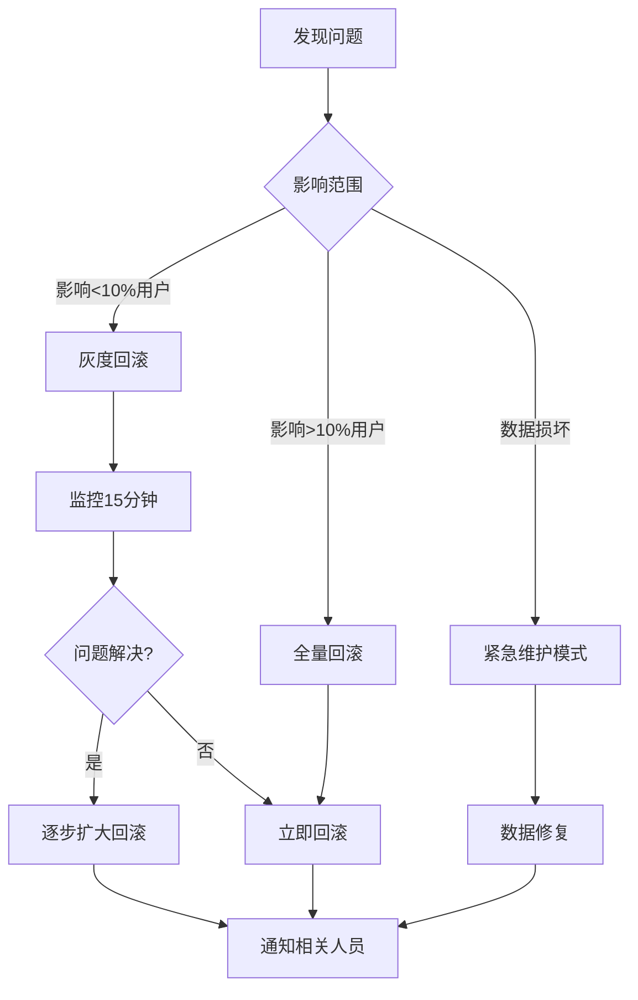

# 版本管理与回滚文档 - CMS Backend

> 最后更新: 2025-01-10  
> 当前版本: v1.0.0  
> 技术栈: FastAPI + MongoDB + MariaDB

## 📌 快速导航

- [当前版本信息](#1-当前版本信息)
- [版本历史记录](#2-版本历史记录)
- [回滚操作手册](#3-回滚操作手册)
- [数据库迁移记录](#4-数据库迁移记录)
- [API变更日志](#5-api变更日志)
- [依赖版本管理](#6-依赖版本管理)
- [紧急回滚流程](#7-紧急回滚流程)

---

## 1. 当前版本信息

### 生产环境
```yaml
版本号: v0.8.2
部署时间: 2025-01-10 14:30:00 UTC
Git标签: release/v0.8.2
Git提交: abc123def456
Docker镜像: cms-backend:v0.8.2
部署方式: Blue-Green Deployment
```

### 预发布环境
```yaml
版本号: v0.9.0-beta.1
部署时间: 2025-01-10 10:00:00 UTC
Git标签: release/v0.9.0-beta.1
Git提交: ghi789jkl012
Docker镜像: cms-backend:v0.9.0-beta.1
部署方式: Canary Release (10%)
```

### 开发环境
```yaml
版本号: v0.10.0-dev
分支: develop
最新提交: mno345pqr678
Docker镜像: cms-backend:latest
自动部署: 每次提交到develop分支
```

---

## 2. 版本历史记录

### v0.8.x 系列 (当前稳定版)

| 版本号 | 发布日期 | 类型 | 主要变更 | Git标签 | 回滚脚本 |
|--------|---------|------|---------|---------|---------|
| v0.8.2 | 2025-01-10 | 补丁 | 修复缓存失效问题 | release/v0.8.2 | [rollback-v0.8.2.sh](#) |
| v0.8.1 | 2025-01-08 | 补丁 | 修复认证Token冲突 | release/v0.8.1 | [rollback-v0.8.1.sh](#) |
| v0.8.0 | 2025-01-05 | 次要 | 添加Redis缓存层 | release/v0.8.0 | [rollback-v0.8.0.sh](#) |

### v0.7.x 系列

| 版本号 | 发布日期 | 类型 | 主要变更 | Git标签 | 回滚脚本 |
|--------|---------|------|---------|---------|---------|
| v0.7.3 | 2025-01-03 | 补丁 | 性能优化 | release/v0.7.3 | [rollback-v0.7.3.sh](#) |
| v0.7.2 | 2025-01-01 | 补丁 | 安全更新 | release/v0.7.2 | [rollback-v0.7.2.sh](#) |
| v0.7.1 | 2024-12-28 | 补丁 | Bug修复 | release/v0.7.1 | [rollback-v0.7.1.sh](#) |
| v0.7.0 | 2024-12-25 | 次要 | 内容管理模块 | release/v0.7.0 | [rollback-v0.7.0.sh](#) |

### 版本兼容性矩阵

| 后端版本 | MariaDB | MongoDB | Redis | 前端版本 | 破坏性变更 |
|---------|---------|---------|-------|---------|-----------|
| v0.8.x | 10.6+ | 5.0+ | 7.0+ | v1.2.x | 否 |
| v0.7.x | 10.5+ | 4.4+ | 6.2+ | v1.1.x | 否 |
| v0.6.x | 10.5+ | 4.4+ | 6.0+ | v1.0.x | 是 (API) |

---

## 3. 回滚操作手册

### 3.1 代码回滚

#### 基础回滚步骤
```bash
#!/bin/bash
# rollback-code.sh

# 1. 确定要回滚的版本
TARGET_VERSION="v0.8.1"

# 2. 备份当前版本
git tag backup/$(date +%Y%m%d-%H%M%S)
git push origin --tags

# 3. 切换到目标版本
git checkout tags/release/${TARGET_VERSION}

# 4. 创建回滚分支
git checkout -b rollback/${TARGET_VERSION}-$(date +%Y%m%d)

# 5. 推送到远程
git push origin rollback/${TARGET_VERSION}-$(date +%Y%m%d)

# 6. 触发部署流程
./scripts/deploy.sh ${TARGET_VERSION}
```

#### Docker镜像回滚
```bash
#!/bin/bash
# rollback-docker.sh

# 1. 停止当前容器
docker-compose stop app

# 2. 切换到旧版本镜像
export IMAGE_TAG="v0.8.1"
docker-compose up -d app

# 3. 健康检查
./scripts/health-check.sh

# 4. 如果失败，恢复到原版本
if [ $? -ne 0 ]; then
    export IMAGE_TAG="v0.8.2"
    docker-compose up -d app
fi
```

### 3.2 数据库回滚

#### MariaDB回滚
```sql
-- rollback-mariadb-v0.8.2.sql

-- 1. 检查当前版本
SELECT version FROM schema_migrations ORDER BY version DESC LIMIT 1;

-- 2. 回滚到上一个版本
-- 示例：回滚用户表修改
ALTER TABLE users DROP COLUMN two_factor_enabled;
ALTER TABLE users DROP COLUMN two_factor_secret;

-- 3. 更新版本记录
DELETE FROM schema_migrations WHERE version = '20250110001';

-- 4. 验证回滚
SHOW COLUMNS FROM users;
```

#### MongoDB回滚
```javascript
// rollback-mongodb-v0.8.2.js

// 1. 连接到数据库
use cms_content;

// 2. 检查当前版本
db.migrations.find().sort({_id: -1}).limit(1);

// 3. 回滚集合结构变更
// 示例：移除新添加的字段
db.articles.updateMany(
  {},
  { $unset: { "metadata.version": "", "metadata.draft": "" } }
);

// 4. 回滚索引
db.articles.dropIndex("metadata.version_1");

// 5. 更新迁移记录
db.migrations.deleteOne({ version: "20250110001" });
```

### 3.3 配置回滚

```bash
#!/bin/bash
# rollback-config.sh

# 1. 备份当前配置
cp .env .env.backup.$(date +%Y%m%d-%H%M%S)

# 2. 恢复旧版本配置
cp .env.v0.8.1 .env

# 3. 重新加载配置
docker-compose restart app

# 4. 验证配置
curl http://localhost:8000/health
```

---

## 4. 数据库迁移记录

### 4.1 MariaDB迁移历史

| 版本 | 迁移文件 | 执行时间 | 描述 | 回滚SQL |
|------|---------|---------|------|---------|
| 20250110001 | add_2fa_columns.sql | 2025-01-10 14:00 | 添加双因素认证字段 | [回滚](#) |
| 20250108001 | add_audit_log.sql | 2025-01-08 10:00 | 创建审计日志表 | [回滚](#) |
| 20250105001 | add_cache_table.sql | 2025-01-05 09:00 | 添加缓存配置表 | [回滚](#) |
| 20250103001 | create_roles_permissions.sql | 2025-01-03 11:00 | 创建权限系统表 | [回滚](#) |

### 4.2 MongoDB迁移历史

| 版本 | 迁移文件 | 执行时间 | 描述 | 回滚脚本 |
|------|---------|---------|------|---------|
| 20250110001 | add_article_metadata.js | 2025-01-10 14:05 | 添加文章元数据 | [回滚](#) |
| 20250109001 | create_media_collection.js | 2025-01-09 15:00 | 创建媒体集合 | [回滚](#) |
| 20250107001 | add_category_tree.js | 2025-01-07 13:00 | 分类树形结构 | [回滚](#) |
| 20250105001 | create_indexes.js | 2025-01-05 09:30 | 创建性能索引 | [回滚](#) |

### 4.3 迁移脚本示例

```bash
#!/bin/bash
# migrate.sh - 数据库迁移主脚本

# 设置环境变量
export ENVIRONMENT=${1:-development}
source .env.${ENVIRONMENT}

# MariaDB迁移
echo "执行MariaDB迁移..."
alembic upgrade head

# MongoDB迁移
echo "执行MongoDB迁移..."
python scripts/mongo_migrate.py

# 验证迁移
echo "验证迁移结果..."
python scripts/verify_migration.py

# 生成迁移报告
echo "生成迁移报告..."
python scripts/migration_report.py > migrations/reports/$(date +%Y%m%d-%H%M%S).txt
```

---

## 5. API变更日志

### v0.9.0 (即将发布)

#### 新增端点
```yaml
POST /api/v1/auth/2fa/enable - 启用双因素认证
POST /api/v1/auth/2fa/verify - 验证双因素认证码
GET /api/v1/analytics/dashboard - 获取仪表板数据
```

#### 修改端点
```yaml
GET /api/v1/users:
  新增参数:
    - include_deleted: boolean (包含已删除用户)
    - expand: string[] (展开关联数据)
  
POST /api/v1/articles:
  新增字段:
    - scheduled_at: datetime (定时发布)
    - metadata: object (自定义元数据)
```

#### 废弃端点
```yaml
GET /api/v1/old/users - 使用 GET /api/v1/users 替代
POST /api/v1/auth/session - 使用 JWT认证替代
```

### v0.8.0 (当前版本)

#### 破坏性变更 ⚠️
```yaml
认证头格式变更:
  旧: Authorization: Token <token>
  新: Authorization: Bearer <token>

响应格式统一:
  旧: { "data": {...} }
  新: { "success": true, "code": 200, "data": {...}, "message": "Success" }
```

---

## 6. 依赖版本管理

### 6.1 Python依赖

```toml
# pyproject.toml
[tool.poetry.dependencies]
python = "^3.11"
fastapi = "^0.104.0"
uvicorn = "^0.24.0"
sqlalchemy = "^2.0.23"
motor = "^3.3.2"
beanie = "^1.23.0"
redis = "^5.0.0"
pydantic = "^2.5.0"
alembic = "^1.13.0"
```

### 6.2 依赖更新记录

| 日期 | 包名 | 旧版本 | 新版本 | 原因 | 影响 |
|------|------|--------|--------|------|------|
| 2025-01-10 | fastapi | 0.103.0 | 0.104.0 | 安全更新 | 无 |
| 2025-01-08 | sqlalchemy | 1.4.41 | 2.0.23 | 主版本升级 | 需要代码调整 |
| 2025-01-05 | redis | 4.6.0 | 5.0.0 | 性能提升 | 配置变更 |

### 6.3 依赖安全扫描

```bash
# 每日自动执行安全扫描
poetry audit
safety check
bandit -r src/
```

---

## 7. 紧急回滚流程

### 7.1 回滚决策树



### 7.2 紧急联系人

| 角色 | 姓名 | 电话 | 邮箱 | 备注 |
|------|------|------|------|------|
| 技术负责人 | 张三 | 13800138000 | tech@example.com | 7x24 |
| 运维负责人 | 李四 | 13900139000 | ops@example.com | 7x24 |
| DBA | 王五 | 13700137000 | dba@example.com | 工作时间 |
| 产品经理 | 赵六 | 13600136000 | pm@example.com | 工作时间 |

### 7.3 一键回滚脚本

```bash
#!/bin/bash
# emergency-rollback.sh - 紧急回滚脚本

set -e

# 颜色输出
RED='\033[0;31m'
GREEN='\033[0;32m'
YELLOW='\033[1;33m'
NC='\033[0m'

echo -e "${RED}🚨 紧急回滚程序启动 🚨${NC}"

# 1. 确认回滚
read -p "确认要回滚到的版本 (例如: v0.8.1): " TARGET_VERSION
read -p "确认回滚原因: " ROLLBACK_REASON

# 2. 记录回滚日志
echo "$(date): 回滚到 ${TARGET_VERSION}, 原因: ${ROLLBACK_REASON}" >> rollback.log

# 3. 启用维护模式
echo -e "${YELLOW}启用维护模式...${NC}"
docker-compose up -d maintenance

# 4. 备份当前状态
echo -e "${YELLOW}备份当前数据...${NC}"
./scripts/backup-all.sh

# 5. 执行回滚
echo -e "${YELLOW}执行代码回滚...${NC}"
git checkout tags/release/${TARGET_VERSION}

echo -e "${YELLOW}执行数据库回滚...${NC}"
./scripts/db-rollback.sh ${TARGET_VERSION}

echo -e "${YELLOW}更新Docker镜像...${NC}"
export IMAGE_TAG=${TARGET_VERSION}
docker-compose up -d app

# 6. 健康检查
echo -e "${YELLOW}执行健康检查...${NC}"
sleep 10
if ./scripts/health-check.sh; then
    echo -e "${GREEN}✅ 回滚成功！${NC}"
    
    # 7. 关闭维护模式
    docker-compose stop maintenance
    
    # 8. 发送通知
    ./scripts/notify-rollback.sh "${TARGET_VERSION}" "${ROLLBACK_REASON}" "成功"
else
    echo -e "${RED}❌ 回滚失败！请立即联系技术负责人！${NC}"
    ./scripts/notify-rollback.sh "${TARGET_VERSION}" "${ROLLBACK_REASON}" "失败"
    exit 1
fi
```

---

## 8. 部署策略

### 8.1 蓝绿部署

```yaml
# docker-compose.blue-green.yml
services:
  app-blue:
    image: cms-backend:${BLUE_VERSION}
    ports:
      - "8001:8000"
    environment:
      - ENV=blue
    networks:
      - cms-network

  app-green:
    image: cms-backend:${GREEN_VERSION}
    ports:
      - "8002:8000"
    environment:
      - ENV=green
    networks:
      - cms-network

  nginx:
    image: nginx:alpine
    volumes:
      - ./nginx-bg.conf:/etc/nginx/nginx.conf
    ports:
      - "80:80"
    depends_on:
      - app-blue
      - app-green
```

### 8.2 金丝雀发布

```nginx
# nginx-canary.conf
upstream backend {
    server app-stable:8000 weight=9;  # 90%流量
    server app-canary:8000 weight=1;  # 10%流量
}

server {
    listen 80;
    location / {
        proxy_pass http://backend;
    }
}
```

### 8.3 灰度发布规则

```python
# canary_router.py
from fastapi import Request

def should_use_canary(request: Request) -> bool:
    """判断是否使用金丝雀版本"""
    
    # 基于用户ID的灰度
    user_id = request.headers.get("X-User-ID")
    if user_id and hash(user_id) % 100 < 10:  # 10%用户
        return True
    
    # 基于地域的灰度
    region = request.headers.get("X-Region")
    if region in ["beta-test", "canary"]:
        return True
    
    # 基于Cookie的灰度
    if request.cookies.get("canary") == "true":
        return True
    
    return False
```

---

## 9. 监控与告警

### 9.1 版本监控指标

| 指标 | 阈值 | 告警级别 | 响应措施 |
|------|------|---------|---------|
| 错误率 | >5% | 高 | 考虑回滚 |
| 响应时间P95 | >1s | 中 | 性能分析 |
| 内存使用 | >80% | 高 | 扩容/优化 |
| CPU使用率 | >70% | 中 | 负载均衡 |
| 5xx错误 | >10/分钟 | 高 | 立即调查 |

### 9.2 版本对比监控

```python
# version_monitor.py
import prometheus_client as prom

# 定义指标
version_requests = prom.Counter(
    'http_requests_by_version',
    'HTTP requests by version',
    ['version', 'endpoint', 'status']
)

version_latency = prom.Histogram(
    'http_latency_by_version',
    'HTTP latency by version',
    ['version', 'endpoint']
)

# 版本对比仪表板查询
"""
# 不同版本错误率对比
sum(rate(http_requests_by_version{status=~"5.."}[5m])) by (version) /
sum(rate(http_requests_by_version[5m])) by (version)

# 不同版本响应时间对比
histogram_quantile(0.95,
  sum(rate(http_latency_by_version_bucket[5m])) by (version, le)
)
"""
```

---

## 10. 自动化工具

### 10.1 版本发布脚本

```bash
#!/bin/bash
# release.sh - 自动化版本发布

VERSION=$1
ENVIRONMENT=$2

# 1. 运行测试
echo "运行测试套件..."
pytest tests/

# 2. 构建Docker镜像
echo "构建Docker镜像..."
docker build -t cms-backend:${VERSION} .

# 3. 推送到镜像仓库
echo "推送镜像..."
docker push cms-backend:${VERSION}

# 4. 创建Git标签
echo "创建Git标签..."
git tag -a release/${VERSION} -m "Release ${VERSION}"
git push origin release/${VERSION}

# 5. 更新部署配置
echo "更新部署配置..."
sed -i "s/IMAGE_TAG=.*/IMAGE_TAG=${VERSION}/" .env.${ENVIRONMENT}

# 6. 执行数据库迁移
echo "执行数据库迁移..."
./scripts/migrate.sh ${ENVIRONMENT}

# 7. 部署新版本
echo "部署新版本..."
./scripts/deploy.sh ${VERSION} ${ENVIRONMENT}

# 8. 验证部署
echo "验证部署..."
./scripts/verify-deployment.sh ${VERSION} ${ENVIRONMENT}

echo "✅ 版本 ${VERSION} 发布完成！"
```

### 10.2 回滚验证脚本

```python
# verify_rollback.py
import requests
import sys
from typing import Dict, List

def verify_endpoints(base_url: str, version: str) -> bool:
    """验证所有端点是否正常"""
    
    critical_endpoints = [
        "/health",
        "/api/v1/auth/login",
        "/api/v1/users",
        "/api/v1/articles"
    ]
    
    failures = []
    
    for endpoint in critical_endpoints:
        try:
            response = requests.get(f"{base_url}{endpoint}")
            if response.status_code >= 500:
                failures.append(f"{endpoint}: {response.status_code}")
        except Exception as e:
            failures.append(f"{endpoint}: {str(e)}")
    
    if failures:
        print(f"❌ 版本 {version} 验证失败:")
        for failure in failures:
            print(f"  - {failure}")
        return False
    
    print(f"✅ 版本 {version} 验证成功!")
    return True

if __name__ == "__main__":
    base_url = sys.argv[1]
    version = sys.argv[2]
    
    if not verify_endpoints(base_url, version):
        sys.exit(1)
```

---

## 11. 版本发布检查清单

### 发布前检查

- [ ] 所有测试通过
- [ ] 代码审查完成
- [ ] 文档更新
- [ ] 数据库迁移脚本准备
- [ ] 回滚脚本准备
- [ ] 性能测试完成
- [ ] 安全扫描完成
- [ ] 依赖版本锁定

### 发布中检查

- [ ] 维护模式启用
- [ ] 数据备份完成
- [ ] 迁移脚本执行成功
- [ ] Docker镜像推送成功
- [ ] 配置更新完成

### 发布后检查

- [ ] 健康检查通过
- [ ] 关键接口测试
- [ ] 监控指标正常
- [ ] 日志无异常
- [ ] 性能指标达标
- [ ] 用户访问正常

---

## 12. 故障恢复时间目标

| 场景 | RTO（恢复时间目标） | RPO（恢复点目标） | 自动化程度 |
|------|-------------------|------------------|-----------|
| 代码回滚 | <5分钟 | 0（无数据损失） | 全自动 |
| 数据库回滚 | <15分钟 | <5分钟 | 半自动 |
| 完整系统恢复 | <30分钟 | <15分钟 | 半自动 |
| 灾难恢复 | <2小时 | <1小时 | 手动 |

---

## 附录A: Git分支策略

```
main (生产环境)
  ├── release/v1.0.0 (版本标签)
  ├── hotfix/security-patch (紧急修复)
  
develop (开发环境)
  ├── feature/user-management (功能开发)
  ├── feature/content-system (功能开发)
  
release (预发布)
  └── release/v1.1.0 (准备发布)
```

## 附录B: 常用命令

```bash
# 查看当前版本
cat version.txt

# 查看版本历史
git tag -l "release/*"

# 比较版本差异
git diff release/v0.8.1..release/v0.8.2

# 查看迁移状态
alembic current
mongo cms_content --eval "db.migrations.find()"

# 执行回滚
./scripts/rollback.sh v0.8.1

# 验证部署
curl -s http://localhost:8000/health | jq
```

## 附录C: 问题排查指南

1. **版本不匹配**: 检查Docker镜像标签
2. **迁移失败**: 查看迁移日志 `/var/log/migrations/`
3. **性能退化**: 对比版本监控指标
4. **功能异常**: 检查功能开关配置
5. **数据不一致**: 验证数据库版本

---

## 更新日志

- 2025-01-10: 初始版本创建
- 2025-01-10: 添加紧急回滚流程
- 2025-01-10: 更新版本兼容性矩阵

---

## 支持联系

- **24/7紧急热线**: 400-123-4567
- **技术支持邮箱**: support@example.com
- **运维值班电话**: 13800138000
- **Slack频道**: #cms-emergency
- **监控大屏**: https://monitor.example.com