# SearchTask 字段关系 UML 图解

## 1. 类图 (Class Diagram)

### SearchTask 实体结构

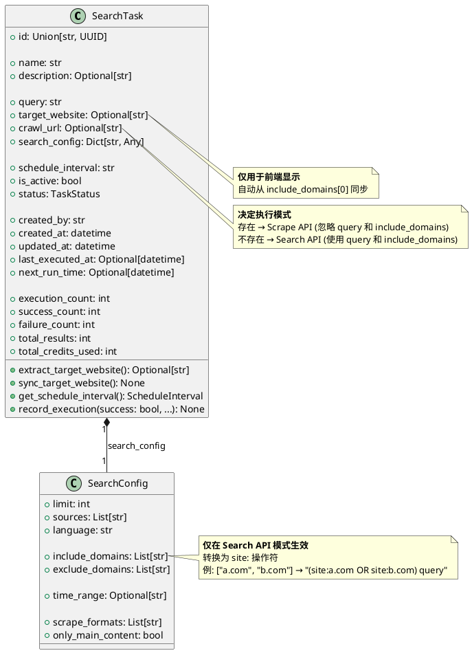

---

## 2. 执行流程图 (Sequence Diagram)

### 场景1: Search API 模式 (crawl_url 为空)

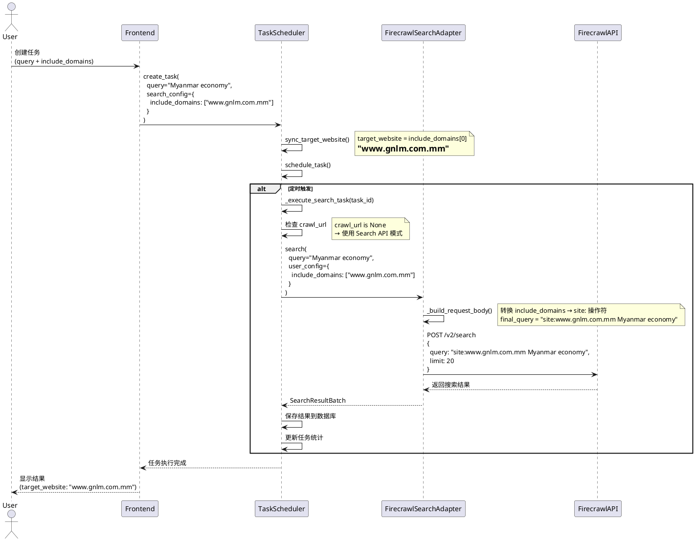

---

### 场景2: Scrape API 模式 (crawl_url 存在)

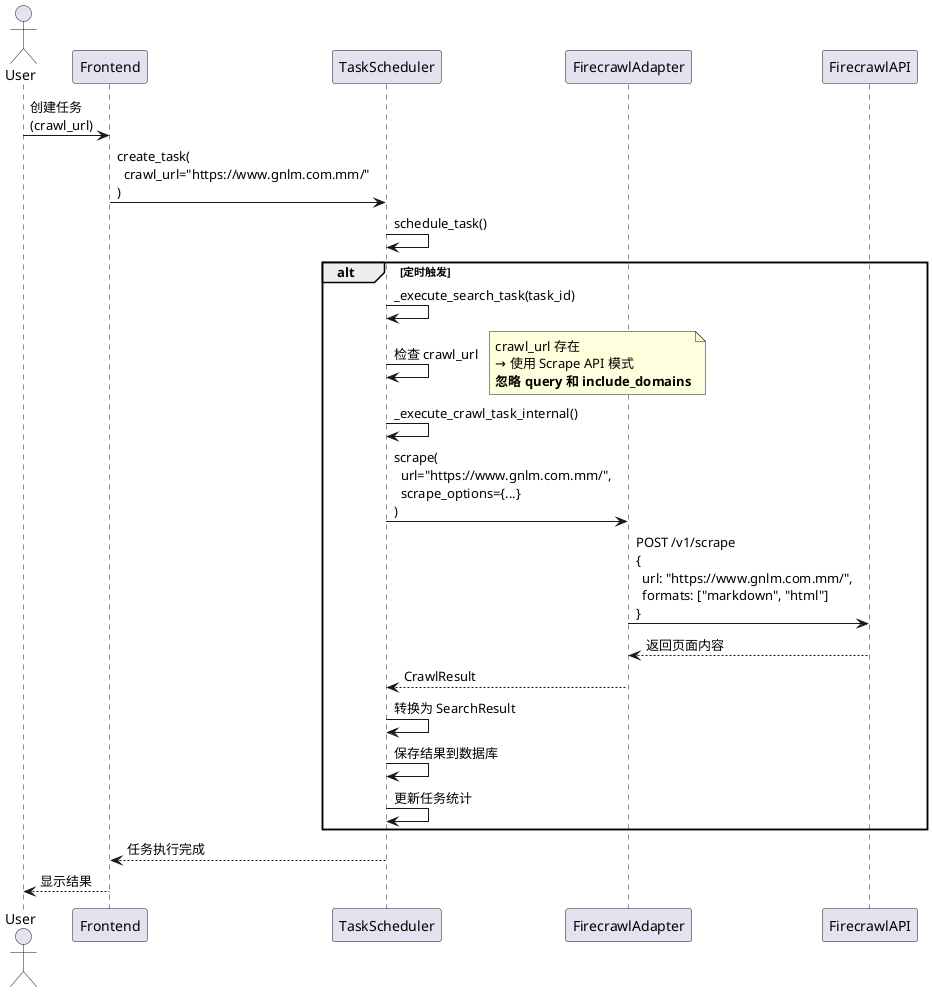

---

## 3. 状态图 (State Diagram)

### 任务执行模式切换

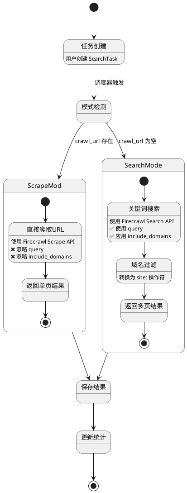

---

## 4. 组件图 (Component Diagram)

### 字段依赖关系

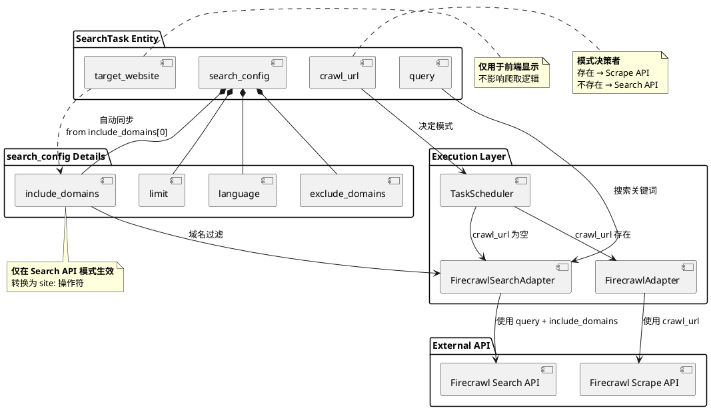

---

## 5. 活动图 (Activity Diagram)

### 任务创建与字段验证

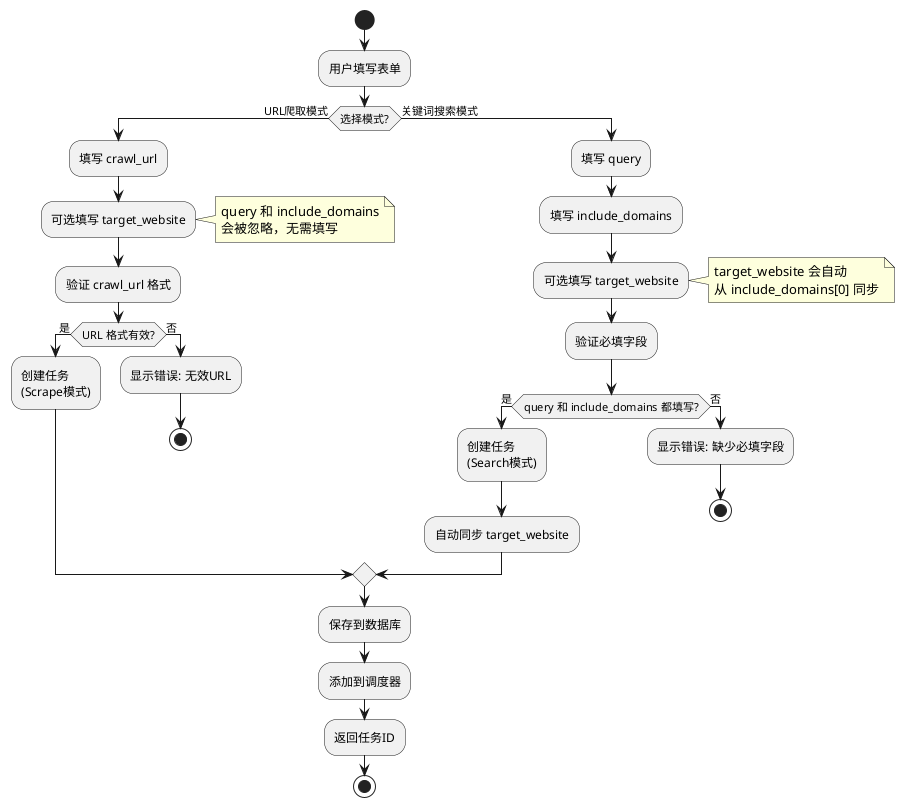

---

## 6. 部署图 (Deployment Diagram)

### 系统架构与字段流转

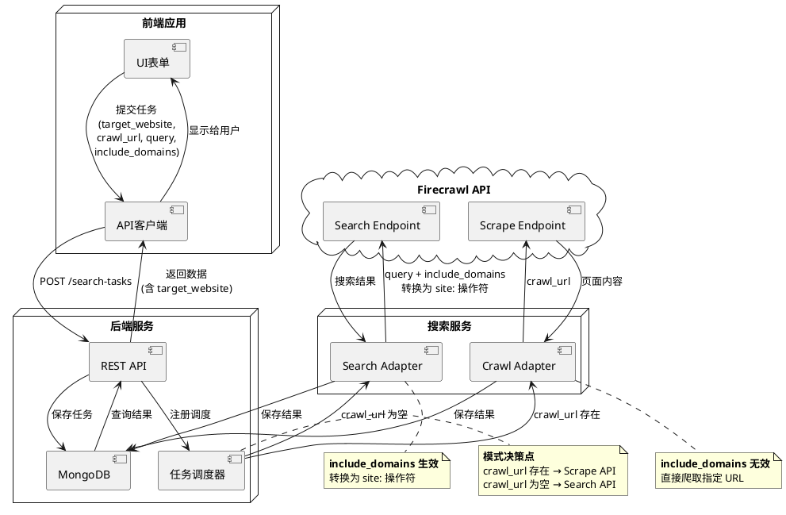

---

## 7. 对象图 (Object Diagram)

### Search 模式实例

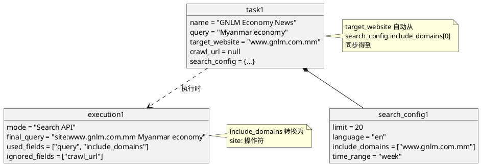

---

### Crawl 模式实例

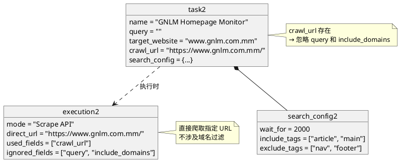

---

## 8. 用例图 (Use Case Diagram)

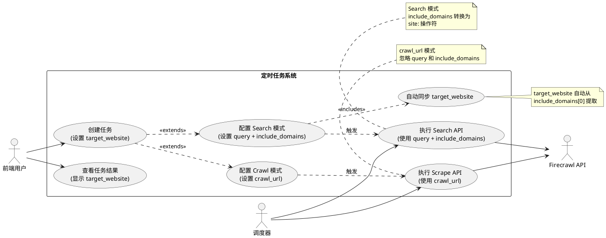

---

## 9. 通信图 (Communication Diagram)

### 字段交互与数据流

```plantuml
@startuml
object User
object Frontend
object API
object TaskScheduler
object SearchAdapter
object CrawlAdapter
object Database

User -> Frontend : 1: 提交任务配置
Frontend -> API : 2: POST /search-tasks\n(target_website, crawl_url, query, include_domains)
API -> Database : 3: 保存任务
API -> API : 4: sync_target_website()\n(target_website ← include_domains[0])
API -> TaskScheduler : 5: 注册调度

alt crawl_url 为空 (Search 模式)
  TaskScheduler -> SearchAdapter : 6a: search(query, include_domains)
  SearchAdapter -> SearchAdapter : 6a.1: 转换 include_domains → site:
  SearchAdapter -> Database : 6a.2: 保存搜索结果
else crawl_url 存在 (Crawl 模式)
  TaskScheduler -> CrawlAdapter : 6b: scrape(crawl_url)
  CrawlAdapter -> Database : 6b.1: 保存爬取结果
end

Database -> Frontend : 7: 返回结果\n(包含 target_website)
Frontend -> User : 8: 显示任务状态

note right of API
  target_website 同步逻辑:
  if not target_website:
    target_website = include_domains[0]
end note

note bottom of SearchAdapter
  Search 模式:
  ✅ 使用 query
  ✅ 使用 include_domains
  ❌ 忽略 crawl_url
end note

note bottom of CrawlAdapter
  Crawl 模式:
  ✅ 使用 crawl_url
  ❌ 忽略 query
  ❌ 忽略 include_domains
end note
@enduml
```

---

## 10. 时序图总结 (Timing Diagram)

### 字段生效时间线

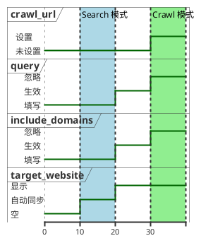

---

## 使用说明

### 查看 UML 图

这些 UML 图使用 PlantUML 语法编写，可以通过以下方式查看：

1. **在线渲染**: 访问 [PlantUML Web Server](http://www.plantuml.com/plantuml/uml/)，粘贴代码
2. **IDE 插件**:
   - VS Code: 安装 "PlantUML" 插件
   - IntelliJ IDEA: 内置 PlantUML 支持
3. **本地命令行**:
   ```bash
   npm install -g node-plantuml
   puml generate TASK_FIELDS_UML.md
   ```

### 图解说明

- **类图**: 展示 SearchTask 和 SearchConfig 的结构关系
- **序列图**: 展示 Search 和 Crawl 两种模式的执行流程
- **状态图**: 展示任务执行模式的切换逻辑
- **组件图**: 展示字段之间的依赖关系
- **活动图**: 展示任务创建和字段验证的流程
- **部署图**: 展示系统架构和字段在各层之间的流转
- **对象图**: 展示具体实例中字段的赋值
- **用例图**: 展示用户和系统之间的交互
- **通信图**: 展示字段在各组件之间的传递
- **时序图**: 展示字段在不同时间点的状态变化
