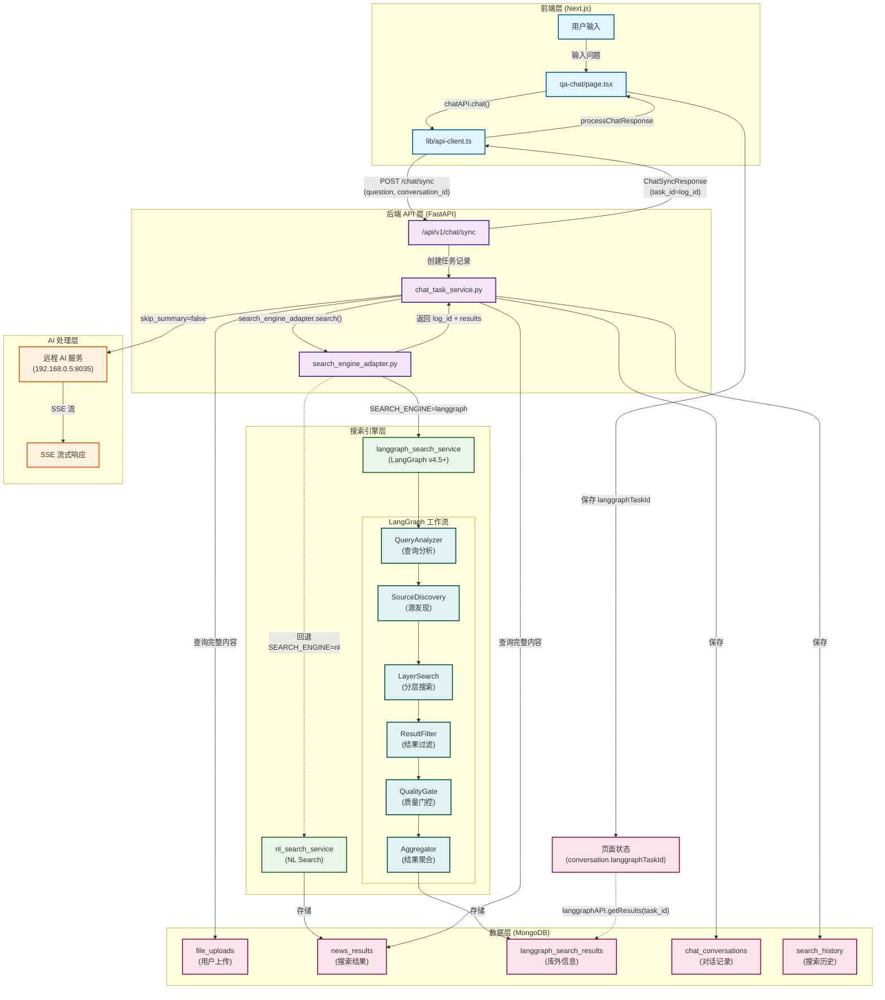

# 智能搜索流程图 v4.6.0

## 完整流程 Mermaid 图



## 数据流关键点

### 1. task_id 传递链路 (v4.6.0 统一)

```
LangGraph thread_id (log_id)
    ↓
search_engine_adapter.search() 返回 log_id
    ↓
ChatSyncResponse.task_id = log_id
    ↓
前端 processChatResponse() 保存到 conversation.langgraphTaskId
    ↓
用于查询 langgraphAPI.getResults({ task_id })
```

### 2. 三种 ID 系统对比

| ID 类型 | 格式 | 用途 | 示例 |
|--------|------|------|------|
| conversation_id | MongoDB ObjectId | 对话会话标识 | 67a3f2e9b1d4c8e9f0a1b2c3 |
| task_id (v4.6.0) | LangGraph thread_id | LangGraph 工作流标识，用于查询库外信息 | 248728141926559744 |
| mongo_id | MongoDB ObjectId | 数据库文档 ID | 69312ed5cf789ae4312d6036 |

### 3. API 请求/响应格式

#### 请求: POST /api/v1/chat/sync
```json
{
  "question": "西藏最新新闻",
  "conversation_id": "248728141926559744",
  "search_mode": "single"
}
```

#### 响应: ChatSyncResponse
```json
{
  "question": "西藏最新新闻",
  "answer": "为您找到 5 条相关信息...",
  "sources": [...],
  "sources_count": 5,
  "answer_length": 1234,
  "status": "success_ai",
  "task_id": "248728141926559744"  // LangGraph thread_id
}
```

### 4. 库外信息查询

#### 请求: GET /api/v1/langgraph/results
```json
{
  "task_id": "248728141926559744",  // 使用保存的 langgraphTaskId
  "page": 1,
  "page_size": 100
}
```

## 版本历史

- **v4.6.0** (2025-01-14): 统一 task_id 存储 LangGraph thread_id
- **v4.5.0** (2025-01-10): 集成 LangGraph 搜索引擎
- **v4.0.0** (2024-12-20): 引入 SearchEngineAdapter
- **v3.0.0** (2024-11-15): 统一任务化模型
